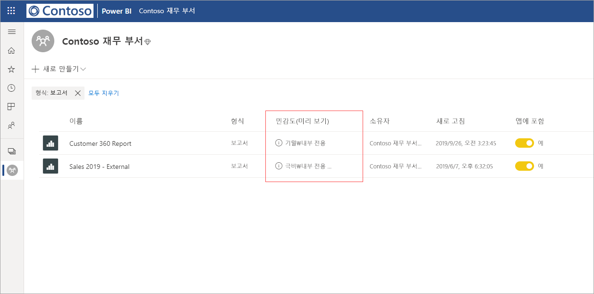
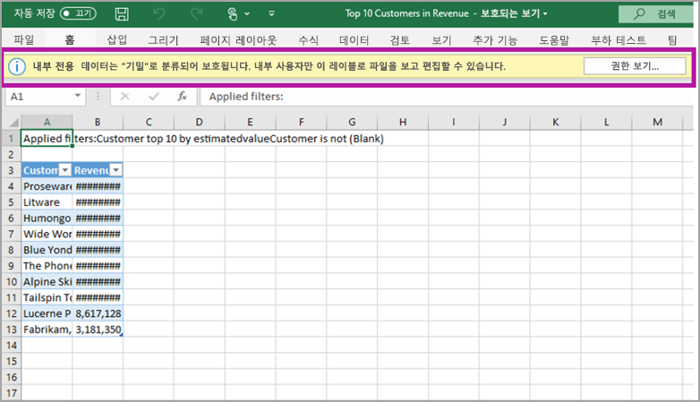

# Power BI의 데이터 보호(미리 보기)

현대적인 기업은 중요한 데이터를 처리하고 보호하는 방법에 대한 엄격한 비즈니스 규정 및 요구 사항을 준수해야 합니다. Power BI는 Microsoft Information Protection 및 Microsoft Cloud App Security와 통합되므로, Power BI에서 중요한 데이터의 사용과 표시를 보다 강력하게 제어할 수 있습니다. 

Power BI에서 데이터 보호를 사용하면 다음을 수행할 수 있습니다.

* Microsoft 민감도 레이블을 사용하여 Office 365에서 파일을 분류하고 보호하는 데 사용되는 것과 동일한 분류법으로 Power BI 서비스(대시보드, 보고서, 데이터 세트 및 데이터 흐름)의 콘텐츠를 분류하고 레이블을 추가합니다. 

* 콘텐츠의 민감도 레이블 및 보호를 적용하여 Power BI 서비스에서 파일로 데이터를 내보낼 때 암호화 또는 워터마크와 같은 보호 설정을 적용합니다(Excel, PowerPoint 및 PDF). 

  예를 들어 사용자가 Power BI에서 보고서에 기밀 레이블을 적용할 수 있습니다. 그런 다음, 데이터를 Excel 파일로 내보내면 Power BI는 기밀 레이블을 파일에 적용합니다. 이 레이블은 콘텐츠를 암호화하고 기밀 워터마크를 적용할 수 있습니다.

* Microsoft Cloud App Security를 사용하여 Power BI의 활동을 모니터링하고, 보안 문제를 조사하며, Microsoft Cloud App Security 조건부 액세스 앱 제어를 통해 Power BI의 콘텐츠를 보호합니다. 

## Power BI의 민감도 레이블

민감도 레이블은 [Microsoft 365 보안 센터](https://security.microsoft.com/) 또는 [Microsoft 365 규정 준수 센터](https://compliance.microsoft.com/)에서 만들고 관리합니다.

두 센터 중 하나에서 민감도 레이블에 액세스하려면 **분류 > 민감도 레이블**로 이동합니다. 이러한 민감도 레이블은 Azure Information Protection, Office 앱, Office 365 서비스 등의 여러 Microsoft 서비스에서 사용할 수 있습니다.

> [!IMPORTANT]
> Azure Information Protection 고객은 Power BI에서 민감도 레이블을 사용하기 위해 레이블을 앞에 나열된 서비스 중 하나로 마이그레이션해야 합니다. 또한 민감도 레이블은 퍼블릭 클라우드에만 지원되고, 소버린 클라우드와 같은 클라우드의 테넌트에서는 지원되지 않습니다.
>
> [민감도 레이블을 Microsoft Information Protection으로 마이그레이션](https://docs.microsoft.com/azure/information-protection/configure-policy-migrate-labels)하는 방법을 자세히 알아보세요.

## 민감도 레이블의 작동 방식

Power BI 대시보드, 보고서, 데이터 세트 또는 데이터 흐름에 민감도 레이블을 적용하는 경우 다음과 같은 이점을 제공하는 ‘태그’를 해당 리소스에 적용하는 것과 비슷합니다. 
* **사용자 지정 가능** - 조직에 있는 다양한 수준의 중요한 콘텐츠를 위해 개인, 공용, 일반, 기밀, 매우 기밀 등의 범주를 만들 수 있습니다.
* **일반 텍스트** - 레이블은 일반 텍스트로 작성되므로 사용자가 민감도 레이블 지침에 따라 콘텐츠 처리 방법을 쉽게 이해할 수 있습니다.
* **지속적** - 콘텐츠에 적용된 민감도 레이블은 콘텐츠를 Excel, PowerPoint, PDF 등의 지원되는 파일 형식으로 내보낼 때 콘텐츠와 함께 이동합니다. 

  즉, 보호 설정을 비롯한 민감도 레이블은 콘텐츠를 따라 이동하고 정책을 적용하기 위한 기초가 됩니다. 

## 민감도 레이블 예제 

Power BI의 민감도 레이블이 작동하는 방식의 빠른 예제는 다음과 같습니다.

1. Power BI 서비스에서 **매우 기밀 - 내부 전용** 민감도 레이블을 보고서에 적용합니다.

   

2. 이 보고서의 데이터를 Excel 파일로 내보내면 민감도 레이블과 보호가 내보낸 Excel 파일에 적용됩니다.

   

Microsoft Office 애플리케이션에서 민감도 레이블은 위의 이미지와 같이 메일 또는 문서의 태그로 표시됩니다.

콘텐츠를 사용 및 공유할 때 콘텐츠와 함께 이동하고 지속되는 분류를 스티커처럼 콘텐츠에 할당할 수도 있습니다. 이 분류를 사용하여 사용 현황 보고서를 생성하고 중요한 콘텐츠의 활동 데이터를 볼 수 있습니다. 이 정보에 따라 나중에 언제든지 보호 설정을 적용하도록 선택할 수 있습니다.

## Power BI에서 민감도 레이블 사용

Power BI에서 민감도 레이블을 사용하도록 설정하려면 먼저 다음 필수 조건을 충족해야 합니다. 

* [Microsoft 365 보안 센터](https://security.microsoft.com/) 또는 [Microsoft 365 규정 준수 센터](https://compliance.microsoft.com/)에서 민감도 레이블을 정의했는지 확인합니다. 
* Power BI에서 [민감도 레이블을 사용](service-security-enable-data-sensitivity-labels.md)(미리 보기)하도록 설정합니다.
* 사용자에게 적절한 라이선스가 있는지 확인합니다.
  * Power BI에서 레이블을 적용하거나 보려면 사용자에게 Azure Information Protection Premium P1 또는 Premium P2 라이선스가 있어야 합니다. Microsoft Azure Information Protection은 독립 실행형으로 구입하거나 Microsoft 라이선스 제품군 중 하나를 통해 구입할 수 있습니다. 자세한 내용은 [Azure Information Protection 가격 책정](https://azure.microsoft.com/pricing/details/information-protection/)을 참조하세요.
  * Power BI 리소스에 레이블을 적용하려면 사용자에게 위에서 언급한 Azure Information Protection 라이선스 외에도 Power BI Pro 라이선스가 있어야 합니다. 

## Microsoft Cloud App Security를 사용하여 콘텐츠 보호

Microsoft Cloud App Security를 사용하여 의도하지 않은 유출이나 위반으로부터 Power BI 콘텐츠를 보호할 수 있습니다. Microsoft Cloud App Security를 설정하고 구성하면 보안 관리자가 사용자 액세스 및 활동을 모니터링하고, 실시간 위험 분석을 수행하며, 레이블 관련 제어를 설정할 수 있습니다.

예를 들어 조직에서 Microsoft Cloud App Security를 사용하여 사용자가 중요한 데이터를 Power BI에서 비관리형 디바이스로 다운로드할 수 없도록 하는 정책을 구성할 수 있습니다. 이러한 구성을 사용하면 사용자가 생산성을 유지하고 어디서나 Power BI에 연결하도록 허용하는 동시에 Microsoft Cloud App Security를 통해 위반하는 사용자 작업을 실시간으로 차단할 수 있습니다. 

### 요구 사항

민감도 레이블이 Microsoft Cloud App Security를 사용하려면 먼저 다음 필수 조건을 충족해야 합니다. 

* Cloud App Security 및 Azure Information Protection을 [테넌트에 사용](https://docs.microsoft.com/cloud-app-security/azip-integration)하도록 설정해야 합니다.
* 앱을 [Microsoft Cloud App Security에 연결](https://docs.microsoft.com/cloud-app-security/enable-instant-visibility-protection-and-governance-actions-for-your-apps)해야 합니다.

## 고려 사항 및 제한 사항

다음 목록은 Power BI에서 민감도 레이블의 몇 가지 제한 사항입니다.

* Power BI에서 Microsoft Information Protection 민감도 레이블을 적용하고 보려면 Azure Information Protection Premium P1 또는 Premium P2 라이선스가 필요합니다. Microsoft Azure Information Protection은 독립 실행형으로 구입하거나 Microsoft 라이선스 제품군 중 하나를 통해 구입할 수 있습니다. 자세한 내용은 [Azure Information Protection 가격 책정](https://azure.microsoft.com/pricing/details/information-protection/)을 참조하세요.
* 민감도 레이블은 대시보드, 보고서, 데이터 세트 및 데이터 흐름에만 적용할 수 있습니다.
* 내보낸 파일의 레이블 및 보호 제어 적용은 Excel, PowerPoint 및 PDF 파일에서만 지원됩니다. 데이터를 .CSV 파일, 메일 구독, 시각적 개체 포함 및 인쇄로 내보낼 때는 레이블 및 보호가 적용되지 않습니다.
* Power BI에서 파일을 내보내는 사용자는 민감도 레이블 설정에 따라 해당 파일에 대한 액세스 및 편집 권한을 갖습니다. 데이터를 내보내는 사용자는 파일의 소유자 권한을 얻지 못합니다. 
* 현재, [페이지를 매긴 보고서]( https://docs.microsoft.com/power-bi/paginated-reports-report-builder-power-bi)와 통합 문서에서는 민감도 레이블을 사용할 수 없습니다. 
* 레이블을 적용하고 나면, 현재 Power BI 자산에서 레이블을 삭제할 수 없습니다.
* Power BI 자산의 민감도 레이블은 작업 영역 목록 및 계보 보기에만 표시됩니다. 현재 즐겨찾기, 공유한 항목, 최근 항목 또는 앱 보기에는 레이블이 표시되지 않습니다. 그러나 Power BI 자산에 적용된 레이블은 표시되지 않는 경우에도 Excel, PowerPoint 및 PDF 파일로 내보낸 데이터에 항상 유지됩니다.
* [Microsoft 365 보안 센터](https://security.microsoft.com/) 또는 [Microsoft 365 규정 준수 센터](https://compliance.microsoft.com/)에서 구성된 ‘파일 암호화 설정’ 민감도 레이블은 Power BI에서 ‘내보낸’ 파일에만 적용되고 Power BI ‘내부’에서는 적용되지 않습니다.   
* [HYOK 보호](https://docs.microsoft.com/azure/information-protection/configure-adrms-restrictions)는 Power BI에서 적용된 레이블에 대해 지원되지 않습니다.
* Office 앱에서 레이블을 보고 적용하려면 [라이선스 요구 사항](https://docs.microsoft.com/microsoft-365/compliance/sensitivity-labels-office-apps#subscription-and-licensing-requirements-for-sensitivity-labels)을 충족해야 합니다.
* 민감도 레이블은 글로벌(퍼블릭) 클라우드의 테넌트에만 지원됩니다. 다른 클라우드의 테넌트에서는 민감도 레이블이 지원되지 않습니다.

## 다음 단계

이 문서에서는 Power BI의 데이터 보호에 대해 간략하게 설명했습니다. 다음 문서에서는 Power BI의 데이터 보호에 대해 자세히 설명합니다. 

* [Power BI에서 데이터 민감도 레이블 사용](service-security-enable-data-sensitivity-labels.md)
* [Power BI에서 데이터 민감도 레이블 적용](../designer/service-security-apply-data-sensitivity-labels.md)
* [Power BI에서 Microsoft Cloud App Security 제어 사용](service-security-using-microsoft-cloud-app-security-controls.md)