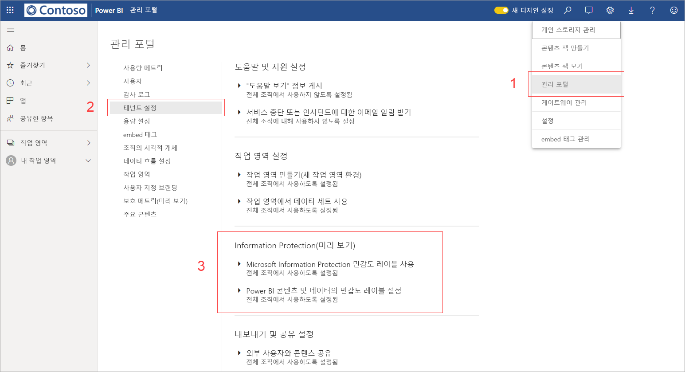
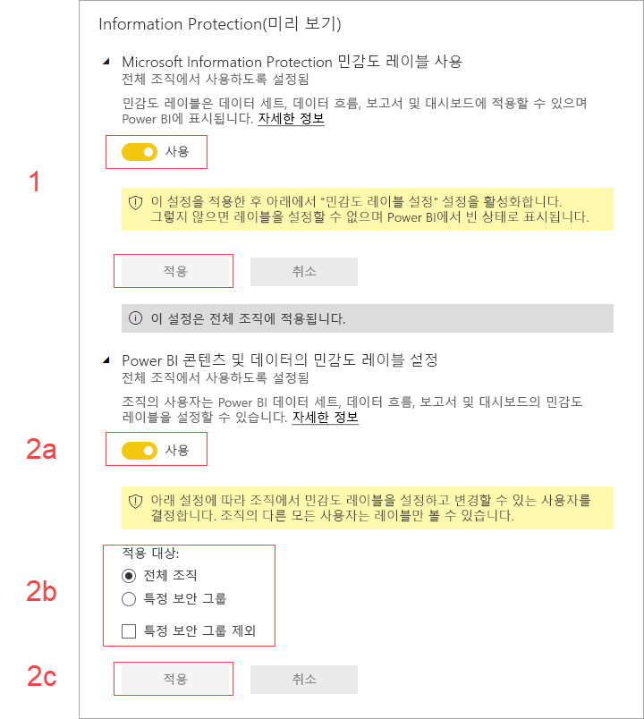

# Power BI에서 데이터 민감도 레이블 사용(미리 보기)

Power BI에서 [Microsoft Information Protection 데이터 민감도 레이블](https://docs.microsoft.com/microsoft-365/compliance/sensitivity-labels)을 사용하도록 설정하면 다음이 적용됩니다.

* 조직의 특정 사용자와 보안 그룹이 민감도 레이블을 분류하고 Power BI 대시보드, 보고서, 데이터 세트 및 데이터 흐름(이후에는 ‘자산’으로 표시됨)에 [민감도 레이블을 적용](../designer/service-security-apply-data-sensitivity-labels.md)할 수 있습니다. 
* 조직의 모든 구성원이 해당 레이블을 볼 수 있습니다.

데이터 민감도 레이블은 Power BI 작성자와 사용자가 데이터 민감도를 인식하게 하여 데이터 보호를 강화하는 동시에 분류의 의미와 해당 분류의 데이터를 처리하는 방법에 대한 정보를 제공합니다.

데이터 민감도 레이블이 포함된 Power BI 데이터를 Excel, PowerPoint 또는 PDF 파일로 내보내면 데이터 민감도 레이블도 데이터와 함께 이동합니다. 즉, 민감도 레이블 정책 때문에 레이블이 지정된 데이터에 대한 액세스 권한이 없는 사용자는 Power BI ‘외부’(Excel, PowerPoint 또는 PDF 앱)에서 파일을 열 수 없습니다. 

데이터 민감도 레이블을 사용하려면 Azure Information Protection 라이선스가 필요합니다. 자세한 내용은 [라이선스](#licensing)를 참조하세요.

## 데이터 민감도 레이블 사용

Power BI에서 Microsoft Information Protection 데이터 민감도 레이블을 사용하도록 설정하려면 Power BI 관리 포털로 이동하여 테넌트 설정 창을 열고 Information Protection 섹션을 찾습니다.

**Information Protection** 섹션에서 다음 단계를 수행합니다.
1.  **Microsoft Information Protection 민감도 레이블 사용** 토글을 사용하도록 설정하고 **적용**을 누릅니다. 이 단계는 ‘단지’ 전체 조직에서 민감도 레이블을 볼 수 있도록만 하고 레이블을 적용하지는 않습니다.  Power BI에서 해당 레이블을 적용할 수 있는 사람을 정의하려면 2단계를 완료해야 합니다.
2.  Power BI 자산에서 민감도 레이블을 적용하고 변경할 수 있는 사람을 정의합니다. 이 단계에는 다음 세 가지 작업이 포함됩니다.
    1.  **Power BI 콘텐츠 및 데이터의 민감도 레이블 설정** 토글을 사용하도록 설정합니다.
    2.  적절한 보안 그룹을 선택합니다. 기본적으로 조직의 모든 사용자가 민감도 레이블을 적용할 수 있습니다. 그러나 특정 사용자나 보안 그룹만 민감도 레이블을 설정할 수 있도록 선택할 수 있습니다. 전체 조직이나 특정 보안 그룹을 선택한 상태에서 사용자 또는 보안 그룹의 특정 하위 집합을 제외할 수 있습니다.
    * 전체 조직에 대해 민감도 레이블을 사용하도록 설정한 경우 예외는 일반적으로 보안 그룹입니다.
    * 특정 사용자나 보안 그룹에 대해서만 민감도 레이블을 사용하도록 설정한 경우 예외는 일반적으로 특정 사용자입니다.  
    이 방법을 사용하면 특정 사용자가 해당 권한이 있는 그룹에 속해 있더라도 Power BI에서 민감도 레이블을 적용하지 못하도록 방지할 수 있습니다.
    
    3. **적용**을 누릅니다.

> [!IMPORTANT]
> 자산에 대한 *‘만들기’* 및 *‘편집’* 권한이 있고, 이 섹션에서 설정된 관련 보안 그룹에 속해 있는 Power BI Pro 사용자만 민감도 레이블을 설정하고 편집할 수 있습니다. 이 그룹에 속하지 않는 사용자는 레이블을 설정하거나 편집할 수 없습니다. 

## 고려 사항 및 제한 사항

Power BI는 Microsoft Information Protection 민감도 레이블을 사용합니다. 따라서 민감도 레이블을 사용하도록 설정할 때 오류 메시지가 발생하는 경우 다음 중 하나 때문일 수 있습니다.

* Azure Information Protection [라이선스](#licensing)가 없습니다.
* 민감도 레이블이 Power BI에서 지원하는 Microsoft Information Protection 버전으로 마이그레이션되지 않았습니다. [민감도 레이블을 마이그레이션](https://docs.microsoft.com/azure/information-protection/configure-policy-migrate-labels)하는 방법을 자세히 알아보세요.
* 조직에 Microsoft Information Protection 민감도 레이블이 정의되어 있지 않습니다. 또한 게시된 정책에 포함된 레이블만 사용할 수 있습니다. [민감도 레이블에 대해 자세히 알아보거나](https://docs.microsoft.com/Office365/SecurityCompliance/sensitivity-labels), [Microsoft 보안 및 규정 준수 센터](https://sip.protection.office.com/sensitivity?flight=EnableMIPLabels)를 방문하여 조직의 레이블 및 게시 정책을 정의하는 방법을 알아보세요.

## 라이선싱

* Power BI에서 Microsoft Information Protection 레이블을 보거나 적용하려면 사용자에게 Azure Information Protection Premium P1 또는 Premium P2 라이선스가 있어야 합니다. Microsoft Azure Information Protection은 독립 실행형으로 구입하거나 Microsoft 라이선스 제품군 중 하나를 통해 구입할 수 있습니다. 자세한 내용은 [Azure Information Protection 가격 책정](https://azure.microsoft.com/pricing/details/information-protection/)을 참조하세요.
* Power BI 자산에 레이블을 적용해야 하는 사용자의 경우 Power BI Pro 라이선스가 있어야 합니다.

## 다음 단계

이 문서에서는 Power BI에서 데이터 민감도 레이블을 사용하도록 설정하는 방법을 설명했습니다. 다음 문서에서는 Power BI의 데이터 보호에 대해 자세히 설명합니다. 

* [Power BI의 데이터 보호 개요](service-security-data-protection-overview.md)
* [Power BI에서 데이터 민감도 레이블 적용](../designer/service-security-apply-data-sensitivity-labels.md)
* [Power BI에서 Microsoft Cloud App Security 제어 사용](service-security-using-microsoft-cloud-app-security-controls.md)
* [데이터 보호 메트릭 보고서](service-security-data-protection-metrics-report.md)