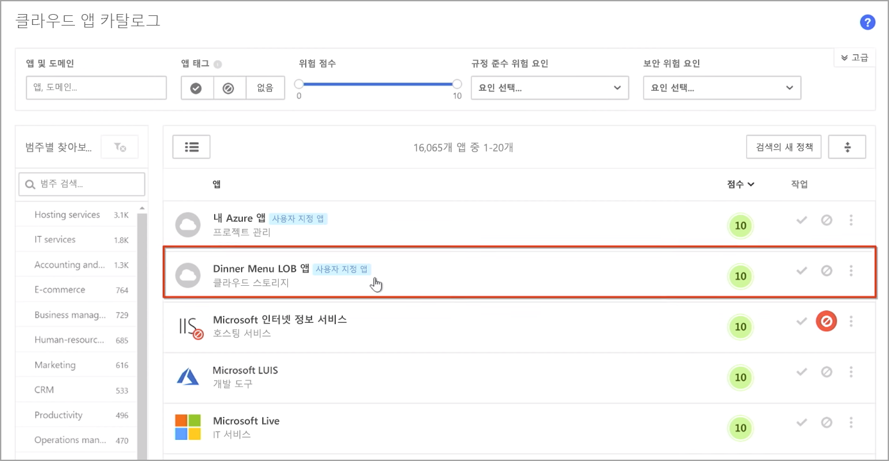
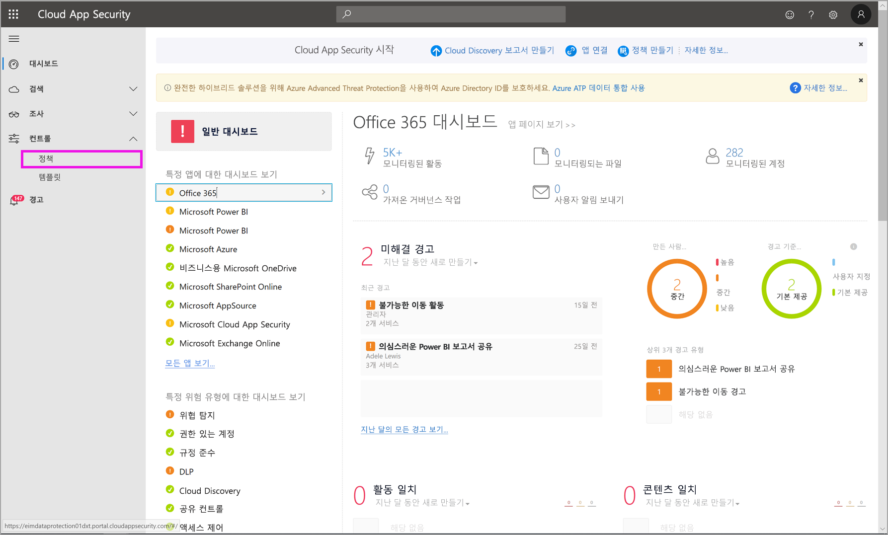
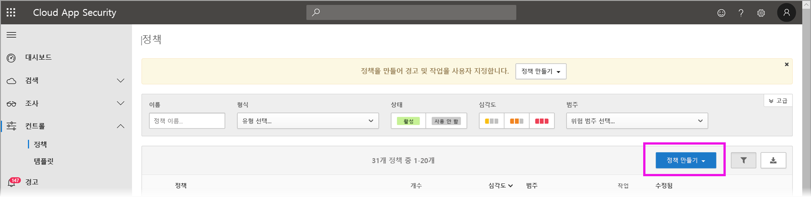
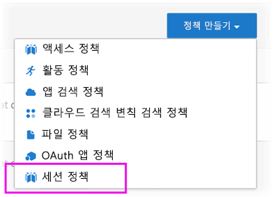
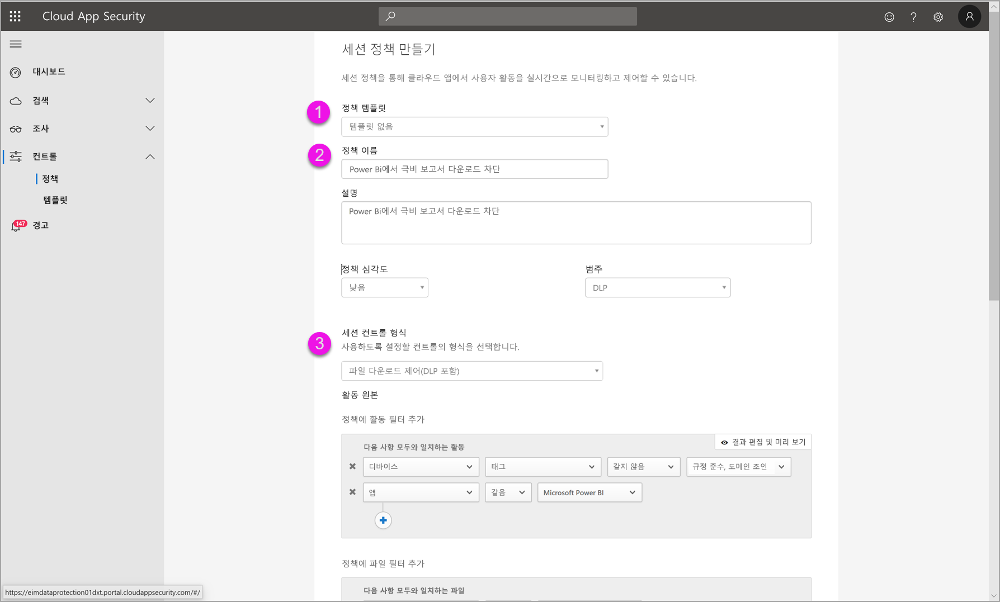
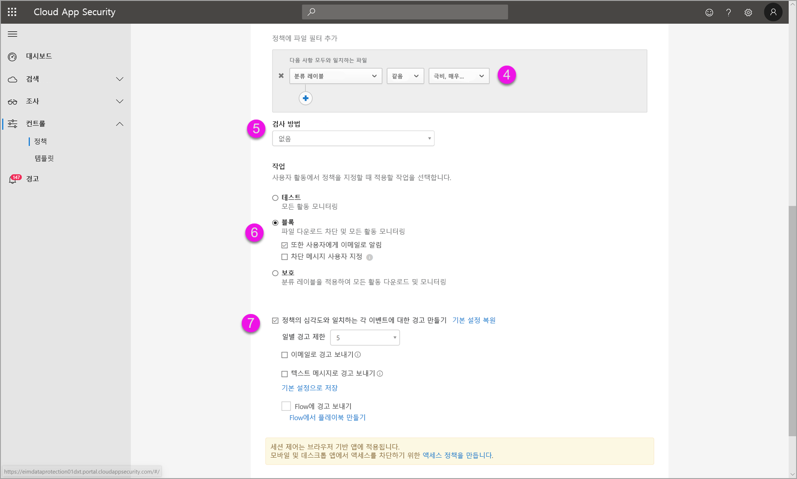

# Power BI에서 Microsoft Cloud App Security 제어 사용(미리 보기)

Power BI에서 Microsoft Cloud App Security를 사용하면 의도하지 않은 유출이나 위반으로부터 Power BI 보고서, 데이터 및 서비스를 보호할 수 있습니다. Cloud App Security에서 Azure AD(Azure Active Directory)의 실시간 세션 제어를 통해 조직의 데이터에 대한 조건부 액세스 정책을 만들어 Power BI 분석의 보안을 유지할 수 있습니다. 이러한 정책을 설정하면 관리자가 사용자 액세스 및 활동을 모니터링하고, 실시간 위험 분석을 수행하며, 레이블 관련 제어를 설정할 수 있습니다. 

Power BI뿐만 아니라 모든 종류의 앱과 서비스에 대해 Microsoft Cloud App Security를 구성할 수 있습니다. Cloud App Security는 앱과 디바이스를 보호하는 Microsoft 서비스이며, 고유한 대시보드를 통해 관리됩니다. Power BI 데이터 및 분석에 Cloud App Security 보호 기능을 활용하려면 Power BI에서 작동하도록 Cloud App Security를 구성해야 합니다. 작동 방식 개요, 대시보드, 앱 위험 점수를 포함하여 Cloud App Security에 대한 자세한 내용은 [Microsoft Cloud App Security](https://docs.microsoft.com/cloud-app-security/) 설명서를 참조하세요.

## Power BI에서 Microsoft Cloud App Security 사용

Power BI에서 Microsoft Cloud App Security를 사용하려면 관련된 Microsoft 보안 서비스를 사용 및 구성해야 하며, 일부 서비스는 Power BI 외부에서 설정됩니다.

### Microsoft Cloud App Security 라이선스

테넌트에 Microsoft Cloud App Security가 포함되려면 다음 라이선스 중 하나가 있어야 합니다.
* MCAS: EMS E5 및 M365 E5 제품군의 일부로, 지원되는 모든 앱에 OCAS 기능을 제공합니다.
* CAS-D: MCAS Discovery만 제공합니다.
* OCAS: Office E5 제품군의 일부로, Office 365에만 MCAS 기능을 제공합니다.
* 선택 사항: 주요 Microsoft Cloud App Security 기능을 활용하기 위한 AAD P1 및 AIP P1

다음 섹션에서는 Power BI에서 Microsoft Cloud App Security를 사용하는 단계를 설명합니다.

### Azure Active Directory에서 세션 정책 설정(필수)
세션 제어를 설정하는 데 필요한 단계는 Azure AD 및 Microsoft Cloud App Security 포털에서 수행합니다. Azure AD 포털에서 Power BI에 대한 조건부 액세스 정책을 만들고, Microsoft Cloud App Security 서비스를 통해 Power BI에서 사용되는 세션을 라우팅합니다. 

Microsoft Cloud App Security는 역방향 프록시 아키텍처를 사용하여 작동하며, Azure AD 조건부 액세스와 통합되어 Power BI 사용자 활동을 실시간으로 모니터링합니다. 다음 단계는 프로세스에 대한 이해를 돕기 위해 여기에 제공되었으며, 자세한 단계별 지침은 각 단계에 연결된 콘텐츠에서 제공됩니다. 전체 프로세스를 설명하는 [Cloud App Security 문서](https://docs.microsoft.com/cloud-app-security/proxy-deployment-aad)를 참조할 수도 있습니다.

1.  [Azure AD 조건부 액세스 테스트 정책 만들기](https://docs.microsoft.com/cloud-app-security/proxy-deployment-aad#add-azure-ad)
2.  [정책으로 범위가 지정된 사용자를 사용하여 각 앱에 로그인](https://docs.microsoft.com/cloud-app-security/proxy-deployment-aad#sign-in-scoped)
3.  [앱이 액세스 및 세션 제어를 사용하도록 구성되었는지 확인](https://docs.microsoft.com/cloud-app-security/proxy-deployment-aad#portal)
4.  [배포 테스트](https://docs.microsoft.com/cloud-app-security/proxy-deployment-aad#step-4-test-the-deployment)

세션 정책 설정 프로세스는 [세션 정책](https://docs.microsoft.com/cloud-app-security/session-policy-aad) 문서에서 자세히 설명합니다. 

### 변칙 검색 정책을 설정하여 PBI 활동 모니터링(권장)
정책에 포함하고 제외하려는 사용자 및 그룹에만 적용되도록 개별적으로 범위를 지정할 수 있는 Power BI 변칙 검색 정책을 정의할 수 있습니다. [자세히 알아봅니다](https://docs.microsoft.com/cloud-app-security/anomaly-detection-policy#scope-anomaly-detection-policies).

Cloud App Security에는 Power BI 전용의 두 가지 기본 제공 검색도 있습니다. [자세한 내용은 이 문서의 뒷부분에 있는 섹션을 참조하세요](#built-in-microsoft-cloud-app-security-detections-for-power-bi).

### Microsoft Information Protection 민감도 레이블 사용(권장)

민감도 레이블을 사용하면 조직의 사용자가 조직 외부의 파트너와 협업하면서 중요한 콘텐츠와 데이터를 신중하게 파악할 수 있도록 중요한 콘텐츠를 분류하고 보호할 수 있습니다. 

Power BI에 민감도 레이블을 사용하는 프로세스에 대한 자세한 내용은 [Power BI의 민감도 레이블](../designer/service-security-apply-data-sensitivity-labels.md) 문서를 참조하세요. [민감도 레이블을 기반으로 하는 Power BI 정책의 예제](#example)는 아래를 참조하세요.

## Power BI용 기본 제공 Microsoft Cloud App Security 검색

Microsoft Cloud App Security 검색을 통해 관리자는 모니터링되는 앱의 특정 활동을 모니터링할 수 있습니다. 현재 Power BI 전용의 두 가지 기본 제공 Cloud App Security 검색이 있습니다. 

* **의심스러운 공유** – 사용자가 익숙하지 않은(조직 외부) 메일을 사용하여 중요한 보고서를 공유하는 경우를 검색합니다. 중요한 보고서는 민감도 레이블이 **내부 전용** 이상으로 설정되어 있는 보고서입니다. 

* **대량 보고서 공유** – 사용자가 단일 세션에서 많은 보고서를 공유하는 경우를 검색합니다.

이러한 검색의 설정은 Cloud App Security 포털에서 구성합니다. [자세히 알아봅니다](https://docs.microsoft.com/cloud-app-security/anomaly-detection-policy#unusual-activities-by-user). 

## Microsoft Cloud App Security의 Power BI 관리자 역할

Power BI에서 Microsoft Cloud App Security를 사용하는 경우 Power BI 관리자의 새 역할이 만들어집니다. [Cloud App Security 포털](https://portal.cloudappsecurity.com/)에 Power BI 관리자로 로그인하면 Power BI 관련 데이터, 경고, 위험에 노출된 사용자, 활동 로그 및 기타 정보에 대한 액세스가 제한됩니다.

## 고려 사항 및 제한 사항 
Power BI에서 Cloud App Security를 사용하면 사용자 세션 및 해당 활동을 모니터링하는 검색을 통해 조직의 콘텐츠와 데이터를 보호할 수 있습니다. Power BI에서 Cloud App Security를 사용하는 경우 다음과 같은 몇 가지 고려 사항과 제한 사항에 유의해야 합니다.

* Microsoft Cloud App Security는 Excel, PowerPoint 및 PDF 파일에만 적용할 수 있습니다.
* Power BI에 대한 세션 정책에 민감도 레이블 기능을 사용하려는 경우 Azure Information Protection Premium P1 또는 Premium P2 라이선스가 있어야 합니다. Microsoft Azure Information Protection은 독립 실행형으로 구입하거나 Microsoft 라이선스 제품군 중 하나를 통해 구입할 수 있습니다. 자세한 내용은 [Azure Information Protection 가격 책정](https://azure.microsoft.com/pricing/details/information-protection/)을 참조하세요. 또한 Power BI 자산에 민감도 레이블이 적용되어 있어야 합니다.
* 모든 운영 체제의 모든 주요 플랫폼에 있는 모든 브라우저에서 세션 컨트롤을 사용할 수 있습니다. Internet Explorer 11, Microsoft Edge(최신 버전), Google Chrome(최신 버전), Mozilla Firefox(최신 버전) 또는 Apple Safari(최신 버전)를 사용하는 것이 좋습니다. Power BI 퍼블릭 API 호출 및 브라우저 기반이 아닌 기타 세션은 Microsoft Cloud App Security 세션 컨트롤의 일부로 지원되지 않습니다. [자세한 내용을 참조하세요](https://docs.microsoft.com/cloud-app-security/proxy-intro-aad#supported-apps-and-clients).

> [!CAUTION]
> * 현재 Microsoft Cloud App Security의 ‘콘텐츠 검사’ 정책은 Excel 파일 정책을 적용할 때 Power BI에서 사용할 수 없으므로, Power BI에 대해 이 정책을 설정하면 안 됩니다. 
> * 세션 정책의 “작업” 부분에서 “보호” 기능은 항목에 레이블이 없는 경우에만 적용됩니다. 레이블이 이미 있으면 “보호” 작업이 적용되지 않습니다. Power BI에서 항목에 이미 적용된 기존 레이블은 재정의할 수 없습니다.

## 예제

다음 예제는 Power BI에서 Microsoft Cloud App Security를 사용하여 새 세션 정책을 만드는 방법을 보여 줍니다.

먼저 새 세션 정책을 만듭니다. **Cloud App Security** 포털의 왼쪽 메뉴에서 **정책**을 선택합니다.

표시되는 창에서 **정책 만들기** 드롭다운을 선택합니다.

드롭다운의 옵션 목록에서 **세션 정책**을 선택합니다.

표시되는 창에서 세션 정책을 만듭니다. 번호가 매겨진 단계는 다음 이미지의 설정을 설명합니다.

  1. **정책 템플릿** 드롭다운에서 ‘템플릿 없음’을 선택합니다. 
  2. **정책 이름** 상자에 세션 정책에 적합한 이름을 입력합니다.
  3. **세션 제어 유형**에서 ‘제어 파일 다운로드됨(DLP 포함)’을 선택합니다. 

      **활동 원본** 섹션에서 적절한 차단 정책을 선택합니다. 비관리형 디바이스와 비규격 디바이스를 차단하는 것이 좋습니다. 세션이 Power BI에 있을 때 다운로드를 차단하려면 선택합니다.

        

        아래로 스크롤하면 더 많은 옵션이 표시됩니다. 다음 이미지는 이러한 옵션과 추가 예제를 보여 줍니다. 

  4. ‘기밀성 레이블’을 ‘매우 기밀’ 또는 조직에 가장 적합한 레이블로 선택합니다.  
  5. **검사 방법**을 ‘없음’으로 변경합니다. 
  6. 요구 사항에 맞는 **차단** 옵션을 선택합니다.
  7. 이러한 작업에 대한 경고를 만들어야 합니다.

        

        

  8. 최종적으로, **만들기** 단추를 선택하여 세션 정책을 만들어야 합니다.

        

> [!CAUTION]
> Power BI Excel 파일에 대해 **콘텐츠 검사** 정책을 만들면 안 됩니다. 이는 ‘미리 보기’ 릴리스의 알려진 제한 사항입니다. 

## 다음 단계
이 문서에서는 Microsoft Cloud App Security를 통해 Power BI에 데이터 및 콘텐츠 보호 기능을 제공할 수 있는 방법을 설명했습니다. Power BI에 대한 데이터 보호 기능과 이 기능을 사용하도록 설정하는 Azure 서비스에 대한 지원 콘텐츠를 설명하는 다음 문서를 참조할 수도 있습니다.

* [Power BI의 데이터 보호 개요](service-security-data-protection-overview.md)
* [Power BI에서 데이터 민감도 레이블 사용](service-security-enable-data-sensitivity-labels.md)
* [Power BI에서 데이터 민감도 레이블 적용](../designer/service-security-apply-data-sensitivity-labels.md)

다음 Azure 및 보안 문서도 유용할 수 있습니다.

* [Microsoft Cloud App Security 조건부 액세스 앱 제어를 사용하여 앱 보호](https://docs.microsoft.com/cloud-app-security/proxy-intro-aad)
* [추천 앱을 위한 조건부 액세스 앱 제어 배포](https://docs.microsoft.com/cloud-app-security/proxy-deployment-aad)
* [세션 정책](https://docs.microsoft.com/cloud-app-security/session-policy-aad)
* [민감도 레이블 개요](https://docs.microsoft.com/microsoft-365/compliance/sensitivity-labels)