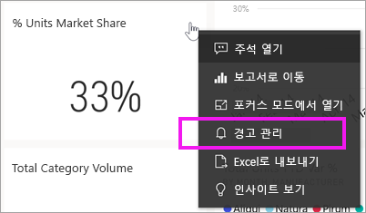
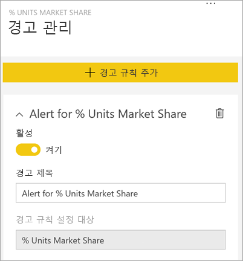
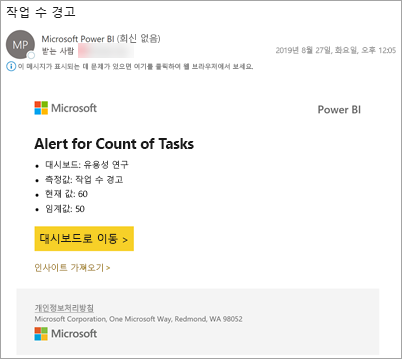
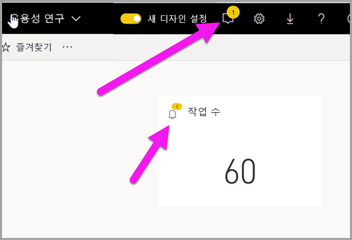
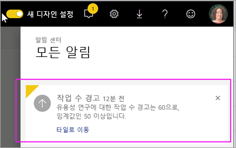
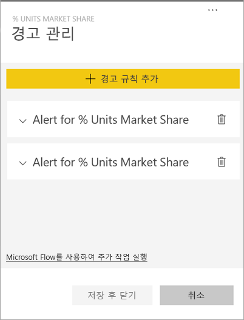
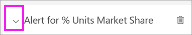
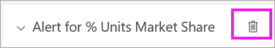

# 자습서:  Power BI 대시보드에서 대시보드 경고 설정
대시보드의 데이터가 설정해 놓은 한도보다 많이 또는 적게 변경되면 알리도록 경고를 설정합니다. 알림은 계기, KPI 및 카드에 대해 작동합니다. 이 기능은 계속 발전하고 있으므로 [아래의 팁 및 문제 해결 섹션](#tips-and-troubleshooting)을 참조하세요.

대시보드를 공유하더라도 자신이 설정한 경고만 볼 수 있습니다. 데이터 경고는 플랫폼 전반에서 완전히 동기화되며 [Power BI 모바일 앱](mobile/mobile-set-data-alerts-in-the-mobile-apps.md) 및 Power BI 서비스에서 데이터 경고를 설정하고 봅니다. 

> [!WARNING]
> 이러한 경고는 데이터에 대한 정보를 제공합니다. 모바일 디바이스에서 Power BI 데이터를 보는데 그 모바일 디바이스를 잃어버린 경우 Power BI 서비스를 사용하여 모든 경고를 해제하는 것이 좋습니다.
> 

이 자습서에서는 다음 내용을 다룹니다.
> [!div class="checklist"]
> * 경고를 설정할 수 있는 사용자
> * 경고를 지원하는 시각적 개체
> * 내 경고를 볼 수 있는 사용자
> * Power BI Desktop 및 Mobile에서 작동하는 경고
> * 경고를 만드는 방법
> * 내 경고를 수신하는 위치

아직 Power BI에 등록하지 않은 경우 시작하기 전에 [평가판에 등록합니다](https://app.powerbi.com/signupredirect?pbi_source=web).

이 예제에서는 영업 및 마케팅 샘플 앱의 대시보드 카드 타일을 사용합니다. 이 앱은 [Microsoft AppSource](https://appsource.microsoft.com)에서 사용할 수 있습니다. 앱을 다운로드하는 데 도움이 필요한 경우 [Power BI를 사용하여 앱 설치 및 사용](end-user-app-view.md)을 참조하세요.

1. 대시보드 계기, KPI 또는 카드 타일에서 줄임표(...)를 선택합니다.
   
   
2. 종 모양 아이콘  또는 **경고 관리**를 선택하여 **총 매장**에 대한 하나 이상의 경고를 추가합니다.

   

   
1. **경고 관리** 창에서 **+ 경고 규칙 추가**를 선택합니다.  슬라이더가 **켜기**로 설정되어 있는지 확인하고, 경고 제목을 입력합니다. 제목은 경고를 쉽게 인식하는 데 도움이 됩니다.
   
   
4. 아래로 스크롤하여 경고 세부 정보를 입력합니다.  이 예제에서는 시장 점유율이 35 이상으로 늘리는 경우 하루에 한 번 알리는 경고를 만듭니다. 경고는 알림 센터에 표시됩니다. Power BI에서 전자 메일도 전송됩니다.
   
   
5. **저장 후 닫기**를 선택합니다.
 
   > [!NOTE]
   > 경고는 새로 고쳐지는 데이터에만 적용됩니다. 데이터가 새로 고쳐지면, Power BI에서 해당 데이터에 대해 경고가 설정되어 있는지 확인됩니다. 데이터가 경고 임계값에 도달하면, 경고가 트리거됩니다. 
   > 

## 경고 수신
추적되는 데이터가 설정해 놓은 임계값 중 하나에 도달하면, 몇 가지 현상이 발생합니다. 먼저, Power BI에서 마지막 경고가 전송된 후 1시간을 초과하여 경과했는지 또는 24시간을 초과하여 경과했는지(선택한 옵션에 따라) 확인됩니다. 데이터가 임계값을 넘어서는 동안은, 경고를 수신하게 됩니다.

다음으로, Power BI에서 알림 센터에 경고를 보내고 필요에 따라 메일로 보냅니다. 각 경고에는 데이터에 대한 직접 링크가 포함됩니다. 관련 타일을 보려면 링크를 선택하세요.  

1. 전자 메일을 보내도록 경고를 설정해 놓으면, 다음과 같은 내용을 받은 편지함에서 찾을 수 있습니다. 이 경고는 다른 대시보드에 설정한 경고로, 이 대시보드는 유용성 팀에서 완료한 작업을 추적합니다.
   
   
2. Power BI에서 **알림 센터**에 메시지가 추가되고 해당되는 타일에 새로운 경고 아이콘이 추가됩니다.
   
   
3. 알림 센터를 열어서 경고 세부 정보를 봅니다.
   
    
   
  

## 경고 관리

경고는 여러 가지 방법으로 관리할 수 있습니다. 대시보드 타일 자체에서, Power BI 설정 메뉴에서, 그리고 [ iPhone용 Power BI 모바일 앱](mobile/mobile-set-data-alerts-in-the-mobile-apps.md) 또는 [Windows 10용 Power BI 모바일 앱](mobile/mobile-set-data-alerts-in-the-mobile-apps.md)에서 관리할 수 있습니다.

### 타일 자체에서

1. 타일에 대한 경고를 변경하거나 제거하려면, 종 모양 아이콘 을 선택하여 **경고 관리** 창을 다시 엽니다. 해당 타일에 설정해 놓은 모든 경고가 표시됩니다.
   
    을 선택합니다.
2. 경고를 수정하려면, 경고 이름 왼쪽에 있는 화살표를 선택합니다.
   
    을 선택합니다.
3. 경고를 삭제하려면, 경고 이름 오른쪽에 있는 쓰레기통을 선택합니다.
   
      

### Power BI 설정 메뉴에서

1. Power BI 메뉴 모음에서 기어 아이콘을 선택합니다.
   
    을 선택합니다.
2. **설정**에서 **경고**를 선택합니다.
   
    
3. 여기에서 경고를 켜거나 끌 수 있으며, **경고 관리** 창을 열어서 내용을 변경하거나, 경고를 삭제할 수 있습니다.

## 팁 및 문제 해결 

* 알림은 계기, KPI 및 카드에만 설정할 수 있습니다.
* 계기, KPI 또는 카드에 경고를 설정할 수 없는 경우 시스템 관리자에게 도움을 요청하세요. 대시보드 또는 특정 유형의 대시보드 타일에 대해 경고가 꺼져 있거나 사용할 수 없는 경우도 있습니다.
* 경고는 새로 고쳐지는 데이터에만 적용됩니다. 정적 데이터에 대해서는 적용되지 않습니다. Microsoft에서 제공하는 대부분의 샘플은 정적입니다. 

## 리소스 정리
경고 삭제 지침은 위에 설명되어 있습니다. 간단히 말해서 Power BI 메뉴 모음에서 기어 아이콘을 선택합니다. **설정**에서 **경고**를 선택하고 경고를 삭제합니다.

> [!div class="nextstepaction"]
> [모바일 디바이스에서 데이터 경고 설정](mobile/mobile-set-data-alerts-in-the-mobile-apps.md)

