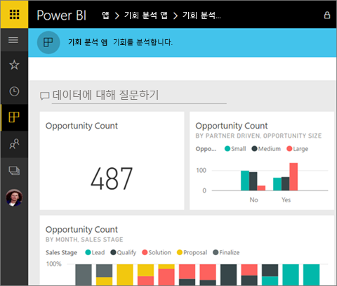
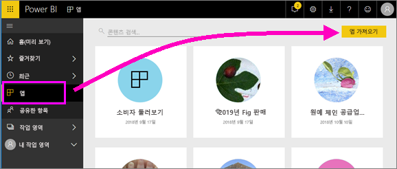
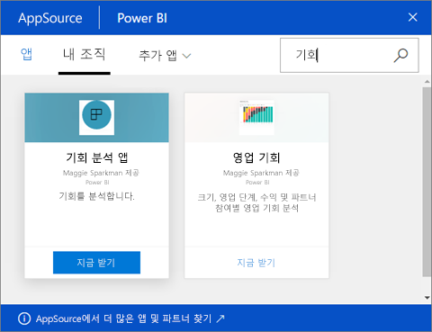

# Power BI에서 대시보드 및 보고서로 앱 설치 및 사용
이제 [앱에 대한 기본 이해](end-user-apps.md)을 했으므로, 앱을 열고 상호 작용하는 방법에 대해 알아보겠습니다. 

## 새 앱을 가져오는 방법
새 앱을 가져오는 방법에는 몇 가지가 있습니다. 보고서 디자이너 동료는 Power BI 계정에 자동으로 앱을 설치하거나 앱에 직접 링크를 보낼 수 있습니다. 또한 AppSource로 회사 내부 및 외부에서 사용할 수 있는 앱을 검색할 수 있습니다. 

모바일 디바이스의 Power BI에서는 AppSource가 아닌 직접 링크를 통해서만 설치할 수 있습니다. 앱 작성자가 앱을 자동 설치할 경우 앱 목록이 표시됩니다.

## 직접 링크에서 앱 설치
새 앱을 설치하는 가장 쉬운 방법은 앱 작성자가 이메일로 직접 링크를 받는 것입니다.  

**컴퓨터에서** 

이메일의 링크를 선택하면 Power BI 서비스([https://powerbi.com](https://powerbi.com))가 브라우저에서 열립니다. 앱을 설치하겠다고 확인하면 Power BI가 앱 방문 페이지로 열립니다.

**iOS 또는 Android 모바일 디바이스에서** 

모바일 디바이스에서 메일의 링크를 선택하면 앱이 자동으로 설치되어 모바일 앱에서 앱 콘텐츠 목록을 엽니다. 

## Microsoft AppSource에서 앱 가져오기
Microsoft AppSource에서 앱을 찾아 설치할 수도 있습니다. 액세스할 수 있는 앱(즉, 앱 작성자가 귀하에게 권한을 부여했거나 모든 사용자에게 부여한 앱)만 표시됩니다.

1. **앱**  > **앱 가져오기**를 선택합니다. 
   
     
2. AppSource의 **내 조직**에서 검색하여 결과 범위를 좁힌 후 찾고자 하는 앱을 찾을 수 있습니다.
   
     
3. **지금 가져오기**를 선택하여 앱 콘텐츠 목록에 추가합니다. 

## 앱에서 대시보드 및 보고서와 상호 작용
이제 앱에서 대시보드 및 보고서의 데이터를 탐색할 수 있습니다. 필터링, 강조 표시, 정렬 및 드릴다운과 같은 모든 표준 Power BI 상호 작용에 액세스할 수 있습니다. 보고서의 테이블 또는 다른 시각적 개체에서 [데이터를 Excel로 내보낼](end-user-export-data.md) 수도 있습니다. [Power BI에서 보고서와 상호 작용](end-user-reading-view.md)을 읽어 보세요. 

## 다음 단계
* [외부 서비스용 Power BI 앱](end-user-connect-to-services.md)
* 궁금한 점이 더 있나요? [Power BI 커뮤니티에 질문합니다.](http://community.powerbi.com/)

