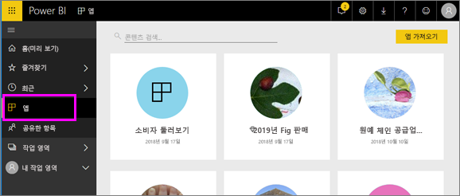

# Power BI의 앱
## Power BI 앱이란?
*앱*은 관련 대시보드 및 보고서를 모두 한 곳에서 결합하는 Power BI 콘텐츠 형식입니다. 앱은 하나 이상의 대시보드와 하나 이상의 보고서를 함께 번들할 수 있습니다. 앱은 귀하와 같은 *소비자*와 함께 앱을 배포하고 공유하는 Power BI *디자이너*에 의해 생성됩니다. 

앱은 **앱** 콘텐츠 목록에 구성되어 있습니다.

> [!NOTE]
> 앱 기능을 사용하려면 Power BI Pro 라이선스가 필요합니다. <!-- add link to how to figure out your license -->

## 앱 ***디자이너*** 및 앱 ***소비자***
사용자 역할에 따라, 본인이 사용하기 위해 앱을 만들거나(*디자이너*) 또는 동료와 공유하는 사람이 될 수 있습니다. 또는 다른 사용자가 만든 앱을 수신하고 다운로드 하는(*소비자*) 사람이 될 수 있습니다. 이 문서는 앱 *소비자*를 위한 것입니다.

## 앱의 이점
앱은 Power BI 서비스([https://powerbi.com](https://powerbi.com)) 및 모바일 디바이스에서 쉽게 찾아 설치할 수 있습니다. 앱을 설치한 후에는 다양한 여러 대시보드가 앱, 브라우저 또는 모바일 디바이스에 모두 함께 있기 때문에 그 이름들을 기억할 필요가 없습니다.

앱을 사용하면 앱 작성자가 업데이트를 릴리스할 때마다 자동으로 변경 사항을 확인할 수 있습니다. 또한 작성자는 데이터 새로 고침 예약 빈도를 조절하기도 하므로, 최신 상태로 유지하는 것에 대해 염려할 필요가 없습니다. 

<!-- add conceptual art -->
## 새 앱 가져오기
몇 가지 방법으로 앱을 가져올 수 있습니다. 
- 앱 작성자는 Power BI 계정에 자동으로 앱을 설치할 수 있으며, 다음에 Power BI를 열면 **앱** 콘텐츠 목록에서 새 앱을 볼 수 있습니다. 
- 앱 작성자는 앱에 대한 직접 링크를 이메일로 보낼 수 있습니다. 링크를 선택하면 Power BI에서 앱이 열립니다.
- 액세스할 수 있는 모든 앱을 볼 수 있는 AppSource에서 앱을 검색할 수 있습니다. AppSource에는 회사 내외부에서 보고서 디자이너가 게시한 앱이 포함되어 있습니다. 예를 들어 Google Analytics, GitHub 또는 Microsoft Dynamics와 같이 이미 사용하고 있는 서비스에 대한 AppSource에서 앱을 찾을 수 있습니다. 
- 모바일 디바이스의 Power BI에서는 AppSource가 아닌 직접 링크를 통해서만 설치할 수 있습니다. 앱 작성자가 앱을 자동 설치할 경우 앱 목록이 표시됩니다.

## 다음 단계
* [앱 열기 및 상호 작용](end-user-app-view.md)

