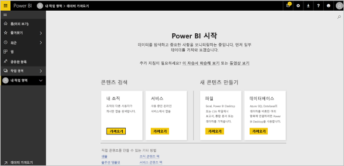
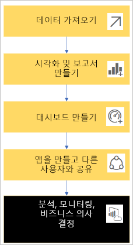
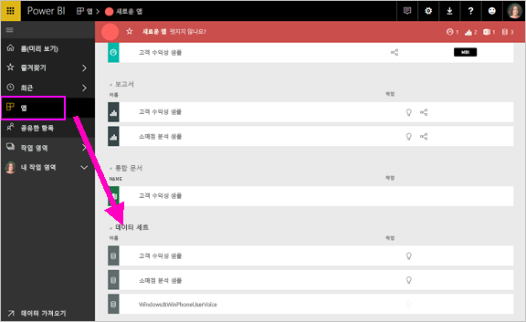
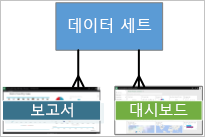
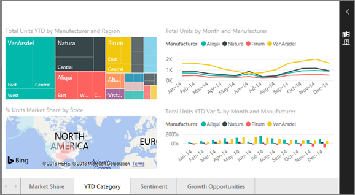
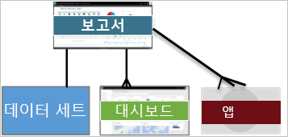
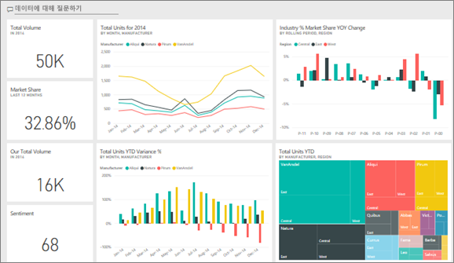
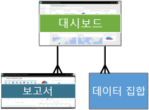
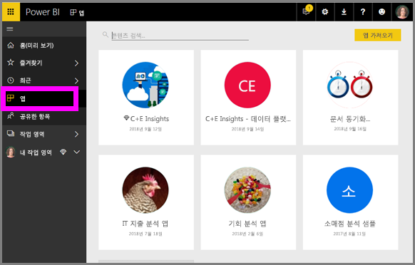
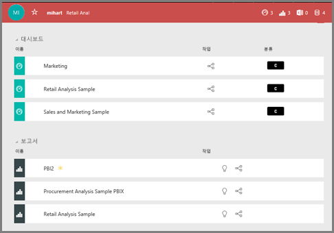

# Power BI 서비스 ***소비자를*** 위한 기본 개념

## Power BI *소비자* 및 *설계자*
이 문서에서는 독자가 [Power BI 개요](../power-bi-overview.md)를 이미 읽었고, 자신을 Power BI ***소비자***로 인식하고 있다고 가정합니다. 소비자는 동료에게 대시보드 및 보고서와 같은 Power BI 콘텐츠를 받습니다. 소비자는 웹 사이트 기반 버전의 Power BI인 Power BI 서비스를 사용합니다. 

"Power BI Desktop" 또는 "Desktop"이라는 용어는 분명히 들어보셨을 것입니다. 이는 대시보드와 보고서를 빌드하고 소비자와 함께 공유하는 *설계자*가 사용하는 독립형 도구입니다. 소비자는 Power BI 서비스만 사용하게 되므로 다른 Power BI 도구가 있다는 것만 알아두면 됩니다. 그리고 이 문서는 Power BI 서비스에만 적용됩니다. 

## 용어 및 개념
이 문서는 Power BI의 시각적 둘러보기나 실습용 자습서가 아닙니다. Power BI 용어 및 개념을 익히는 데 도움이 될 만한 개요 문서입니다. 용어와 전반적인 개념을 알려줄 것입니다. Power BI 서비스와 탐색 창을 둘러보려면 [둘러보기](end-user-experience.md)를 방문하세요.

## Power BI 서비스를 처음으로 열기
대부분의 Power BI 소비자는 1) 자신의 회사에서 라이선스를 구입했고, 2) 관리자가 그러한 라이선스를 직원에게 할당했기 때문에 Power BI 서비스를 사용합니다. 

시작하려면 브라우저를 열고 **app.powerbi.com**만 입력하면 됩니다. Power BI 서비스를 맨 처음에 열면 다음과 같은 내용이 표시됩니다.

Power BI를 사용할 때는 웹 사이트를 열 때마다 표시되는 내용을 개인 설정할 수 있습니다.  예를 들어, Power BI가 홈 페이지를 여는 것을 선호하는 사람도 있고, 즐겨찾기 대시보드에 먼저 표시되는 것을 선호하는 사람도 있습니다. 걱정하지 마세요. 그 방법을 알려드리겠습니다. 
- [홈 미리 보기](https://powerbi.microsoft.com/en-us/blog/introducing-power-bi-home-and-global-search)    
- [콘텐츠를 **추천**](end-user-featured.md) 콘텐츠로 설정 

하지만 좀 더 자세히 살펴보기 전에 Power BI 서비스를 구성하는 요소에 대한 이야기로 돌아가 보겠습니다.

## Power BI ***콘텐츠***
### 구성 요소 소개
Power BI 소비자를 위한 5가지 구성 요소는 ***시각화***, ***대시보드***, ***보고서***, ***앱*** 및 ***데이터 집합***입니다. 이를 *Power BI* ***콘텐츠***라고 부르기도 합니다. 그리고 *콘텐츠*는 ***작업 영역***에 있습니다. 일반적인 워크플로에서는 이와 같은 구성 요소가 모두 사용됩니다.  Power BI *설계자*(아래 다이어그램에서 노란색으로 표시)는 *데이터 세트*에서 데이터를 수집하고, 분석을 위해 Power BI로 가져오고, 유용한 사실과 인사이트를 보여주는 다양한 *시각화*로 구성된 *보고서*를 만들고, 보고서의 시각화를 대시보드에 고정하고, 보고서 및 대시보드를 *앱* 또는 다른 공유 콘텐츠 형태로 *소비자*와 공유합니다(아래 다이어그램에서 검은색으로 표시). 

가장 기본적으로 
*  ***시각화***(또는 *시각적 개체*)는 Power BI *설계자*가 *보고서* 및 *데이터 집합*의 데이터를 사용하여 빌드한 차트 유형입니다. 일반적으로 *설계자*는 Power BI Desktop의 시각적 개체를 빌드합니다. 

    자세한 내용은 [Power BI *소비자*용 시각화](end-user-visualizations.md)를 참조하세요.

*  *데이터 집합*은 데이터 컨테이너입니다. 예를 들어 세계 보건 기구의 Excel 파일이나 회사 소유의 고객 데이터베이스 또는 Salesforce 파일이 여기에 해당될 수 있습니다.  

*  *대시보드*는 대화형 시각적 개체, 텍스트 및 그래픽이 표시되는 단일 화면입니다. 대시보드는 가장 중요한 메트릭을 하나의 화면에 담아 스토리를 알려주거나 궁금증을 해결해 줍니다. 대시보드 콘텐츠는 하나 이상의 보고서와 하나 이상의 데이터 집합에서 가져옵니다.

    자세한 내용은[Power BI *소비자*용 대시보드](end-user-dashboards.md)를 참조하세요.

*  *보고서*는 대화형 시각적 개체, 텍스트 및 그래픽으로 구성된 여러 페이지의 모음을 말합니다. 보고서는 단일 데이터 집합을 기반으로 합니다. Oten 보고서 페이지는 개별 보고서로 정리되어, 주 관심 분야를 다루거나 단일 질문에 답합니다.

    자세한 내용은 [Power BI *소비자*용 보고서](end-user-reports.md)를 참조하세요.

*  *앱*은 *설계자*가 관련 대시보드와 보고서를 번들로 묶고 공유하는 방법입니다. *소비자*는 일부 앱을 자동으로 받지만 동료나 커뮤니티에서 만든 다른 앱을 검색하러 갈 수도 있습니다. 예를 들어 이미 사용 중일 수 있는 Google 웹로그 분석 및 Microsoft Dynamics CRM과 같은 외부 서비스는 Power BI 앱을 제공합니다.

자세히 말해서, 신규 사용자가 Power BI에 처음 로그인한 경우 대시보드, 앱 또는 보고서가 아직 없습니다. 
_______________________________________________________

## 데이터 세트
*데이터 집합*은 *설계자*가 가져오거나 연결한 다음, 보고서와 대시보드를 빌드하는 데 사용하는 데이터 컬렉션입니다. 소비자는 데이터와 직접 상호 작용하지 않지만 더 큰 그림에 어떻게 부합하는지 이해하면 도움이 될 것입니다.  

각 데이터 집합은 OneDrive의 Excel 통합 문서, 온-프레미스 SSAS 표 형식 데이터 집합, Salesforce 데이터 집합 등 데이터의 단일 원본을 나타냅니다. 다양한 데이터 원본이 지원됩니다.

설계자가 소비자와 앱을 공유하면 소비자는 앱에 포함된 데이터 집합을 확인할 수 있습니다. 

**하나의** 데이터 집합은...

* 반복해서 사용할 수 있습니다.
* 여러 보고서에서 사용할 수 있습니다.
* 해당 데이터 집합의 시각화가 여러 대시보드에 표시될 수 있습니다.
  
  

다음 단원(시각화)에서 계속.
__________________________________________________________

## 시각화
시각화(즉, 시각적 개체)는 데이터에서 발견된 정보를 표시합니다. 인간의 뇌는 숫자로 된 스프레드시트보다 그림을 더 빠르게 이해하므로 시각화를 사용하면 인사이트를 더 쉽게 파악할 수 있습니다.

Power BI에서 볼 수 있는 시각화로는 폭포, 리본, 트리맵, 원형, 깔때기, 카드, 분산형 및 게이지 등이 있습니다. [Power BI에 포함된 시각화의 전체 목록](../power-bi-visualization-types-for-reports-and-q-and-a.md)을 참조하세요.

   

시각화는 커뮤니티에서도 제공되며, 이를 *사용자 지정 시각적 개체*라고 합니다. 인식할 수 없는 시각적 개체가 포함된 보고서를 받은 경우 사용자 지정 시각적 개체일 가능성이 높습니다. 사용자 지정 시각적 개체를 해석하는 데 도움이 필요하면 <!--[look up the name of the report or dashboard *designer*](end-user-owner.md)-->보고서 이름 또는 대시보드 *설계자*를 조회하고 해당 설계자에게 문의하세요.

보고서의 **한 가지** 시각화...

* 복사/붙여넣기를 사용하여 동일한 보고서에서 계속해서 사용할 수 있습니다.
* 여러 대시보드에 사용할 수 있습니다.
__________________________________________________
## 보고서
Power BI 보고서는 시각화, 그래픽 및 텍스트로 이루어진 하나 이상의 페이지입니다. 보고서의 모든 시각화는 단일 데이터 집합에서 제공합니다. *설계자*는 [*읽기 보기*에서 보고서와 상호 작용하는](end-user-reading-view.md) *소비자*와 보고서를 공유합니다.

**하나의** 보고서는...

* 여러 대시보드에 연결할 수 있습니다. 해당 보고서에 고정된 타일이 여러 대시보드에 나타날 수 있습니다.
* 데이터 집합 하나의 데이터만 사용하여 만들 수 있습니다.  
* 여러 앱의 일부일 수 있습니다.
  
  

________________________________________________

## 대시보드
대시보드는 기본 데이터 집합의 일부 하위 집합에 대한 사용자 지정 보기를 나타냅니다. *설계자*는 대시보드를 빌드하고 개인적으로 혹은 앱에 포함하는 방법으로 *소비자*와 공유합니다. 대시보드는 *타일*, 그래픽 및 텍스트가 포함된 단일 캔버스입니다. 

  

타일은 *설계자*가 보고서에서 대시보드 등으로 *고정*하는 시각적 개체의 렌더링입니다.  고정된 각 타일에는 데이터 집합에서 만들고 대시보드에 고정된 [시각화](end-user-visualizations.md)가 표시됩니다. 또한 타일에는 전체 보고서 페이지가 포함될 수 있으며, 라이브 스트리밍 데이터 또는 동영상도 포함될 수 있습니다. *설계자*가 대시보드에 타일을 추가할 수 있는 여러 가지 방법이 있지만 이 개요 항목에서 다루기엔 너무 많습니다. 자세히 알아보려면 [Power BI의 대시보드 타일](end-user-tiles.md)을 참조하세요. 

소비자는 대시보드를 편집할 수 없습니다. 하지만 주석을 추가하고, 관련 데이터를 보고, 즐겨찾기로 설정하고, 구독하는 등의 작업은 가능합니다. 

대시보드는 어떤 용도로 사용됩니까?  몇 가지만 말하자면 다음과 같습니다.

* 의사 결정을 내리는 데 필요한 모든 정보를 한 눈에 보기 위해서
* 비즈니스에 가장 중요한 정보를 모니터링하기 위해서
* 모든 동료가 동일한 페이지에서 동일한 정보를 보고 사용하도록 하기 위해서
* 비즈니스, 제품, 사업부, 마케팅 캠페인 등의 상태를 모니터링하기 위해서
* 더 큰 대시보드의 개인 설정된 보기를 만들어 자신에게 중요한 모든 메트릭을 표시하기 위해서

**하나의** 대시보드는...

* 여러 데이터 집합의 시각화를 표시할 수 있습니다.
* 여러 보고서의 시각화를 표시할 수 있습니다.
* 다른 도구(예: Excel)에서 고정된 시각화를 표시할 수 있습니다.
  
  

________________________________________________

## 앱
이러한 대시보드 및 보고서 컬렉션은 관련 콘텐츠를 단일 패키지로 정리합니다. Power BI *설계자*는 이를 빌드하고 개인, 그룹, 전체 조직 또는 대중과 공유합니다. 소비자는 자신이 동료와 동일한 데이터(단일 버전의 진실한 정보)로 작업하고 있음을 확신할 수 있습니다. 

앱은 Power BI 서비스(https://powerbi.com) 및 모바일 장치에서 쉽게 찾아 설치할 수 있습니다. 앱을 설치한 후에는 다양한 여러 대시보드가 앱, 브라우저 또는 모바일 장치에 모두 함께 있기 때문에 그 이름들을 기억할 필요가 없습니다. 

이 앱에는 단일 앱을 구성하는 관련 대시보드 3개와 관련 보고서 3개가 있습니다.

앱을 사용하면 앱 작성자가 업데이트를 릴리스할 때마다 자동으로 변경 사항을 확인할 수 있습니다. 또한 작성자는 데이터 새로 고침 예약 빈도를 조절하기도 하므로, 최신 상태로 유지하는 것에 대해 염려할 필요가 없습니다.

몇 가지 방법으로 앱을 가져올 수 있습니다. 앱 설계자는 Power BI 계정에서 자동으로 앱을 설치하거나, 앱에 대한 직접 링크를 보내거나, Microsoft AppSource에서 검색할 수 있습니다(액세스할 수 있는 모든 앱을 볼 수 있음). 모바일 장치의 Power BI에서는 AppSource가 아닌 직접 링크를 통해서만 설치할 수 있습니다. 앱 설계자가 앱을 자동 설치할 경우 앱 목록이 표시됩니다.

앱이 설치되면 앱 목록에서 선택하고 어떤 대시보드나 보고서를 첫 번째로 열어서 살펴볼지 선택합니다.   

이 문서가 소비자용 Power BI 서비스를 이루는 구성 요소를 이해하는 데 도움이 되었기를 바랍니다. 

## 다음 단계
- [용어집](end-user-glossary.md) 검토 및 책갈피에 추가    
- [Power BI 서비스 둘러보기](end-user-experience.md)
- [소비자를 위해 특별히 작성된 Power BI 개요](end-user-consumer.md) 읽기    
- Will이 Power BI 서비스의 기본 개념을 검토하고 간략한 둘러보기를 제공하는 동영상을 시청하세요. <iframe width="560" height="315" src="https://www.youtube.com/embed/B2vd4MQrz4M" frameborder="0" allowfullscreen></iframe>