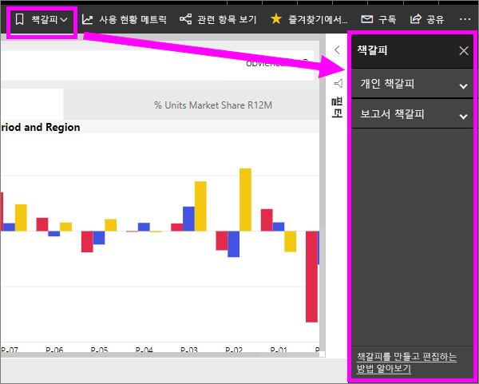
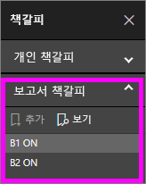
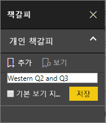
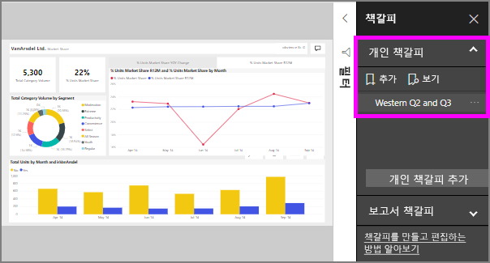

# 책갈피는 무엇인가요?
책갈피는 필터, 슬라이서 및 시각적 개체의 상태를 비롯한 보고서 페이지의 현재 구성된 보기를 캡처합니다. 책갈피를 선택하면 Power BI는 해당 보기로 이동합니다. 두 종류의 책갈피가 있습니다-사용자가 직접 만드는 책갈피와 보고서 *디자이너*에 의해 생성된 책갈피.

## 책갈피를 사용하여 Power BI에서 정보 공유 및 스토리 빌드 
책갈피에는 다양한 용도가 있습니다. 흥미로운 인사이트를 검색하고 보존하기를 원할 때-나중에 돌아올 수 있도록 책갈피를 만듭니다. 현재 페이지에서 나가야 할 때 작업을 보존하기를 원한다면 책갈피를 만듭니다. 또한 책갈피를 보고서의 기본 보기로 만들어, 매번 돌아갈 때마다 보고서 페이지의 해당 보기가 먼저 열리도록 할 수 있습니다. 

책갈피의 컬렉션을 만들고, 원하는 순서로 정렬한 다음, 프레젠테이션에서 각 책갈피를 단계별로 진행하여 스토리를 전달하는 일련의 통찰력을 강조할 수 있습니다.  

## 책갈피 사용
책갈피 창을 열려면 메뉴 모음에서 **책갈피**를 선택합니다. 보고서의 원래 게시된 보기로 돌아가려면 **기본값으로 다시 설정**을 선택합니다.

### 보고서 책갈피
경우 보고서 *디자이너* 보고서 책갈피를 포함 합니다. 아래에서 찾을 수 있습니다 합니다 **책갈피를 보고서** 제목입니다. 

해당 보고서 보기를 변경하려면 책갈피를 선택합니다. 

### 개인 책갈피

책갈피를 만들 때 책갈피에서 다음과 같은 요소가 저장됩니다.

* 현재 페이지
* 필터
* 슬라이서 유형(예: 드롭다운 또는 목록) 및 슬라이서 상태를 포함한 슬라이서
* 시각적 개체 선택 상태(예: 교차 강조 표시 필터)
* 정렬 순서
* 드릴 위치
* 표시 유형(**선택** 창을 사용하는 개체)
* 표시 되는 개체의 포커스 또는 **스포트라이트** 모드

책갈피에 표시하려는 대로 보고서 페이지를 구성합니다. 보고서 페이지 및 시각적 개체가 원하는 대로 정렬되면 **책갈피** 창에서 **추가**를 선택하여 책갈피를 추가합니다. 이 예제에서는 지역 및 날짜에 대한 몇 가지 필터를 추가했습니다. 

**Power BI**는 책갈피를 만들고 책갈피에 일반 이름 또는 입력한 이름을 제공합니다. 책갈피 이름 옆의 줄임표를 선택한 다음 나타나는 메뉴에서 작업을 선택하여 나타나는 책갈피를 *이름 바꾸기*, *삭제*, 또는 *업데이트*할 수 있습니다.

책갈피를 만든 후에 **책갈피** 창에서 책갈피를 선택하여 간단히 표시할 수 있습니다. 

<!--
## Arranging bookmarks
As you create bookmarks, you might find that the order in which you create them isn't necessarily the same order you'd like to present them to your audience. No problem, you can easily rearrange the order of bookmarks.

In the **Bookmarks** pane, simply drag-and-drop bookmarks to change their order, as shown in the following image. The yellow bar between bookmarks designates where the dragged bookmark will be placed.

The order of your bookmarks can become important when you use the **View** feature of bookmarks, as described in the next section. 

-->

## 슬라이드 쇼로 책갈피
책갈피를 순서대로 표시하거나 보려면, 슬라이드 쇼를 시작하기 위해 **책갈피** 창에서 **보기**를 선택합니다.

**보기** 모드인 경우 알아야 할 몇 가지 기능은 다음과 같습니다.

1. 책갈피의 이름은 캔버스 맨 아래에 표시되는 책갈피 제목 표시줄에 나타납니다.
2. 책갈피 제목 표시줄에는 다음 또는 이전 책갈피로 이동할 수 있도록 화살표가 있습니다.
3. **책갈피** 창에서 **종료**를 선택하거나 책갈피 제목 표시줄에서 **X**를 선택하여 **보기** 모드를 종료할 수 있습니다. 

**보기** 모드인 경우 **책갈피** 창을 닫고(해당 창에 있는 X를 클릭하여) 프레젠테이션을 위해 추가 공간을 제공할 수 있습니다. 또한 시각적 개체를 조작하는 경우와 마찬가지로 **보기** 모드인 모든 시각적 개체는 대화형이고 교차 강조 표시에 사용할 수 있습니다. 

<!--
## Visibility - using the Selection pane
With the release of bookmarks, the new **Selection** pane is also introduced. The **Selection** pane provides a list of all objects on the current page and allows you to select the object and specify whether a given object is visible. 

You can select an object using the **Selection** pane. Also, you can toggle whether the object is currently visible by clicking the eye icon to the right of the visual. 

When a bookmark is added, the visible status of each object is also saved based on its setting in the **Selection** pane. 

It's important to note that **slicers** continue to filter a report page, regardless of whether they are visible. As such, you can create many different bookmarks, with different slicer settings, and make a single report page appear very different (and highlight different insights) in various bookmarks.

## Bookmarks for shapes and images
You can also link shapes and images to bookmarks. With this feature, when you click on an object, it will show the bookmark associated with that object. This can be especially useful when working with buttons; you can learn more by reading the article about [using buttons in Power BI](desktop-buttons.md). 

To assign a bookmark to an object, select the object, then expand the **Action** section from the **Format Shape** pane, as shown in the following image.

Once you turn the **Action** slider to **On** you can select whether the object is a back button, a bookmark, or a Q&A command. If you select bookmark, you can then select which of your bookmarks the object is linked to.

There are all sorts of interesting things you can do with object-linked bookmarking. You can create a visual table of contents on your report page, or you can provide different views (such as visual types) of the same information, just by clicking on an object.

When you are in editing mode you can use ctrl+click to follow the link, and when not in edit mode, simply click the object to follow the link. 

## Bookmark groups

Beginning with the August 2018 release of **Power BI Desktop**, you can create and use bookmark groups. A bookmark group is a collection of bookmarks that you specify, which can be shown and organized as a group. 

To create a bookmark group, hold down the CTRL key and select the bookmarks you want to include in the group, then click the ellipses beside any of the selected bookmarks, and select **Group** from the menu that appears.

**Power BI Desktop** automatically names the group *Group 1*. Fortunately, you can just double-click on the name and rename it to whatever you want.

With any bookmark group, clicking on the bookmark group's name only expands or collapses the group of bookmarks, and does not represent a bookmark by itself. 

When using the **View** feature of bookmarks, the following applies:

* If the selected bookmark is in a group when you select **View** from bookmarks, only the bookmarks *in that group* are shown in the viewing session. 

* If the selected bookmark is not in a group, or is on the top level (such as the name of a bookmark group), then all bookmarks for the entire report are played, including bookmarks in any group. 

To ungroup bookmarks, just select any bookmark in a group, click the ellipses, and then select **Ungroup** from the menu that appears. 

Note that selecting **Ungroup** for any bookmark from a group takes all bookmarks out of the group (it deletes the group, but not the bookmarks themselves). So to remove a single bookmark from a group, you need to **Ungroup** any member from that group, which deletes the grouping, then select the members you want in the new group (using CTRL and clicking each bookmark), and select **Group** again. 
-->

## 제한 사항 및 고려 사항
**책갈피**의 이 릴리스에서는 몇 가지 제한 사항 및 고려 사항을 기억해야 합니다.

* 대부분의 사용자 지정 시각적 개체는 책갈피에서 잘 작동합니다. 책갈피 및 사용자 지정 시각적 개체 관련 문제가 발생하면 해당 사용자 지정 시각적 개체의 작성자에게 문의하여 시각적 개체에 책갈피 지원을 추가하도록 요청합니다. 
* 책갈피를 만든 후 보고서 페이지에서 시각적 개체를 추가하는 경우 시각적 개체는 기본 상태로 표시됩니다. 즉, 이전에 책갈피를 만든 페이지에 슬라이서를 도입하는 경우 슬라이서가 해당 기본 상태로 작동합니다.
* 책갈피를 만든 후에 시각적 개체를 이동하면 책갈피에 반영됩니다. 
* 일반적으로 보고서 *디자이너*가 보고서를 업데이트하거나 게시하는 경우, 사용자의 책갈피는 영향을 받지 않습니다. 그러나 디자이너가 책갈피가 사용하는 필드를 제거하는 등 보고서를 크게 변경한 경우, 다음에 책갈피를 열려고 할 때 오류 메시지가 나타납니다. 

<!--
## Next steps
spotlight?
-->
