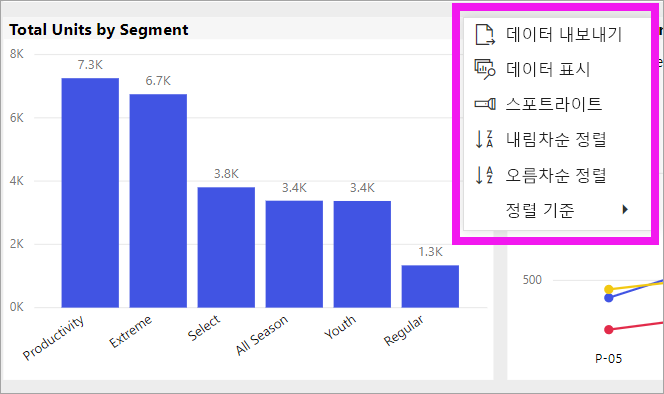

# Power BI 보고서에서 차트 정렬 방식 변경

[!INCLUDE [power-bi-service-new-look-include](../includes/power-bi-service-new-look-include.md)]

Power BI 서비스에서 다양한 데이터 필드로 정렬하여 시각적 개체의 모양을 변경할 수 있습니다. 시각적 개체의 정렬 방법을 변경하여 전달하려는 정보를 강조 표시하고 해당 추세(또는 강조점)에 시각적 효과를 반영했는지 확인할 수 있습니다.

숫자 데이터(예: 판매 수치) 또는 텍스트 데이터(예: 주 이름) 중 어떤 데이터를 사용하든지 시각화를 원하는 대로 정렬하고 모양으로 만들 수 있습니다. Power BI는 여러 가지 정렬 방법과 간편한 메뉴를 제공합니다. 시각적 개체에서 **추가 작업**(...)을 선택한 다음, 정렬 기준으로 사용할 필드를 선택합니다.

대시보드의 시각적 개체는 정렬할 수 없지만, Power BI 보고서에서 차트의 범주 이름 또는 각 범주의 숫자 값을 기준으로 대부분의 시각화를 알파벳순으로 정렬할 수 있습니다. 예를 들어 다음 차트는 **매장 이름** 범주를 기준으로 알파벳순으로 정렬되어 있습니다.

정렬 기준을 범주(매장 이름)에서 값(평방 피트당 매출)으로 대신 변경하는 것은 쉽습니다.

1. **추가 작업**(...)을 선택한 다음, **정렬 기준 > 평방 피트당 매출**을 선택합니다.
2. 필요한 경우 **추가 작업**(...)을 다시 선택하고 **내림차순 정렬**을 선택합니다. 정렬 작업에 사용 중인 필드는 굵은 글꼴로 표시되고 노란색 막대가 있습니다.

   

> [!NOTE]
> 일부 시각화는 정렬되지 않습니다. 예를 들어 트리맵, 지도, 등치 지역도, 분산형, 계기, 카드, 폭포 시각화는 정렬할 수 없습니다.

## 정렬 순서에 적용한 변경 내용 저장
Power BI 보고서에서는 필터, 슬라이서, 정렬 및 기타 데이터 보기 변경 사항을 유지합니다. 따라서 보고서에서 다른 곳으로 이동하고 나중에 돌아오면 변경 내용이 저장됩니다.  변경 내용을 보고서 디자이너 설정으로 다시 되돌리려면 위쪽 메뉴 모음에서 **기본값으로 다시 설정**을 선택합니다. 

그러나 **기본값으로 다시 설정** 단추가 회색으로 표시되면 보고서 디자이너가 변경 내용을 저장할 수 없도록 설정한 것입니다.

## 다른 조건을 사용하여 정렬
시각적 개체에 포함되지 않은 다른 필드나 다른 기준을 사용하여 시각적 개체를 정렬하려는 경우도 있습니다.  예를 들어 사전순이 아닌 월별로 정렬하려고 하거나 개별 숫자가 아닌 전체 숫자(예를 들어 0, 1, 20, 9가 아닌 0, 1, 9, 20 전체)별로 정렬하려고 할 수 있습니다.  보고서 디자이너는 이러한 유형의 정렬을 사용할 수 있도록 데이터 세트를 업데이트할 수 있습니다. 디자이너의 연락처 정보는 머리글 표시줄에서 보고서 이름을 선택하여 확인할 수 있습니다.

## 다음 단계
[Power BI 보고서의 시각화](end-user-visualizations.md)에 대해 자세히 알아보세요.

[Power BI - 기본 개념](end-user-basic-concepts.md)
