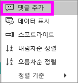
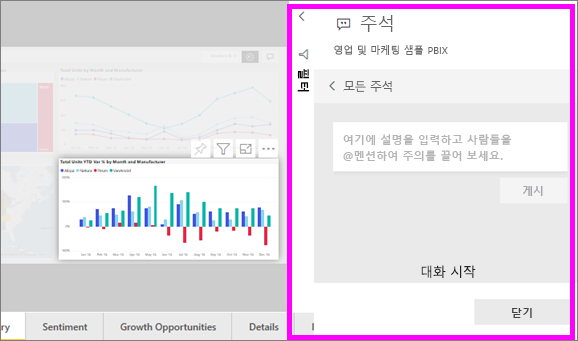
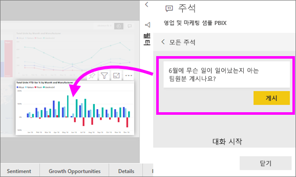
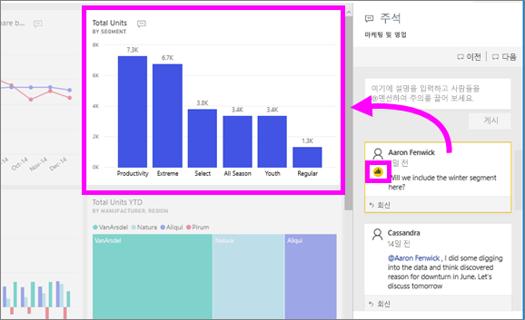

# 대시보드 또는 보고서에 주석 추가
개인 주석을 추가 하거나 동료와 대시보드 또는 보고서에 대 한 대화를 시작 합니다. **주석** 기능은 *소비자*가 다른 사용자와 공동 작업할 수 있는 방법 중 하나입니다. 

## 주석 기능 사용 방법
전체 대시보드, 대시보드 개별 시각적 개체, 보고서 페이지 및 보고서 페이지의 개별 시각적 개체에 메모를 추가할 수 있습니다. 일반 메모 또는 동료 들이 특정 목표로 메모를 추가 합니다.  

보고서에 메모를 추가 하면 Power BI는 현재 필터 및 슬라이서 값을 캡처합니다. 즉, 선택 하거나 보고서 페이지의 의견에 응답 또는 보고서 시각적 개체 필터를 보여 줍니다 변경 될 수 있습니다 하 고 주석을 처음 때 활성 상태인 슬라이서 선택 항목이 추가 됩니다.  

이 중요 한 이유는? 예를 들어 동료 팀과 공유 하 고 싶기는 흥미로운 정보를 표시 하는 필터를 적용 합니다. 선택한 해당 필터를 사용 하지 않고 주석 수 의미가 없습니다. 

### 대시보드 또는 보고서에 일반적인 주석 추가
대시보드 또는 보고서에 주석을 추가 하는 것에 대 한 프로세스는 비슷합니다. 이 예제에서는 대시보드를 사용 하는 것입니다. 

1. Power BI 대시보드 또는 보고서를 열고 선택 합니다 **주석을** 아이콘입니다. 이렇게 하면 주석 대화 상자가 열립니다.

    

    여기서는 대시보드 작성자가 이미 일반 주석을 추가한 것을 볼 수 있습니다.  이 대시보드에 대한 액세스 권한이 있는 사용자는 누구나 이 주석을 볼 수 있습니다.

    

2. 응답하려면 **회신**을 선택하고 응답을 입력한 다음, **게시물**을 선택합니다.  

    

    기본적으로 Power BI는 주석 스레드를 시작한 동료(이 경우 Aaron F)에게 응답을 보냅니다. 

    

 3. 기존 스레드에 포함 되지 않은 주석을 추가 하려는 경우 상위 텍스트 필드에 의견을 입력 합니다.

    

    이 대시보드에 대한 주석은 이제 다음과 같습니다.

    

### 특정 대시보드 또는 보고서 시각적 개체에 주석 추가
전체 대시보드 또는 전체 보고서 페이지에 주석을 추가 하는 것 외에도 개별 대시보드 타일 및 개별 보고서 시각적 개체에 주석을 추가할 수 있습니다. 프로세스 유사 하 고,이 예제 보고서를 사용 하는 것입니다.

1. 시각적 개체를 마우스로 가리키고 줄임표(...)를 선택합니다.    
2. 드롭다운에서 **댓글 추가**를 선택합니다.

      

3.  합니다 **주석을** 페이지의 다른 시각적 개체는 회색으로 표시 하 고 대화 상자가 열립니다. 이 시각적 개체에는 아직 주석이 없습니다. 

      

4. 주석을 입력하고 **게시물**을 선택합니다.

      

    - 보고서 페이지에서 시각적 개체에서 만든 주석을 선택 하면 해당 시각적 개체 (위 참조)를 강조 표시 합니다.

    - 대시보드에서 차트 아이콘  주석을 특정 시각적 개체에 연결 되어 있는지 여부를 알 수 있습니다. 전체 대시보드에 적용 되는 설명에는 특수 아이콘이 없습니다. 차트 아이콘을 선택 하면 대시보드에서 관련된 시각적 개체를 강조 표시 합니다.

        

5. **닫기**를 선택하여 대시보드 또는 보고서로 돌아갑니다.

### @ 기호를 사용하여 동료의 주의 유도
생성 하는지 여부는 대시보드, 보고서, 타일 또는 시각적 메모를 잡기 동료의 주의 사용 하 여는 "\@" 기호입니다.  입력 하는 경우는 "\@" 기호, Power BI를 검색 하 고 조직에서 개인을 선택 수 있는 드롭다운을 엽니다. "\@" 기호로 나타나는 확인된 이름은 파란색 글꼴로 표시됩니다. 

다음은 시각화 ‘디자이너’와 나누는 대화입니다.  @ 기호를 사용하여 댓글이 표시되는지 확인합니다. 이 댓글이 나에게 쓴 것인지 알고 있습니다. Power BI에서 이 앱 대시보드를 열고 헤더에서 **댓글**을 선택합니다. **댓글** 창에 대화가 표시됩니다.

  

## 다음 단계
[소비자를 위한 시각화 개체](end-user-visualizations.md)  로 돌아가기  
<!--[Select a visualization to open a report](end-user-open-report.md)-->
