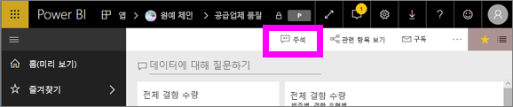
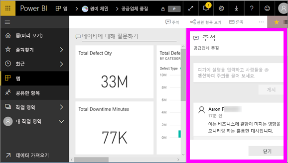
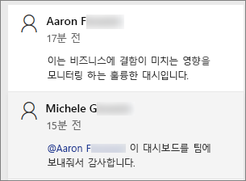
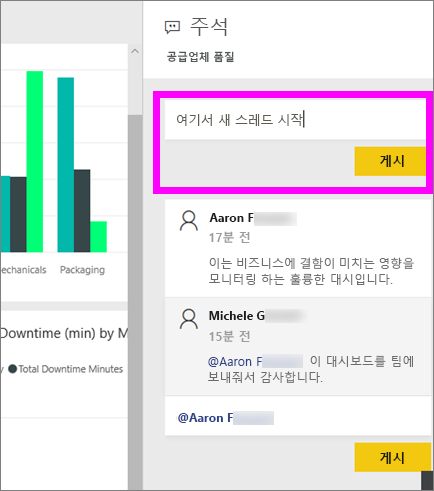
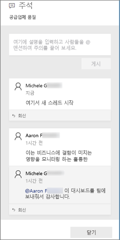
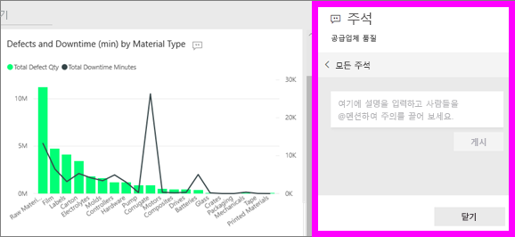
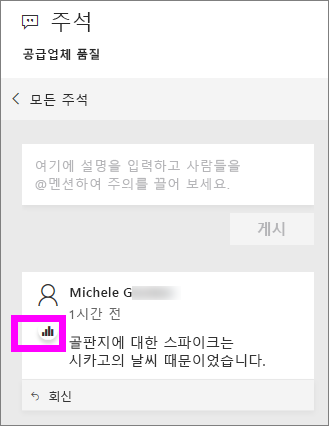
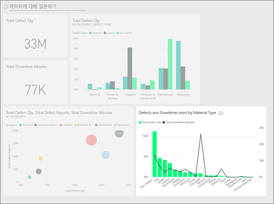

# 대시보드에 주석 추가
개별 주석을 추가하거나 동료와 대시보드에 관한 대화를 시작합니다. **주석** 기능은 *소비자*가 다른 사용자와 공동 작업할 수 있는 방법 중 하나입니다. 

## 주석 기능 사용 방법
전체 대시보드 또는 대시보드의 개별 시각적 개체에 주석을 추가할 수 있습니다. 특정 동료를 대상으로 한 일반 의견 또는 주석을 추가합니다.  

### 일반 대시보드 주석 추가
1. Power BI 대시보드를 열고 **주석** 아이콘을 선택합니다. 이렇게 하면 주석 대화 상자가 열립니다.

    

    여기서는 대시보드 작성자가 이미 일반 주석을 추가한 것을 볼 수 있습니다.  이 대시보드에 대한 액세스 권한이 있는 사용자는 누구나 이 주석을 볼 수 있습니다.

    

2. 응답하려면 **회신**을 선택하고 응답을 입력한 다음, **게시물**을 선택합니다.  

    

    기본적으로 Power BI는 주석 스레드를 시작한 동료(이 경우 Aaron F)에게 응답을 보냅니다. 

    

 3. 기존 스레드의 일부가 아닌 대시보드 주석을 추가하려면 위쪽 텍스트 필드에 주석을 입력합니다.

    

    이 대시보드에 대한 주석은 이제 다음과 같습니다.

    

### 특정 대시보드 시각적 개체에 주석 추가
1. 시각적 개체를 마우스로 가리키고 줄임표(...)를 선택합니다.    
2. 드롭다운에서 **댓글 추가**를 선택합니다.

      

3.  **주석** 대화 상자가 열립니다. 이 시각적 개체에는 아직 주석이 없습니다. 

      

4. 주석을 입력하고 **게시물**을 선택합니다.

      

    차트 아이콘  이 주석이 특정 시각적 개체에 연결되어 있는지 여부를 알 수 있습니다. 아이콘을 선택하여 대시보드에서 관련 시각적 개체를 강조 표시합니다.

    

5. **닫기**를 선택하여 대시보드 또는 보고서로 돌아갑니다.

### @ 기호를 사용하여 동료의 주의 유도
대시보드 주석을 만들거나 특정 시각적 개체에 주석을 달 때 "@" 기호를 사용하여 동료의 주의를 끕니다.  "@" 기호를 입력하면 Power BI는 조직에서 개인을 검색하고 선택할 수 있는 드롭다운을 엽니다. "@" 기호로 나타나는 확인된 이름은 파란색 글꼴로 표시됩니다. 

다음은 시각화 ‘디자이너’와 나누는 대화입니다. @ 기호를 사용하여 댓글이 표시되는지 확인합니다. 이 댓글이 나에게 쓴 것인지 알고 있습니다. Power BI에서 이 앱 대시보드를 열고 헤더에서 **댓글**을 선택합니다. **댓글** 창에 대화가 표시됩니다.

  

## 다음 단계
[소비자를 위한 시각화 개체](end-user-visualizations.md)  로 돌아가기  
<!--[Select a visualization to open a report](end-user-open-report.md)-->