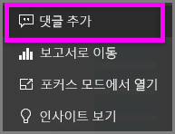
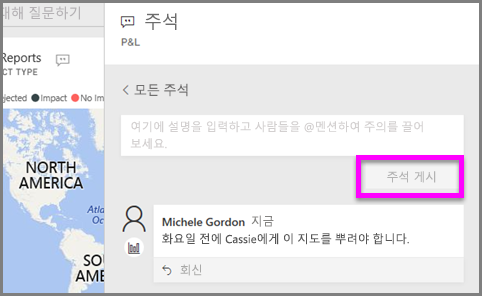
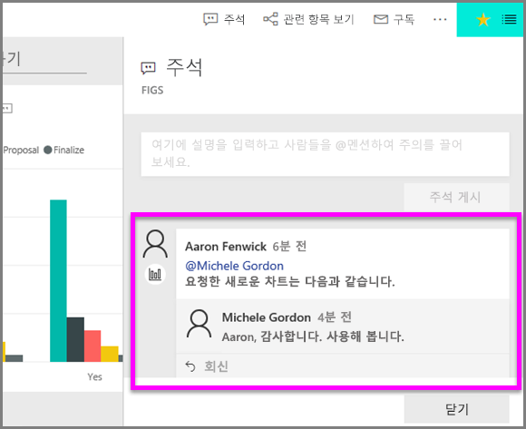

# 시각화에 댓글 추가
개별 댓글을 추가하거나 동료와 함께 시각화에 대한 대화를 시작합니다. **댓글** 기능은 ‘소비자’가 시각화 개체와 상호 작용할 수 있는 방법 중 하나입니다. 

## 댓글 기능 사용 방법

1. 시각화 개체를 마우스로 가리키고 줄임표(...)를 선택합니다.    
2. 드롭다운에서 **댓글 추가**를 선택합니다.

      

3.  댓글을 입력하고 **댓글 게시**를 선택합니다. 이것은 자기 자신에게 다는 댓글로, 맞춤법이 틀렸습니다.

      

4. 다음은 시각화 ‘디자이너’와 나누는 대화입니다. @ 기호를 사용하여 댓글이 표시되는지 확인합니다. 이 댓글이 나에게 쓴 것인지 알고 있습니다. Power BI에서 이 앱 대시보드를 열고 헤더에서 **댓글**을 선택합니다. **댓글** 창에 대화가 표시됩니다. 

      

5. **닫기**를 클릭하여 대시보드 또는 보고서로 돌아갑니다.

## 다음 단계
[소비자를 위한 시각화 개체](end-user-visualizations.md)  로 돌아가기  
<!--[Select a visualization to open a report](end-user-open-report.md)-->