# 대시보드 또는 보고서에 주석 추가
개별 주석을 추가하거나 동료와 대시보드 또는 보고서에 관한 대화를 시작합니다. **댓글** 기능은 *소비자*가 다른 사용자와 공동 작업할 수 있는 방법 중 하나입니다. 

## 의견 기능 사용 방법
전체 대시보드, 대시보드의 개별 시각적 개체, 보고서 페이지, 페이지를 매긴 보고서 및 보고서 페이지의 개별 시각적 개체에 설명을 추가할 수 있습니다. 일반 주석이나 특정 동료를 대상으로 하는 주석을 추가합니다.  

보고서에 주석을 추가할 때 Power BI는 현재 필터 및 슬라이서 값을 캡처합니다. 즉, 주석을 선택하거나 응답하면 보고서 페이지 또는 보고서 시각적 개체가 변경되어 주석을 처음 추가할 때 활성화된 필터 및 슬라이서 선택 항목을 표시할 수 있습니다.  

이 기능이 왜 중요할까요? 동료가 팀과 공유하려는 흥미로운 인사이트를 표시하는 필터를 적용했다고 가정한다면, 해당 필터를 선택하지 않을 경우 댓글이 적합하지 않을 수 있습니다.

페이지를 매긴 보고서를 사용하는 경우 보고서에 관한 일반적인 설명만 추가할 수 있습니다.  개별 보고서 시각적 개체에 관한 설명을 추가하는 기능은 지원되지 않습니다.

### 대시보드 또는 보고서에 일반 주석 추가
대시보드 또는 보고서에 주석을 추가하는 프로세스는 비슷합니다.  이 예제에서는 대시보드를 사용합니다. 

1. Power BI 대시보드 또는 보고서를 열고 **주석** 아이콘을 선택합니다. 이렇게 하면 댓글 대화 상자가 열립니다.

    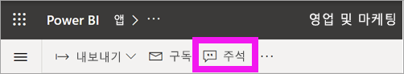

    여기서는 대시보드 작성자가 이미 일반 댓글을 추가한 것을 볼 수 있습니다.  이 대시보드에 대한 액세스 권한이 있는 사용자는 누구나 이 댓글을 볼 수 있습니다.

    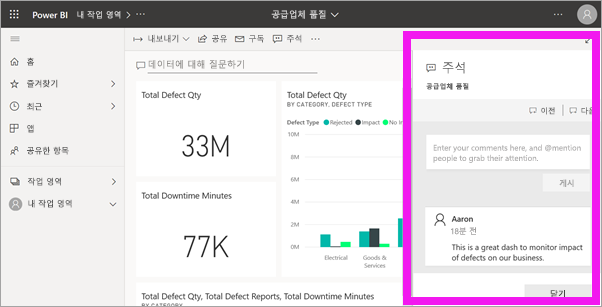

2. 응답하려면 **회신**을 선택하고 응답을 입력한 다음, **게시**를 선택합니다.  

    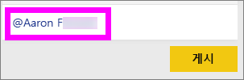

    기본적으로 Power BI는 댓글 스레드를 시작한 동료(이 경우 Aaron)에게 응답을 보냅니다. 

    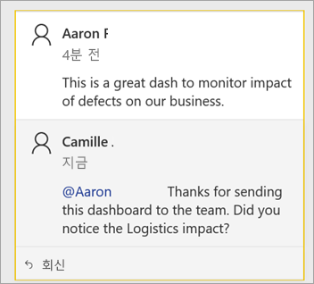

 3. 기존 스레드의 일부가 아닌 주석을 추가하려면 위쪽 텍스트 필드에 주석을 입력합니다.

    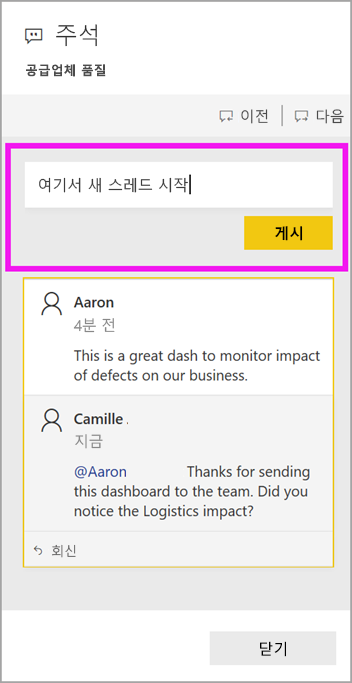

    이 대시보드에 대한 댓글은 이제 다음과 같습니다.

    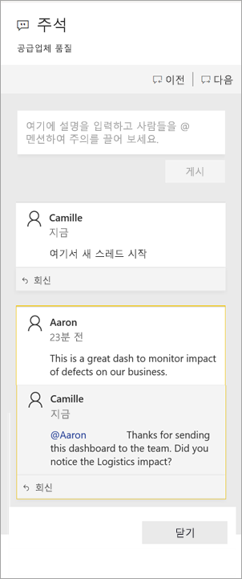

### 특정 대시보드 또는 보고서 시각적 개체에 주석 추가
전체 대시보드 또는 전체 보고서 페이지에 주석을 추가하는 것 외에도, 개별 대시보드 타일과 개별 보고서 시각적 개체에 주석을 추가할 수 있습니다. 프로세스는 비슷하며, 이 예제에서는 보고서를 사용합니다.

1. 시각적 개체를 마우스로 가리키고 줄임표(...)를 선택합니다.    
2. 드롭다운에서 **댓글 열기**를 선택합니다.

    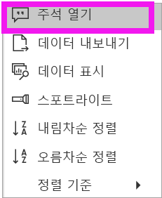  

3.  **주석** 대화 상자가 열리고, 페이지의 다른 시각적 개체는 회색으로 표시됩니다. 이 시각적 개체에는 아직 댓글이 없습니다. 

    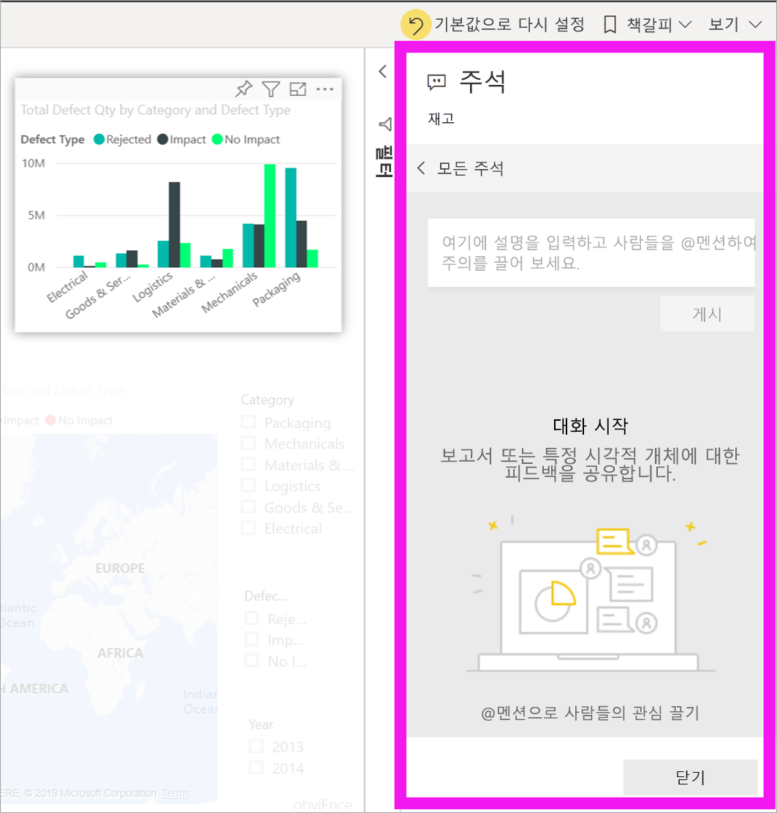  

4. 댓글을 입력하고 **게시**를 선택합니다.

    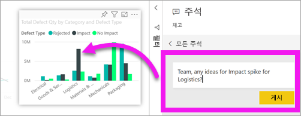  

    - 보고서 페이지에서 시각적 개체에 생성된 주석을 선택하면 해당 시각적 개체가 강조 표시됩니다(위 내용 참조).

    - 대시보드에서 차트 아이콘  을 통해 주석이 특정 시각적 개체에 연결되어 있음을 확인할 수 있습니다. 전체 대시보드에 적용되는 주석에는 특별한 아이콘이 없습니다. 차트 아이콘을 선택하면 대시보드에서 관련 시각적 개체가 강조 표시됩니다.
    

    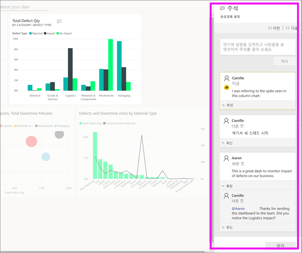

5. **닫기**를 선택하여 대시보드 또는 보고서로 돌아갑니다.

### @ 기호를 사용하여 동료의 주의 유도
대시보드, 보고서, 타일 또는 시각적 개체 댓글을 만드는지와 관계없이 “\@” 기호를 사용하여 동료의 주의를 끕니다.  “\@” 기호를 입력하면 Power BI는 조직에서 개인을 검색하고 선택할 수 있는 드롭다운을 엽니다. "\@" 기호로 나타나는 확인된 이름은 파란색 글꼴로 표시됩니다. 

다음은 시각화 ‘디자이너’와 나누는 대화입니다.  @ 기호를 사용하여 주석을 보도록 유도합니다. 이 댓글이 나에게 쓴 것인지 알고 있습니다. Power BI에서 이 앱 대시보드를 열고 머리글에서 **댓글**을 선택합니다. **댓글** 창에 대화가 표시됩니다.

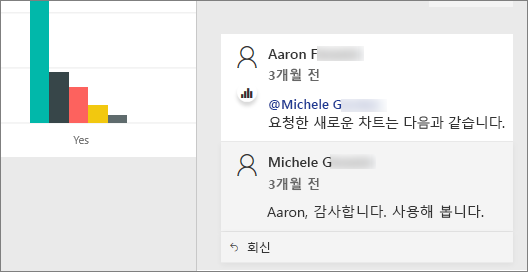  

## 다음 단계
[소비자를 위한 시각화 개체](end-user-visualizations.md)로 돌아가기    
<!--[Select a visualization to open a report](end-user-open-report.md)-->
