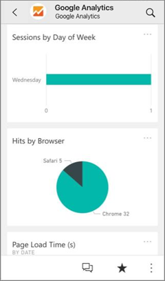
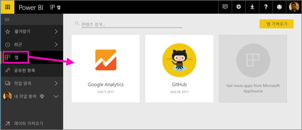
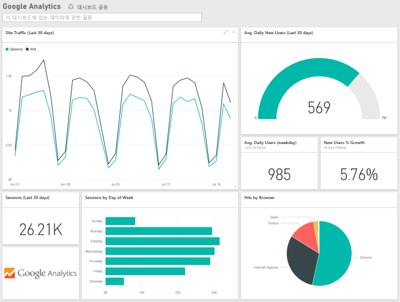
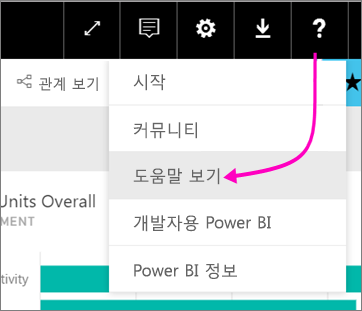

# Power BI로 사용하는 서비스에 연결

앱을 설치한 후 Power BI 서비스([https://powerbi.com](https://powerbi.com)) 및 Power BI 모바일 앱에서 대시보드 및 보고서를 볼 수 있습니다. 

## 시작
[!INCLUDE [powerbi-service-apps-get-more-apps](.././includes/powerbi-service-apps-get-more-apps.md)]

## 대시보드 및 보고서 보기
가져오기가 완료되면 새 앱이 앱 페이지에 표시됩니다.

1. 왼쪽 탐색 창에서 **앱**을 선택하고 앱을 선택합니다.
   
     
2. 질문 및 답변 상자에서 입력하여 질문하고 타일을 클릭하여 기본 보고서를 열 수 있습니다. 
   
    
   
    보고서에서 데이터를 필터링하고 강조 표시할 수 있지만 변경 내용을 저장할 수 없습니다.

## 포함된 내용
서비스에 연결한 후에 대시보드, 보고서 및 데이터 집합을 사용하여 새로 만든 앱을 볼 수 있습니다. 서비스의 데이터는 특정 시나리오에 초점을 맞추고 서비스의 모든 정보가 포함되어 있지는 않습니다. 하루에 한 번 자동으로 데이터가 새로 고쳐지도록 예약됩니다. 데이터 집합을 선택하여 일정을 제어할 수 있습니다.

특정 서비스에 연결하는 방법에 대한 자세한 내용은 개별 도움말 페이지를 참조하세요.

## 문제 해결
**빈 타일**  
Power BI가 서비스에 먼저 연결되어 있는 동안 대시보드에 빈 타일 집합이 표시될 수 있습니다. 2시간 후에 빈 대시보드가 계속 나타나면 연결하지 못한 것입니다. 문제를 해결하는 방법에 대한 정보가 포함된 오류 메시지가 표시되지 않는 경우 지원 티켓을 보관하세요.

* 오른쪽 위 모퉁이에서 물음표 아이콘(**?**) > **도움말 보기**를 선택합니다.
  
    

**누락된 정보**  
대시보드 및 보고서에는 특정 시나리오에 초점을 맞춘 서비스의 콘텐츠가 포함되어 있으며 해당 서비스의 모든 정보가 포함되어 있지는 않습니다. 콘텐츠 팩에 표시되지 않는 특정 메트릭이 있는 경우 [Power BI 지원](https://support.powerbi.com/forums/265200-power-bi) 페이지에서 개념을 추가하세요.

## 서비스 제안
Power BI 앱에 제안하려는 서비스를 사용하나요? [Power BI 지원](https://support.powerbi.com/forums/265200-power-bi) 페이지로 이동하여 의견을 알려 주세요.

앱을 구축하려는 서비스가 있나요? [추천을 제출](https://azure.microsoft.com/marketplace/programs/certified/apply/)하고 "Power BI 콘텐츠 팩 게시"를 선택하여 시작합니다.

## 다음 단계
* [Power BI에서 앱이란?](end-user-apps.md)
* [Power BI에서 데이터 가져오기](../service-get-data.md)
* 궁금한 점이 더 있나요? [Power BI 커뮤니티에 질문합니다.](http://community.powerbi.com/)

