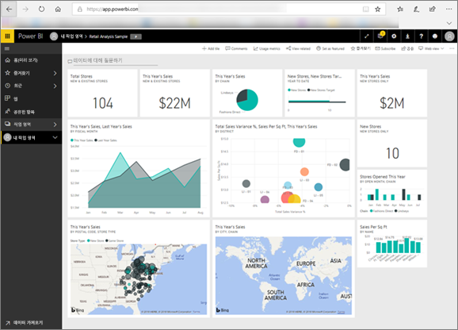

# 소비자용 Power BI
Power BI를 조작하는 방식은 작업 역할에 따라 다릅니다. ‘최종 사용자’ 또는 ‘소비자’는 동료로부터 대시보드, 보고서 및 앱을 받는 사람입니다. 비즈니스 의사 결정을 위해 ‘Power BI 서비스’에서 이 콘텐츠를 검토하고 조작합니다.****

Power BI를 처음 사용하는 경우 [Power BI 개요](../power-bi-overview.md)를 먼저 읽는 것이 좋습니다. 여기서 Power BI를 구성하는 도구 집합에 대해 알아볼 수 있습니다.

소비자는 Power BI의 전체 기능에 액세스할 수는 없지만 대시보드 및 보고서를 빌드하지 않으므로 상관이 없습니다. 사용자 작업은 Power BI를 사용하여 분석, 모니터링, 탐색 및 의사 결정을 하는 것입니다.

소비자용 문서를 읽으면서 용어를 알아보고, Power BI 서비스를 둘러보고, 콘텐츠 탐색 방법을 파악하고, 해당 콘텐츠를 조작하는 방법을 배우게 될 것입니다.  이제 시작하겠습니다.

## 다음 단계

[Power BI ‘소비자’에 대한 용어 및 개념](end-user-basic-concepts.md)

<!-- [Get started guide for *consumers*] -->
[Power BI 서비스 사용 시작](../service-get-started.md)

