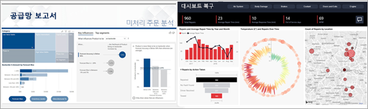

# 소비자용 Power BI

우리는 비즈니스 의사 결정이 의견이 아닌 사실을 기준으로 하는 데이터 문화권에 살고 있습니다. 이러한 결정을 내리기 위해서는 데이터가 필요하며 동료들도 도움을 줄 수 있을 것입니다.     
 
동료들은 각종 보고서, 스프레드시트, 차트를 포함하는 메일, 유인물도 보내줄 것입니다. 데이터가 점점 쌓여가면서 필요한 데이터를 찾기가 더 어려워지며, 최신 정보를 사용하고 있지 않을까 하는 걱정도 들게 됩니다.  
 

## *소비자*용 Power BI 서비스

Power BI를 사용하면 작업을 더 쉬우면서 효율적으로 수행할 수 있습니다. 이러한 모든 데이터는 데이터를 시각화하는 차트 및 그래프가 됩니다. 데이터 인사이트가 긴 목록이나 숫자와 단어의 테이블 대신, 데이터의 인사이트를 알려주는 다채롭고 멋진 시각적 요소를 사용해서 ***보기 좋게*** 표시됩니다. 

 
브라우저 또는 모바일 디바이스에서 Power BI 서비스를 엽니다. 사용자와 동료가 자동으로 업데이트되고 새로 고쳐지는 신뢰할 수 있는 동일한 대시보드 및 보고서를 사용할 수 있으므로 항상 최신 콘텐츠로 작업하게 됩니다.   

콘텐츠가 고정되어 있지 않으므로 추세, 인사이트 및 기타 비즈니스 인텔리전스를 찾아볼 수 있습니다. 콘텐츠를 조각화 및 분석하고 원하는 표현을 사용해서 질문을 할 수도 있습니다. 또는 데이터가 자동으로 흥미로운 인사이트를 제공할 때까지 기다립니다. 데이터가 변경되면 경고가 표시되고, 설정한 일정에 따라 메일로 보고서가 전송됩니다. 어떤 디바이스에서도, 클라우드나 온-프레미스 모두에서, 언제든지 모든 데이터를 사용할 수 있습니다. 이것은 Power BI로 수행할 수 있는 작업의 일부에 불과합니다. 

## 내가 Power BI *소비자*인가요?

Power BI를 조작하는 방식은 작업 역할에 따라 다릅니다. 최종 사용자 또는 *소비자*는 동료로부터 콘텐츠(대시보드, 보고서 및 앱)을 받는 사람입니다. Power BI 서비스라고 하는 Power BI의 온라인 또는 모바일 버전에서 이 콘텐츠를 검토하고 상호 작용하면서 비즈니스 의사 결정을 내립니다. 
   
소비자는 Power BI의 전체 기능에 액세스할 수는 없지만 대시보드 및 보고서를 빌드하지 않으므로 상관이 없습니다. 사용자는 Power BI 서비스를 사용하여 분석, 모니터링, 탐색 및 의사 결정을 수행합니다. 

“Power BI Desktop” 또는 “Desktop”이라는 용어는 분명히 들어보셨을 것입니다. 이는 대시보드와 보고서를 빌드하고 소비자와 함께 공유하는 *설계자*가 사용하는 독립형 도구입니다.  소비자는 Power BI 서비스만 사용하게 되므로 다른 Power BI 도구가 있다는 것만 알아두면 됩니다. 

## 콘텐츠와 안전하게 상호 작용 
필터링, 슬라이스, 구독 및 내보내기 시 작업이 기본 데이터 세트 또는 원래 공유 콘텐츠(대시보드, 보고서 및 앱)에 영향을 주지 않으므로 걱정하지 마세요.  

데이터는 손상되지 않습니다.  Power BI는 “데이터 손상” 없이 탐색하고 실험하기에 적합한 환경입니다.  
 
그렇다고 해서 변경 내용을 저장할 수 없다는 의미는 아닙니다. 하지만 이러한 변경 내용은 사용자가 보는 콘텐츠 모습에만 영향을 줍니다. 그리고 기본 보기로 되돌리기 것은 단추를 클릭하는 것만큼 쉽습니다.  

## 다음 단계

[소비자용 Power BI 서비스 둘러보기](end-user-reading-view.md)    
[소비자용 Power BI 서비스 교육](https://docs.microsoft.com/en-us/learn/paths/consume-data-with-power-bi/)    
[Power BI ‘소비자’에 대한 용어 및 개념](end-user-basic-concepts.md)     

