# Power BI에서 대시보드 및 보고서로 앱 게시

Power BI에서 관련 대시보드 및 보고서 컬렉션을 사용하여 *앱*을 게시할 수 있습니다. *앱 작업 영역*에서 앱을 만듭니다. 여기서 동료와 Power BI 콘텐츠에 대해 공동 작업할 수 있습니다. 그런 다음, 조직의 대규모 사용자 그룹에 완성된 앱을 게시할 수 있습니다. [앱 작업 영역 만들기](../service-create-workspaces.md)에 대해 자세히 알아보세요.

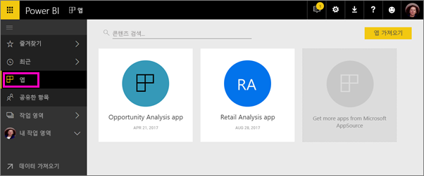

비즈니스 사용자는 비즈니스를 실행하기 위해 여러 Power BI 대시보드 및 보고서가 필요한 경우가 많습니다. Power BI 앱을 사용하면 대시보드 및 보고서의 컬렉션을 만들고 이러한 앱을 전체 조직 또는 특정 사람 또는 그룹에 게시할 수 있습니다. 보고서 작성자 또는 관리자인 경우 앱을 사용하면 이러한 컬렉션에 대한 사용 권한을 더 쉽게 관리할 수 있습니다.

비즈니스 사용자는 몇 가지 방법으로 앱을 가져옵니다. Power BI 관리자가 사용자에게 사용 권한을 부여한 경우 동료의 Power BI 계정에 앱을 자동으로 설치할 수 있습니다. 그렇지 않은 경우 Microsoft AppSource에서 해당 앱을 설치하거나 직접 링크를 보낼 수 있습니다. 한 곳에 모두 있으므로, 손쉽게 콘텐츠를 찾고 되돌아갈 수 있습니다. 이 사용자는 해당 앱의 콘텐츠를 수정할 수 없지만, Power BI 서비스에서, 또는 모바일 앱 중 하나와 상호 작용할 수 있습니다(데이터 필터링, 강조 표시 및 정렬 등). 업데이트를 자동으로 가져오므로, 데이터 새로 고침 빈도를 조절할 수 있습니다. [비즈니스 사용자의 앱 환경](end-user-apps.md)에 대해 자세히 알아보기

**알고 계십니까?** Power BI는 새 작업 영역 환경을 미리 보기 상태로 제공합니다. [새 작업 영역 만들기(미리 보기)](../service-create-the-new-workspaces.md)를 참고하여 나중에 작업 영역을 변경하는 방법을 알아봅니다. 

## 앱 및 조직 콘텐츠 팩
앱은 조직 콘텐츠 팩이 진화된 것입니다. 콘텐츠 팩은 새 작업 영역 환경 미리 보기에서 사용할 수 없습니다. 새 작업 영역 환경이 일반 공급되면 새로 만든 작업 영역에서 콘텐츠 팩을 사용할 수 없습니다. 아직 수행하지 않은 경우 콘텐츠 팩을 앱으로 마이그레이션하기 시작합니다.

## 비디오: 앱 및 앱 작업 영역
<iframe width="640" height="360" src="https://www.youtube.com/embed/Ey5pyrr7Lk8?showinfo=0" frameborder="0" allowfullscreen></iframe>

## 앱에 대한 라이선스
앱 작업 영역의 사용자에게는 각각 Power BI Pro 라이선스가 필요합니다. 앱 사용자인 경우 두 가지 옵션이 있습니다.

* 옵션 1: 모든 비즈니스 사용자는 **Power BI Pro** 라이선스가 있어야 앱을 볼 수 있습니다. 
* 옵션 2: 조직의 무료 사용자는 앱이 Power BI 프리미엄 용량에 있는 경우에 앱 콘텐츠를 볼 수 있습니다. 자세한 내용은 [Power BI 프리미엄이란?](../service-premium.md)을 참조하세요.

## 앱 게시
작업 영역의 대시보드 및 보고서가 준비되면 게시하려는 대시보드 및 보고서를 선택한 다음, 앱으로 게시합니다. 더 광범위한 대상 그룹에게 직접 링크를 보내거나, **AppSource에서 더 많은 앱 다운로드 및 탐색**으로 이동하여 앱 탭에서 앱을 찾을 수 있습니다. 

1. 작업 영역 목록 뷰에서 앱에 포함할 대시보드와 보고서를 결정합니다.

     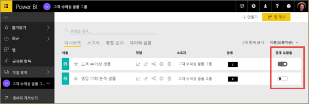

     보고서를 게시하지 않기로 선택한 경우 보고서 옆에 경고와 관련 대시보드가 표시됩니다. 앱을 게시할 수는 있지만 관련 대시보드가 해당 보고서의 타일에서 누락됩니다.

     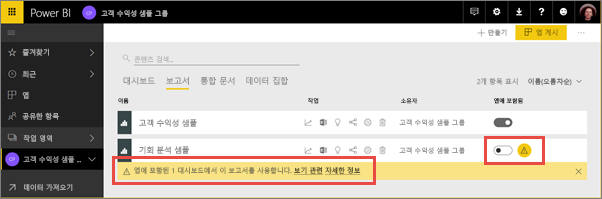

2. 오른쪽 위에서 **앱 게시** 단추를 선택하여 해당 작업 영역의 모든 콘텐츠를 공유하는 프로세스를 시작합니다.
   
     

3. 사람들이 해당 앱을 찾는 데 도움이 되도록 **세부 정보**에서 설명을 입력합니다. 배경색을 지정하여 개인 설정할 수 있습니다.
   
     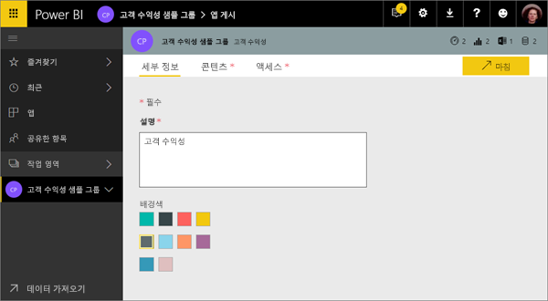

4. **콘텐츠**에서 앱의 일부로 게시하려는 콘텐츠(해당 작업 영역에서 선택한 모든 항목)가 보입니다. 또한, 사람들이 앱으로 이동하여 처음 보게 되는 대시보드 또는 보고서로 앱 시작 페이지를 설정할 수도 있습니다. **없음**을 선택할 수 있습니다. 그러면 앱의 모든 콘텐츠 목록을 표시합니다. 
   
     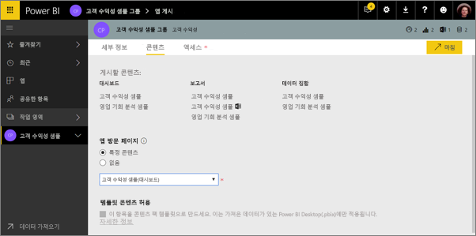

5. **액세스**에서 앱에 액세스할 수 있는 사람을 조직의 모든 사람, 특정 사람, Active Directory 보안 그룹 중에서 결정합니다. 권한이 있는 경우 받는 사람에 대해 앱 자동 설치를 선택할 수 있습니다. [Power BI 관리 포털](#how-to-enable-pushing-apps)에서 이 설정을 사용하도록 설정할 수 있습니다. [앱을 푸시](#how-to-enable-pushing-apps)하기 위한 추가 고려사항을 알아볼 수 있습니다.

    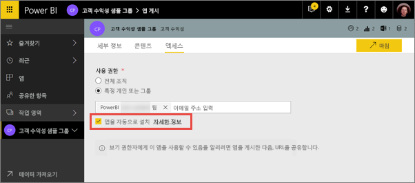

6. **마침**을 선택하면 게시할 준비가 되었음을 확인하는 메시지가 나타납니다. 성공 대화 상자에서는 이 앱에 대한 직접 링크인 URL을 복사하여 이를 공유한 사람에게 보낼 수 있습니다.
   
     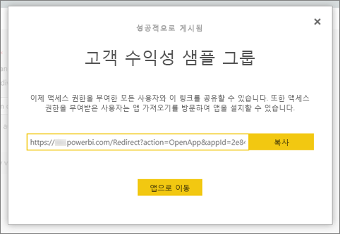

[비즈니스 사용자의 앱 환경](end-user-apps.md)에 대해 자세히 알아보기

## 게시된 앱 변경
앱 게시 후, 변경하거나 업데이트하고 싶을 수 있습니다. 해당 앱 작업 영역의 관리자 또는 멤버이거나 새로운 앱 작업 영역의 기여자인 경우 업데이트하기 쉽습니다. 

1. 앱에 해당하는 앱 작업 영역을 엽니다. 
   
     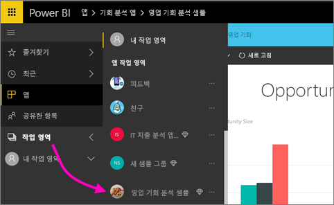
2. 대시보드 또는 보고서를 엽니다. 원하는 변경 사항을 적용할 수 있습니다.
   
     앱 작업 영역은 스테이징 영역이므로 다시 게시할 때까지 앱의 변경 내용은 반영되지 않습니다. 이를 통해 게시된 앱에 영향을 미치지 않고 변경 사항을 적용할 수 있습니다.  
 
3. 콘텐츠의 앱 작업 영역 목록으로 돌아가서 **앱 업데이트**를 선택합니다.
   
     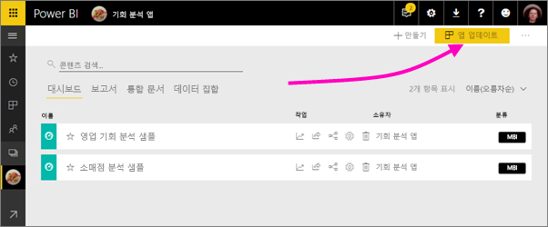

4. 필요한 경우 **세부 정보**, **콘텐츠**, **액세스**를 업데이트하고 **앱 업데이트**를 선택합니다.
   
     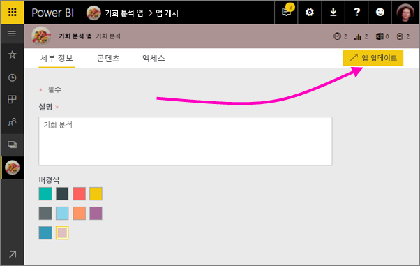

해당 앱을 게시한 사람들은 자동으로 업데이트된 버전의 앱을 보게 됩니다. 

## 최종 사용자에 대해 자동으로 앱 설치
앱은 최종 사용자가 해당 작업을 수행하기 위해 필요한 데이터를 제공합니다. 관리자가 사용자에게 사용 권한을 부여한 경우 자동으로 최종 사용자에게 앱을 설치하여 올바른 앱을 올바른 사용자 또는 그룹에 쉽게 배포할 수 있습니다. Microsoft AppSource에서 찾거나 설치 링크를 따를 필요 없이 최종 사용자의 앱 콘텐츠에서 앱이 자동으로 나타납니다. 이렇게 하면 사용자에게 표준 Power BI 콘텐츠를 쉽게 제공할 수 있습니다.

### 최종 사용자에게 앱을 자동으로 설치하는 방법
관리자가 사용 권한을 할당하면 **앱을 자동으로 설치**하는 새로운 옵션이 표시됩니다. 상자를 선택하고 응용 프로그램 게시자가 **마침**(또는 기존 앱의 경우 **앱 업데이트**)을 선택하는 경우 앱은 **액세스** 탭에 있는 앱의 **사용 권한** 섹션에서 정의된 모든 사용자 또는 그룹에 푸시됩니다.

### 사용자가 푸시된 앱을 가져오는 방법
앱을 푸시한 후에 자동으로 앱 목록을 표시합니다. 조직의 특정 사용자 또는 작업 역할이 바로 액세스해야 하는 앱을 조정할 수 있습니다.

### 앱을 자동으로 설치하기 위한 고려 사항
앱을 최종 사용자에게 푸시할 때 유의할 사항은 다음과 같습니다.

* 사용자에게 앱을 자동으로 설치하는 데 시간이 걸릴 수 있습니다. 대부분의 앱은 사용자에게 즉시 설치되지만 앱을 푸시하는 데 시간이 걸릴 수 있습니다.  앱에 있는 항목의 수 및 액세스 권한이 부여된 사용자의 수에 따라 다릅니다. 사용자가 필요로 하기 전에 업무 외 시간 동안 충분히 앱을 푸시하는 것이 좋습니다. 앱의 가용성에 대한 광범위 통신을 보내기 전에 여러 사용자에게 확인합니다.

* 브라우저를 새로 고칩니다. 앱 목록에서 푸시된 앱을 표시하기 전에 사용자를 새로 고치거나 해당 브라우저를 닫았다가 다시 열어야 합니다.

* 사용자가 앱 목록에서 앱을 즉시 확인하지 않는 경우 해당 브라우저를 새로 고치거나 닫았다가 다시 열어야 합니다.

* 사용자에게 과도한 부하가 걸리지 않도록 하세요. 사용자가 미리 설치된 앱이 유용함을 인식할 수 있도록 너무 많은 앱을 푸시하지 않도록 합니다. 타이밍을 조정하기 위해 최종 사용자에게 앱을 푸시할 수 있는 사용자를 제어하는 것이 좋습니다. 최종 사용자에게 푸시된 조직의 앱을 가져오기 위해 연락 지점을 설정할 수 있습니다.

* 초대를 수락하지 않은 게스트 사용자의 경우 자동으로 앱이 설치되지 않습니다.  

## 앱 게시 취소
앱 작업 영역의 모든 멤버는 앱 게시를 취소할 수 있습니다.

* 앱 작업 영역의 오른쪽 위 모서리 > **앱 게시 취소**에서 줄임표(**...**)를 선택합니다.
  
     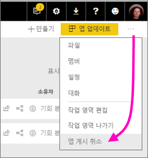

이 작업은 게시된 모든 사용자의 앱을 제거하고 더 이상 액세스 권한을 갖지 않습니다. 앱 작업 영역 또는 해당 내용을 삭제하지 않습니다.

## 다음 단계
* [앱 작업 영역 만들기](../service-create-workspaces.md)
* [Power BI에서 앱 설치 및 사용](end-user-apps.md)
* [외부 서비스용 Power BI 앱](end-user-connect-to-services.md)
* [Power BI 관리 포털](https://docs.microsoft.com/power-bi/service-admin-portal)
* 궁금한 점이 더 있나요? [Power BI 커뮤니티에 질문합니다.](http://community.powerbi.com/)
