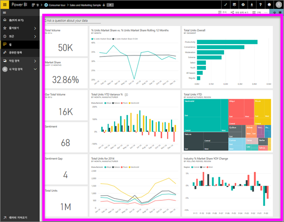

# 대시보드 보기
Power BI 소비자는 대시보드를 보는 데 많은 시간을 소비합니다. 대시보드는 기본 보고서 및 데이터 집합에서 특정 정보를 강조 표시하도록 설계되었습니다. 또한 Power BI 소비자는 데이터 기반 비즈니스 의사 결정을 수행하기 위해 추적, 모니터링, 질문에 답변, 테스트 등에 해당 정보를 사용합니다.

Power BI Pro는 대시보드를 공유하고 공유한 대시보드를 보는 데 필요합니다.

## 대시보드 열기
대시보드는 Power BI 서비스의 여러 위치에서 열 수 있습니다.  핵심은 어느 콘텐츠가 대시보드인지 파악하는 것입니다(예: 보고서와 비교). 대시보드를 식별한 후 대시보드를 클릭하여 열면 Power BI 캔버스가 채워집니다.

|              |         |
|------------|--------------------------------|
|      |대시보드를 식별하는 가장 쉬운 방법은 이  대시보드 아이콘을 찾는 것입니다. 이 아이콘으로 콘텐츠를 찾은 경우에는 이 아이콘을 선택하여 대시보드를 엽니다. |
|                    |          |

 

<!--insert aGIF-->

왼쪽 탐색 모음에 있는 모든 컨테이너에서 대시보드를 찾을 수 있습니다. 
- **홈**(미리 보기)
- **즐겨찾기** - [대시보드를 즐겨찾기로 설정](end-user-favorite.md)한 경우
- **최근 항목** - 최근에 대시보드를 방문한 경우
- **앱** - 대부분의 앱에는 대시보드와 보고서가 모두 포함되어 있음
- **공유한 항목** - 동료가 [대시보드를 공유](end-user-shared-with-me.md)한 경우
- **내 작업 영역** - [Power BI 샘플](../sample-datasets.md)을 다운로드한 경우

## 다음 단계
* [샘플 대시보드](../sample-tutorial-connect-to-the-samples.md) 중 하나를 둘러보면 대시보드에 금방 익숙해 집니다.
* [대시보드 타일](end-user-tiles.md)과 선택할 경우 어떻게 되는지 알아보세요.
* 개별 대시보드 타일을 추적하고 특정 임계값에 도달하면 전자 메일을 수신하고 싶은가요? [타일에 경고를 만듭니다](end-user-alerts.md).
* 즐겁게 대시보드 질문을 활용하세요. [Power BI 질문 및 답변](end-user-q-and-a.md)을 사용하여 데이터에 대한 질문을 하고 시각화 형태로 답변을 받는 방법에 대해 알아봅니다. 