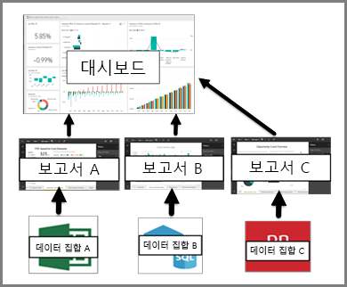

# Power BI 서비스 소비자에 대한 대시보드

Power BI ***대시보드***는 보통 캔버스라고도 하며 스토리를 전달하기 위해 시각화를 사용하는 단일 페이지입니다. 한 페이지로 제한되기 때문에 해당 스토리의 가장 중요한 요소만 포함할 경우 잘 디자인된 대시보드라 할 수 있습니다.

대시보드에 표시되는 시각화를 타일이라고 하며 보고서에서 대시보드에 고정됩니다. Power BI를 처음 접하는 경우 [Power BI 기본 개념](end-user-basic-concepts.md)을 읽으면 적절한 기초 정보를 얻을 수 있습니다.

> [!NOTE]
> 대시보드는 Power BI 서비스의 기능이며 Power BI Desktop에서는 사용할 수 없습니다. 모바일 장치에서는 대시보드를 만들 수 없지만 [보고 공유](mobile/mobile-apps-view-dashboard.md)할 수는 있습니다.
> 
> 

대시보드의 시각화는 보고서를 기반으로 하며 각 보고서는 한 개의 데이터 집합을 기반으로 합니다. 사실, 대시보드를 생각하는 한 가지 방법은 기본 보고서와 데이터 집합으로 들어가는 입구로 여기는 것입니다. 시각화를 선택하면 이를 만드는 데 사용한 보고서(및 데이터 집합)으로 이동합니다.

## 대시보드의 장점
대시보드는 비즈니스를 모니터링하고, 답변을 찾고, 가장 중요한 모든 메트릭을 한 눈에 볼 수 있는 훌륭한 방법입니다. 대시보드의 시각화는 하나 또는 여러 개의 기본 데이터 집합, 하나 또는 여러 개의 기본 보고서에서 제공될 수 있습니다. 대시보드는 온-프레미스 및 클라우드에서 생성된 데이터를 결합하여 데이터의 현재 위치에 관계없이 통합된 보기를 제공합니다.

대시보드는 단순한 예쁜 그림이 아닙니다. 대화형이며 자유롭게 사용자 지정 가능하고 기본 데이터가 변경되면 타일이 업데이트됩니다.

## 대시보드 및 보고서
대개 보고서는 시각화로 채워진 캔버스이므로 대시보드와 혼동됩니다. 하지만 몇 가지 주요 차이점이 있습니다.

| **기능** | **대시보드** | **보고서** |
| --- | --- | --- |
| 페이지 |한 페이지 |한 페이지 이상 |
| 데이터 소스 |대시보드당 보고서 및 데이터 집합 모두 하나 이상 |보고서당 단일 데이터 집합 |
| Power BI Desktop에서 사용 가능 |아니요 |예, 바탕 화면에서 보고서를 만들고 볼 수 있음 |
| 핀 고정 |기존 시각화(타일)를 현재 대시보드에서 다른 대시보드로만 핀 고정 가능 |핀 시각화(타일로)를 임의 대시보드로 핀 고정 가능. 전체 보고서 페이지를 임의 대시보드로 핀 고정 가능. |
| 구독 |대시보드는 구독할 수 없음 |보고서 페이지 구독 가능 |
| 필터링 |필터링 또는 조각화 불가능 |필터링, 강조 표시 및 조각화를 위한 다양한 방법 |
| 경고 설정 |특정 조건이 충족되는 경우 전자 메일 경고를 만들 수 있음 |아니요 |
| 특정 |한 대시보드를 “주천” 대시보드로 설정할 수 있음 |추천 보고서를 만들 수 없음 |
| 자연어 쿼리 |대시보드에서 사용 가능 |보고서에서 사용 불가능 |
| 시각화 유형 변경 가능 |아니요. 실제로 보고서 소유자가 보고서에서 시각화 유형을 변경하면 대시보드에 고정된 시각화가 업데이트되지 않습니다. |예 |
| 기본 데이터 집합 테이블 및 필드를 볼 수 있음 |아니요. 데이터를 내보낼 수 있지만 대시보드 자체에서 테이블 및 필드를 볼 수 없음 |예. 데이터 집합 테이블 및 필드와 값을 볼 수 있음. |
| 시각화를 만들 수 있음 |"타일 추가"를 사용하여 위젯을 대시보드에 추가하는 것으로 제한됨 |다양한 시각적 개체 유형을 만들고 사용자 지정 시각적 개체를 추가하며 편집 권한으로 시각적 개체를 편집하는 등의 작업이 가능 |
| 사용자 지정 |이동 및 배열, 크기 조정, 링크 추가, 이름 바꾸기, 삭제 및 전체 화면 표시 등 시각화(타일)로 작업을 수행할 수 있음. 하지만 데이터와 시각화 자체는 읽기 전용입니다. |읽기용 보기에서 게시, 포함, 필터, 내보내기, .pbix로 다운로드, 관련 콘텐츠 보기, QR 코드 생성, Excel에서 분석 등을 수행할 수 있습니다.  편집용 보기에서 지금까지 언급한 모든 항목을 수행할 수 있습니다. |

## 대시보드 작성자 및 대시보드 소비자
사용자 역할에 따라 자신의 용도에 따라 또는 동료와 공유하기 위해 대시보드를 만들려는 사람이 있을 수 있습니다. 대시보드를 만들고 공유하는 방법에 대해 알아보고 싶습니다. 또는 다른 사람에게서 대시보드를 받은 사람도 있을 수 있습니다. 대시보드를 이해하고 상호 작용하는 방법에 대해 알아보고 싶습니다.

다음은 시작하는 데 도움이 되는 몇 가지 항목을 역할별로 정리한 것입니다.

Power BI Pro는 대시보드를 공유하고 공유한 대시보드를 보는 데 필요합니다.

### 대시보드를 수신하고 사용하는 경우
* [샘플 대시보드](../sample-tutorial-connect-to-the-samples.md) 중 하나를 둘러보면 대시보드에 금방 익숙해 집니다.
* [대시보드 타일](end-user-tiles.md)과 선택할 경우 어떻게 되는지 알아보세요.
* 개별 대시보드 타일을 추적하고 특정 임계값에 도달하면 전자 메일을 수신하고 싶은가요? [타일에 경고를 만듭니다](end-user-alerts.md).
* 즐겁게 대시보드 질문을 활용하세요. [Power BI 질문 및 답변](end-user-q-and-a.md)을 사용하여 데이터에 대한 질문을 하고 시각화 형태로 답변을 받는 방법에 대해 알아봅니다.

> [!TIP]
> 여기서 찾고 있는 항목이 없으면 왼쪽 내용에 있는 목차를 사용합니다.
> 

## 다음 단계
[Power BI란?](../power-bi-overview.md)  
[Power BI - 기본 개념](end-user-basic-concepts.md)  