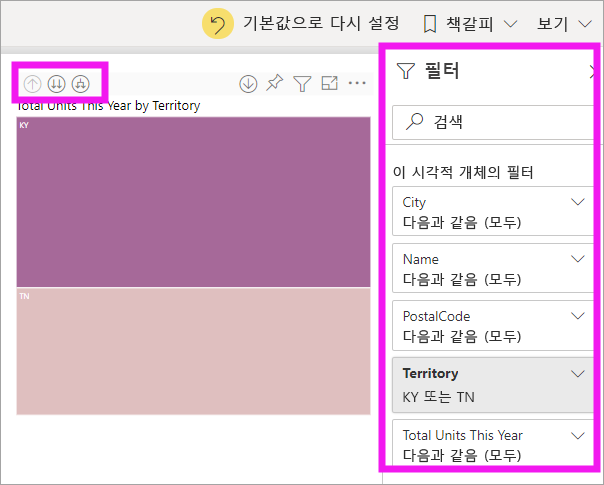
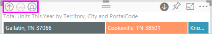
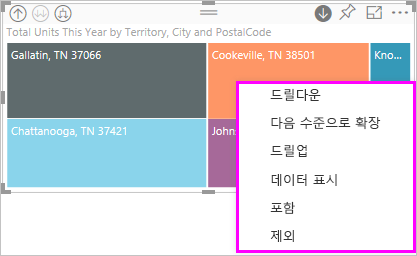
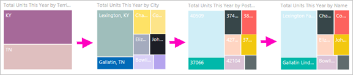
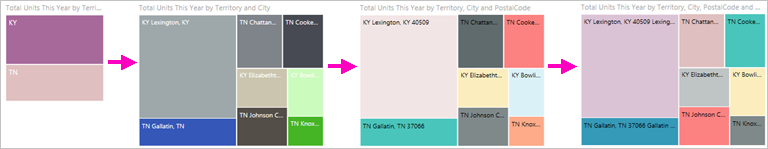
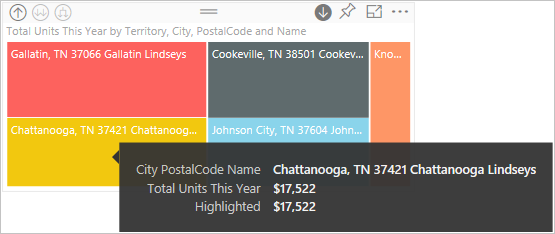
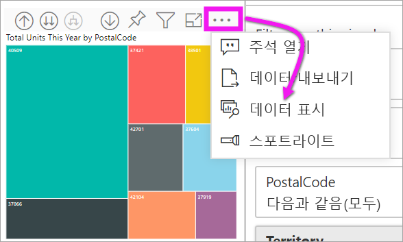

# Power BI에서 시각적 개체 드릴 모드

[!INCLUDE [power-bi-service-new-look-include](../includes/power-bi-service-new-look-include.md)]

이 문서에서는 Microsoft Power BI 서비스의 시각적 개체에서 드릴다운하는 방법을 보여 줍니다. 데이터 요소에서 드릴다운 및 드릴업을 사용하면 데이터의 세부 정보를 살펴볼 수 있습니다. 

## 드릴 시 계층 구조 필요

시각적 계층 구조가 있는 경우 추가 세부 정보를 드릴다운할 수 있습니다. 예를 들어 스포츠, 규칙 및 이벤트로 구성된 계층별로 올림픽 메달 개수를 표시하는 시각적 개체를 사용할 수 있습니다. 기본적으로 시각적 개체는 체조, 스키, 수상 운동 등 스포츠별로 메달 수를 표시하게 됩니다. 하지만 계층 구조가 있기 때문에 시각적 요소 중 하나를 선택하면(예: 바, 라인 또는 버블) 점점 더 자세한 그림을 표시하게 됩니다. **수상 운동** 요소를 선택하면 수영, 다이빙, 수구에 대한 데이터가 표시됩니다.  **다이빙** 요소를 선택하면 스프링보드, 플랫폼, 싱크로나이즈드 다이빙 이벤트에 대한 세부 정보가 표시됩니다.

날짜는 독특한 유형의 계층 구조입니다.  보고서 디자이너는 수시로 시각적 개체에 날짜 계층 구조를 추가합니다. 공통 날짜 계층 구조는 연도, 분기, 월, 일 등을 포함합니다. 

## 드릴할 수 있는 시각적 개체를 파악합니다.
어떤 Power BI 시각적 개체에 계층 구조가 포함되어 있는지 확실치 않나요? 시각적 개체를 마우스로 가리킵니다. 위쪽에 이러한 드릴 컨트롤이 조합되어 표시되면 시각적 개체에 계층 구조가 포함됩니다.

  

## 드릴다운 및 드릴업하는 방법 알아보기

이 예에서는 지역, 구/군/시, 우편 번호, 매장 이름으로 구성된 계층 구조를 포함하는 트리 맵을 사용하고 있습니다. 드릴하기 전 트리 맵은 지역에서 올해 판매된 총 단위를 검색합니다. 

  

### 드릴 기능에 액세스하는 두 가지 방법

계층 구조를 포함하는 시각적 개체에서 드릴다운, 드릴업 및 확장 기능에 액세스하는 두 가지 방법이 있습니다. 두 방법을 모두 사용해 보고 가장 선호하는 방법을 선택합니다.

- 첫 번째 방법: 시각화를 마우스로 가리켜서 아이콘을 확인하고 사용합니다.  

    

- 두 번째 방법: 시각적 개체를 마우스 오른쪽 단추로 클릭하여 메뉴를 표시하고 사용합니다.

    

## 드릴 경로

### 한 번에 모든 필드 드릴다운

시각적 개체를 드릴하는 여러 가지 방법이 있습니다. 드릴다운 아이콘을 선택하면 계층 구조에서 다음 수준으로 이동합니다. 켄터키와 테네시의 **지역** 수준을 찾고 있는 경우 두 주의 구/군/시 수준, 우편 번호 수준, 매장 이름 수준으로 차례로 드릴다운할 수 있습니다. 경로의 각 단계에서는 새 정보를 보여줍니다.

드릴업 아이콘을  "지역별 올해 총 단위"로 돌아갈 때까지 선택합니다.

### 한 번에 모든 필드 확장

**확장**은 현재 보기에 추가 계층 수준을 추가합니다. 예를 들어 **지역** 수준을 살펴볼 때는 도시, 우편 번호, 이름을 확장하고 트리맵에 추가할 수 있습니다. 경로의 각 단계에서는 동일한 정보를 표시하고 한 가지 수준의 새로운 정보에 추가합니다.

또한 한 번에 한 필드에서 드릴다운할지 아니면 확장할지를 선택할 수 있습니다.

### 한 번에 한 필드 드릴다운

1. 드릴다운 아이콘을 선택하여 켭니다. .

    이제 시각적 개체 요소를 선택하여 **한 번에 한 필드**를 드릴다운하는 옵션이 표시됩니다. 시각적 요소의 예에는 막대, 거품, 리프가 있습니다.

    

    드릴다운을 켜지 않은 상태에서 막대, 거품, 리프와 같은 시각적 개체 요소를 선택하면 드릴다운되지 않습니다. 대신에 보고서 페이지에 있는 다른 차트가 교차 필터링됩니다.

1. **TN**에 대한 리프를 선택합니다. 이제 트리맵은 상점이 있는 테네시주의 모든 도시와 지역을 표시합니다.

    

1. 현재는 다음을 수행할 수 있습니다.

    1. Tennessee를 계속 드릴다운합니다.

    1. Tennessee에서 특정 도시를 드릴다운합니다.

    1. 대신 확장합니다.

    한 번에 한 필드 드릴다운을 계속합니다.  **녹스빌, TN**을 선택합니다. 이제 트리맵에는 Knoxville에 있는 상점의 우편 번호가 표시됩니다.

    

    드릴다운하고 다시 백업할 때 제목이 바뀌는 것을 인식합니다.

### 모두 확장 및 한 번에 한 필드 확장

우편 번호만 표시된 트리맵은 그다지 유용하지 않습니다.  따라서 계층 구조에서 한 수준 아래로 *확장*하겠습니다.  

1. 트리맵이 활성화되면 *아래로 확장* 아이콘 을 선택합니다. 이렇게 하면 계층 구조의 수준 두 개, 즉 우편 번호와 상점 이름이 표시됩니다.

    

1. Tennessee 데이터의 네 가지 계층 구조 수준을 모두 보려면 트리맵의 두 번째 수준인 **Total units this year by territory and city**가 나올 때까지 드릴업 화살표를 선택합니다.

    

1. 드릴다운이 켜져 있는지  확인하고 ‘아래로 확장’ 아이콘 을 선택합니다.  이제 트리맵은 동일한 수의 리프(상자)를 표시하지만 각 리프는 추가 세부 정보를 포함합니다. 이제 트리맵은 도시 및 주만 표시하는 대신 우편 번호도 보여 줍니다.

    

1. ‘아래로 확장’ 아이콘을 한 번 더 선택하여 트리맵에 Tennessee의 네 가지 계층 구조 수준을 모두 표시합니다.  리프를 마우스로 가리켜서 더 많은 세부 정보를 봅니다.

    

## 드릴할 때 데이터 표시
**데이터 표시**를 사용하여 백그라운드에서 살펴볼 수 있습니다. 드릴하거나 확장할 때마다 **데이터 표시**는 시각적 개체를 빌드하는 데 사용 중인 데이터를 표시합니다. 따라서 시각적 개체를 빌드하기 위해 계층 구조, 드릴 및 확장 작업이 어떻게 연동되는지를 이해할 수 있습니다. 

오른쪽 위 모서리에서 줄임표(...)를 선택한 후 **데이터 표시**를 선택합니다. 

다음 표는 지역에서 매장 이름으로 모든 필드를 한 번에 드릴다운한 결과를 보여 줍니다.  

**구/군/시**, **우편 번호** 및 **이름**에 대한 합계는 동일합니다. 하지만 항상 그렇지는 않습니다.  이 데이터의 경우 각 우편 번호와 각 구/군/시에는 매장이 하나만 있습니다.  

## 고려 사항 및 제한 사항
기본적으로 드릴은 보고서의 다른 시각적 개체를 필터링하지 않습니다. 그러나 보고서 디자이너는 이 기본 동작을 변경할 수 있습니다. 드릴하는 동안 페이지의 다른 시각적 개체가 교차 필터링되거나 교차 강조 표시되는지 확인합니다.

## 다음 단계

[Power BI 보고서의 시각적 개체](../visuals/power-bi-report-visualizations.md)

[Power BI 보고서](end-user-reports.md)

[Power BI - 기본 개념](end-user-basic-concepts.md)

궁금한 점이 더 있나요? [Power BI 커뮤니티를 이용하세요.](http://community.powerbi.com/)
