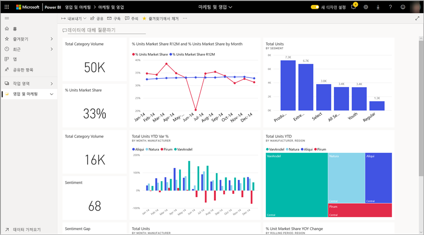
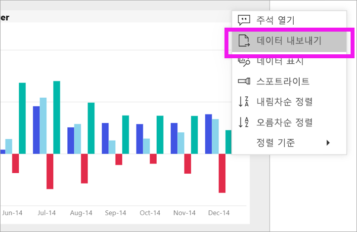
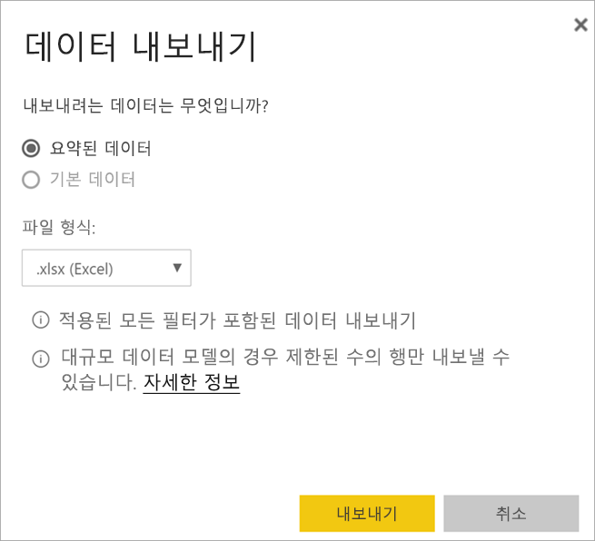
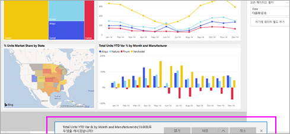

# 시각적 개체에서 데이터 내보내기
시각적 개체를 만드는 데 사용되는 데이터를 보려는 경우 [Power BI에서 해당 데이터를 표시](end-user-show-data.md)하거나 해당 데이터를 Excel에 내보낼 수 있습니다. 데이터를 내보내는 옵션에는 특정 형식이나 라이선스가 필요하며 콘텐츠에 대한 편집 권한이 필요합니다. 내보낼 수 없는 경우 Power BI 관리자에게 문의하세요. 

## Power BI 대시보드의 시각화 개체에서

1. Power BI 대시보드에서 시작합니다. 여기서는 ***영업 및 마케팅 샘플*** 앱에서 대시보드를 사용하고 있습니다. [이 앱은 AppSource.com에서 다운로드](https://appsource.microsoft.com/en-us/product/power-bi/microsoft-retail-analysis-sample.salesandmarketingsample-preview?flightCodes=e2b06c7a-a438-4d99-9eb6-4324ce87f282)할 수 있습니다.

    

2. 시각적 개체를 마우스로 가리켜서 줄임표(...)를 표시한 후 클릭하여 작업 메뉴를 표시합니다.

    

3. **Excel로 내보내기**를 선택합니다.

4. 나타나는 결과는 사용 중인 브라우저에 따라 달라집니다. 파일을 저장하라는 메시지가 표시될 수도 있고, 브라우저 맨 아래에 내보낸 파일에 대한 링크가 표시될 수도 있습니다. 

    

5. Excel에서 파일을 엽니다.  

    

## 보고서의 시각적 개체에서
보고서의 시각적 개체에 있는 데이터를 .csv 또는 .xlsx(Excel) 형식으로 내보낼 수 있습니다. 

1. 대시보드에서 타일을 선택하여 원본 보고서를 엽니다.  이 예제에서는 위와 동일한 시각적 개체인 *Total Units YTD Var %* 를 선택합니다. 

    

    이 타일은 *영업 및 마케팅 샘플* 보고서에서 만들어졌기 때문에 열리는 보고서에 해당합니다. 또한 선택한 타일 시각적 개체를 포함하는 페이지가 열립니다. 

2. 보고서에서 타일을 선택합니다. 오른쪽의 **필터** 창을 확인합니다. 이 시각적 개체에는 필터가 적용되어 있습니다. 필터에 대한 자세한 내용은 [보고서에서 필터 사용](end-user-report-filter.md)을 참조하세요.

    

3. 시각화의 오른쪽 위 모서리에 있는 줄임표를 선택합니다. **데이터 내보내기**를 선택합니다.

    

4. 요약된 데이터 또는 기본 데이터를 내보내는 옵션이 표시됩니다. *영업 및 마케팅 샘플* 앱을 사용하는 경우 **기본 데이터**가 사용하지 않도록 설정됩니다. 그러나 두 옵션을 모두 사용하도록 설정된 보고서가 있을 수 있습니다. 차이점에 대한 설명은 다음과 같습니다.

    **요약된 데이터**: 해당 시각적 개체에 표시되는 내용에 대한 데이터를 내보내려면 이 옵션을 선택합니다.  이 내보내기 유형은 시각적 개체를 만드는 데 사용된 데이터만 표시합니다. 시각적 개체에 필터가 적용된 경우 내보낸 데이터도 필터링됩니다. 예를 들어 이 시각적 개체의 경우 내보내기에는 2014년 및 중부 지역에 대한 데이터만 포함되고, 4개의 제조업체인 VanArsdel, Natura, Aliqui 및 Pirum에 대한 데이터만 포함됩니다.
  

    **기본 데이터**: 시각적 개체에 표시되는 데이터 **외에** 기본 데이터 세트의 추가 데이터를 내보내려면 이 옵션을 선택합니다.  여기에는 데이터 세트에 포함되어 있지만 시각적 개체에는 사용되지 않는 데이터가 포함될 수 있습니다. 

    

5. 나타나는 결과는 사용 중인 브라우저에 따라 달라집니다. 파일을 저장하라는 메시지가 표시될 수도 있고, 브라우저 맨 아래에 내보낸 파일에 대한 링크가 표시될 수도 있습니다. 

    

6. Excel에서 파일을 엽니다. 내보낸 데이터의 양과 대시보드의 동일한 시각적 개체에서 내보낸 데이터를 비교합니다. 차이점은 이 내보내기에 **기본 데이터**기 포함된다는 것입니다. 

    

## 다음 단계

[시각적 개체를 만드는 데 사용되는 데이터 표시](end-user-show-data.md)