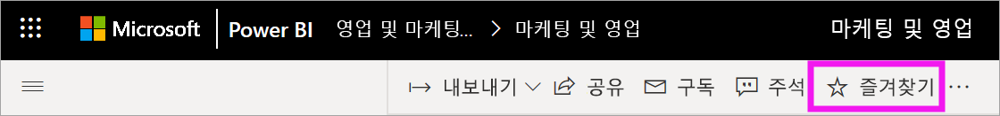
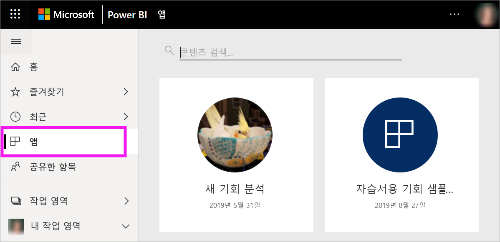
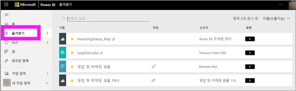
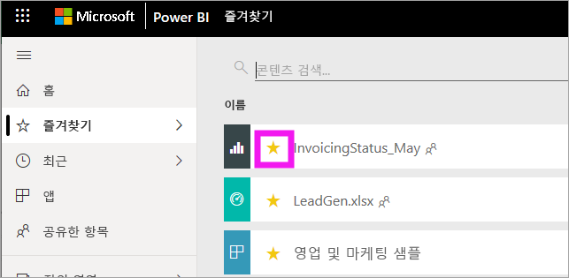

# Power BI 서비스에서 즐겨 찾는 대시보드, 보고서 및 앱
콘텐츠를 *즐겨찾기*로 만들면 **즐겨찾기** 콘텐츠 목록과 Power BI **홈** > **즐겨찾기 및 자주 사용하는 항목**에서 빠르게 액세스할 수 있습니다. 즐겨찾기는 사용자가 가장 자주 이용하는 콘텐츠로, 노란색 별이 표시됩니다.

   

   

단일 대시보드를 Power BI 서비스의 [주요 대시보드](end-user-featured.md)로 선택할 수도 있습니다.

## 대시보드 또는 보고서를 즐겨찾기에 추가

1. 자주 사용하는 대시보드 또는 보고서를 엽니다. 공유한 콘텐츠도 즐겨찾기로 설정할 수 있습니다.

2. Power BI 서비스의 위 메뉴 모음에서 **즐겨찾기** 또는 별  아이콘을 선택합니다.
   
   
   
   홈, 최근에 사용한 항목, 앱, 공유한 항목과 같이 별 아이콘이 표시되는 모든 곳에서 대시보드나 보고서를 즐겨찾기로 설정할 수도 있습니다. 
   
   

## 앱을 즐겨찾기에 추가

1. 탐색 창에서 **앱**을 선택합니다.

   

2. 앱을 마우스로 가리키면 세부 정보가 표시됩니다. 별모양 아이콘 을 선택하여 즐겨찾기로 설정합니다.
   
   

## 즐겨찾기로 작업
1. 즐겨찾기에 액세스하려면 **즐겨찾기** 오른쪽에 있는 플라이아웃 화살표를 선택합니다. 여기에서 즐겨찾기를 선택하여 열 수 있습니다. 즐겨찾기는 최대 5개까지 나열됩니다(알파벳순). 5개 이상이면 **모두 보기**를 선택하여 즐겨찾기 콘텐츠 목록을 엽니다. 
   
   
2. 즐겨찾기에 추가한 모든 콘텐츠를 보려면 탐색 창에서 **즐겨찾기**를 선택하거나 즐겨찾기  아이콘을 선택합니다. 
   
    
   
   여기에서 동작을 취할 수 있습니다. 즐겨찾기를 열고, 소유자를 식별하며, 동료에게 즐겨찾기를 공유할 수 있습니다.

## 즐겨찾기에서 제거된 콘텐츠
예전만큼 자주 보고서를 사용하지 않는다면 즐겨찾기에서 제거할 수 있습니다. 즐겨찾기에서 제거하면 콘텐츠는 즐겨찾기 목록에서 제거되지만 Power BI에서는 제거되지 않습니다.

1. 왼쪽 탐색 창에서 **즐겨찾기**를 선택하여 **즐겨찾기** 화면을 엽니다.
   
   
2. 즐겨찾기에서 제거할 콘텐츠 옆의 노란색 별표를 선택합니다.

> [!NOTE]
> 대시보드, 보고서 또는 앱을 즐겨찾기에서 제거할 수도 있습니다. 해당 항목을 열고 노란색 아이콘의 선택을 취소하면 됩니다. 
> 
> 
## 제한 사항 및 고려 사항
현재는 앱을 즐겨찾기로 설정하면 해당 앱에 포함된 모든 보고서와 대시보드가 자동으로 즐겨찾기로 설정됩니다. 개별 앱 보고서와 대시보드는 즐겨찾기로 설정할 수 없습니다. 

## 다음 단계
- [Power BI: 기본 개념](end-user-basic-concepts.md)
- 궁금한 점이 더 있나요? [Power BI 커뮤니티](http://community.powerbi.com/)를 사용해 보세요.

