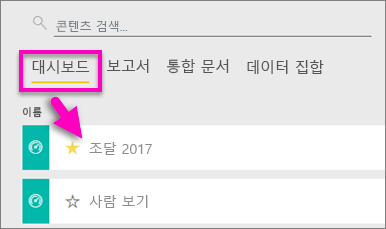

# 즐겨 찾는 대시보드, 보고서 및 Power BI 서비스의 앱
콘텐츠를 *즐겨찾기* 로 만들면 모든 작업 영역에서 액세스할 수 있습니다.  즐겨찾기는 일반적으로 가장 자주 방문하는 콘텐츠입니다.

> [!NOTE]
> 이 항목은 Power BI Desktop이 아니라 Power BI 서비스에 적용됩니다.
> 
> 

단일 대시보드를 Power BI 서비스의 [주요 대시보드](end-user-featured.md)로 선택할 수도 있습니다.

## 대시보드 또는 보고서를 *즐겨찾기*로 추가
Amanda가 작업 영역에 즐겨찾기를 추가하는 비디오를 시청한 다음 비디오 아래에 있는 단계별 지침을 따라서 직접 시도해 볼 수 있습니다.

<iframe width="560" height="315" src="https://www.youtube.com/embed/G26dr2PsEpk" frameborder="0" allowfullscreen></iframe>

1. 자주 사용하는 대시보드 또는 보고서를 엽니다. 공유한 콘텐츠도 *즐겨찾기*가 될 수 있습니다.
2. Power BI 서비스의 오른쪽 위 모서리에서 **즐겨찾기**나 별모양  아이콘을 선택합니다.
   
   
   
   또한 작업 영역 **대시보드** 또는 **보고서** 컨텐츠 보기 탭에서 대시보드 또는 보고서를 즐겨찾기에 추가할 수 있습니다.
   
   

## 앱을 *즐겨찾기*로 추가

1. 왼쪽 탐색 창에서 **앱**을 선택합니다.

   

2. 앱을 마우스로 가리키면 세부 정보가 표시됩니다.  별모양 선택   즐겨찾기로 설정할 아이콘
   
   

## *즐겨찾기* 작업
1. 즐겨찾기에 액세스하려면 아무 작업 영역에서나 **즐겨찾기** 오른쪽의 플라이아웃 화살표를 선택합니다.  여기에서 즐겨찾기를 선택하여 열 수 있습니다. 즐겨찾기 5개만 나열됩니다(사전순). 5개 이상이면 **모두 보기**를 선택하여 즐겨찾기 화면을 엽니다(아래 #2 참조). 
   
   
2. 즐겨찾기에 추가된 **모든** 콘텐츠를 보려면 왼쪽 탐색 창에서 **즐겨찾기**를 선택하거나 즐겨찾기  아이콘을 선택합니다.  
   
    
   
   여기에서 열기, 소유자 식별, 심지어 동료와 공유 등의 작업을 수행할 수 있습니다.

## 즐겨찾기에서 제거된 콘텐츠
이제 보고서를 예전만큼 자주 사용하지 않나요?  즐겨찾기에서 제거할 수 있습니다. 즐겨찾기에서 제거하면 콘텐츠는 즐겨찾기 목록에서 제거되지만 Power BI에서는 제거되지 않습니다.

1. 왼쪽 탐색 창에서 **즐겨찾기**를 선택하여 **즐겨찾기** 화면을 엽니다.
   
   
2. 즐겨찾기에서 제거할 콘텐츠 옆의 노란색 별표를 선택합니다.

> **참고**: 대시보드, 보고서 또는 앱 자체를 즐겨찾기에서 제거할 수도 있습니다. 노란색 아이콘을 열고 선택 취소만 하면 됩니다.   
> 
> 

## 다음 단계
[Power BI란?](../power-bi-overview.md)

[Power BI - 기본 개념](end-user-basic-concepts.md)

궁금한 점이 더 있나요? [Power BI 커뮤니티를 이용하세요.](http://community.powerbi.com/)

