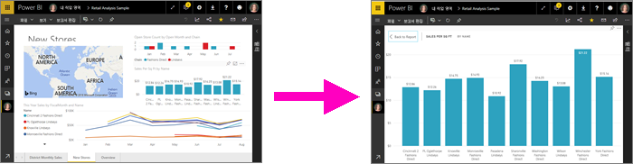
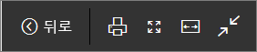
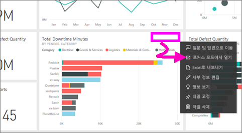
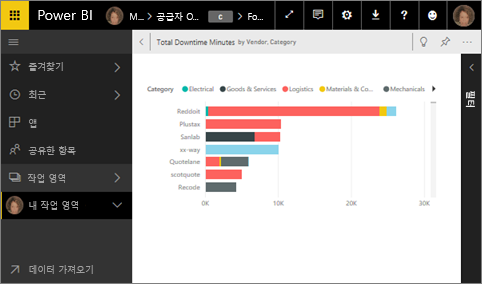
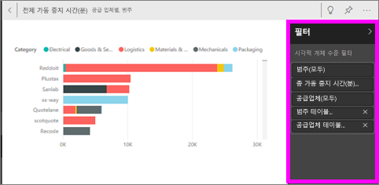
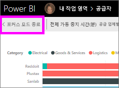
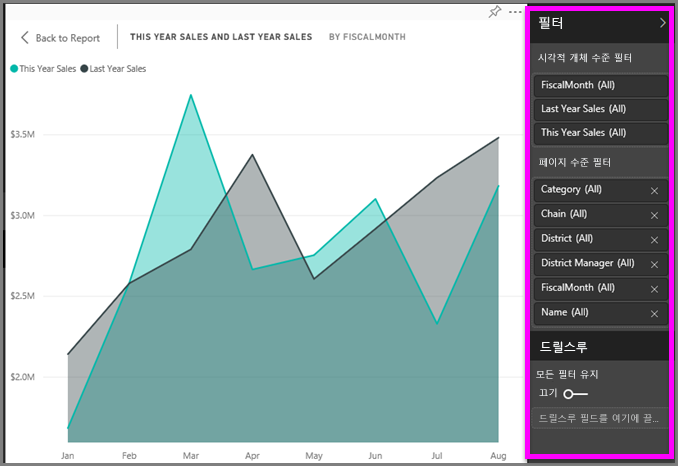
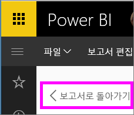

# 콘텐츠를 더 자세히 표시: 포커스 모드 및 전체 화면 모드

<iframe width="560" height="315" src="https://www.youtube.com/embed/dtdLul6otYE" frameborder="0" allowfullscreen></iframe>

포커스 모드 및 전체 화면 모드는 시각적 개체, 보고서 및 대시보드에서 더 자세한 정보를 보는 두 가지 방법입니다.  기본 차이점은 전체 화면은 콘텐츠 주위의 모든 창을 제거하지만 포커스 모드에서는 시각적 개체를 조작할 수 있다는 것입니다. 유사점과 차이점을 자세히 살펴보겠습니다.  

|콘텐츠    | 포커스 모드  |전체 화면 모드  |
|---------|---------|----------------------|
|대시보드     |   가능하지 않음     | 예 |
|보고서 페이지   | 가능하지 않음  | 예|
|보고서 시각화 | 예    | 예 |
|대시보드 타일 | 예    | 예 |
|Windows 10 모바일 | 가능하지 않음 | 예 |

## 전체 화면 모드란?

메뉴 및 탐색 모음 없이 Power BI 서비스 콘텐츠(대시보드, 보고서 페이지, 타일 및 시각적 개체)를 표시합니다.  항상 한눈에 콘텐츠 전체를 볼 수 있습니다. 이를 TV 모드라고도 합니다.   

전체 화면 모드를 열려면 대시보드, 보고서, 포커스 모드의 타일 또는 포커스 모드의 시각적 개체 위에 있는 Power BI 서비스 메뉴 모음에서 **전체 화면** 아이콘 을 선택합니다.  선택한 콘텐츠가 전체 화면을 채웁니다.
Power BI Mobile을 사용하는 경우 [Windows 10 모바일 앱에서 전체 화면을 사용할 수 있습니다](./mobile/mobile-windows-10-app-presentation-mode.md). 

다음과 같은 경우에 전체 화면 모드를 사용합니다.

* 모임이나 회의에서 대시보드, 타일, 시각적 개체 또는 보고서 프레젠테이션
* 사무실의 큰 전용 화면이나 프로젝터에 표시
* 작은 화면으로 보기
* 잠금 모드에서 검토 - 기본 보고서 또는 대시보드를 열지 않고 화면을 터치하거나 타일을 마우스로 가리킬 수 있습니다.

## 포커스 모드란?
***포커스*** 모드를 사용하면 시각적 개체 또는 타일을 확장(팝아웃)하여 더 자세한 정보를 볼 수 있습니다.  약간 복잡한 대시보드 또는 보고서가 있고 하나의 시각적 개체만 확대하려고 할 수 있습니다.  이 경우 포커스 모드가 적합합니다.  

포커스 모드에 있는 동안 Power BI ‘소비자’는 이 시각적 개체가 만들어질 때 적용된 모든 필터를 조작할 수 있습니다.   Power BI 서비스에서는 대시보드 타일 또는 보고서 시각적 개체에서 포커스 모드를 사용할 수 있습니다.

## 전체 화면 모드에서 작업
전체 화면 모드에서 대시보드 또는 보고서 페이지를 열려면 위쪽 탐색 모음에서 전체 화면 아이콘 을 선택합니다. 전체 화면 모드에서 마우스 또는 커서를 이동하면 상황에 맞는 메뉴가 표시됩니다. 전체 화면은 매우 다양한 콘텐츠에 사용할 수 있으므로 상황에 맞는 메뉴의 옵션은 각각 약간 다르지만 별도의 설명 없이도 바로 이해할 수 있습니다.  마우스로 정의의 아이콘을 가리키면 됩니다.

대시보드에 대한 메뉴    
    

보고서 페이지에 대한 메뉴    
    

  *     
  **뒤로** 단추를 사용하여 브라우저에서 이전 페이지로 이동합니다. 이전 페이지가 Power BI 페이지였다면 그것 또한 전체 화면 모드로 표시됩니다.  전체 화면 모드는 종료할 때까지 지속됩니다.

  *     
  전체 화면 모드에서 대시보드 또는 보고서 페이지를 인쇄하려면 이 단추를 사용합니다.

  *     
    스크롤 바에 의지하지 않고 가능한 가장 큰 크기로 대시보드를 표시하려면 **화면에 맞춤** 버튼을 사용합니다.  

    

  *        
    때로 종종 스크롤 막대를 신경 쓰지 않지만 대시보드로 사용 가능한 공간의 전체 너비를 채우려면. **너비에 맞춤** 버튼을 선택합니다.    

    

  *        
    전체 화면 보기에서 이러한 화살표를 사용하여 보고서의 페이지 간을 이동합니다.    
  * 전체 화면 모드를 종료하려면 **전체 화면 종료** 아이콘을 선택합니다.

      

## 포커스 모드에서 작업
포커스 모드를 여는 두 가지 방법은 대시보드 타일 및 보고서 시각화를 사용하는 것입니다.

### 대시보드의 포커스 모드
1. Power BI 서비스에서 대시보드를 엽니다.

2. 마우스로 대시보드 타일 또는 보고서 시각화를 가리키고, 줄임표(...)를 선택하고, **포커스 모드에서 열기**를 선택합니다.

    을 선택합니다.

2. 타일이 열리고 전체 보고서 캔버스를 채웁니다.

   

3. 필터 창을 확장하여 이 시각적 개체에 적용된 모든 필터를 확인합니다.

   

4. [필터를 수정](end-user-report-filter.md)하고 데이터에서 원하는 정보를 찾아 추가로 살펴봅니다.  

5. 포커스 모드에서 나와 시각적 개체의 왼쪽 위 모서리에서 **포커스 모드 종료**를 선택하여 대시보드로 돌아갑니다.

        

## 보고서 시각화에 대한 포커스 모드
1. Power BI 서비스에서 보고서를 엽니다.  이 예제에서는 소매점 분석 샘플 사용에 대해 설명합니다.

1. 보고서가 열린 후 **구역 월별 판매액 탭**을 선택합니다.

2. 왼쪽 아래 모서리의 영역 차트를 마우스로 가리키고 **포커스 모드** 아이콘 을 선택합니다.  

   
2. 시각화가 열리고 전체 캔버스를 채웁니다.

   
3. 선택적으로 [필터] 창을 확장하여 이 시각적 개체에 적용된 필터를 조작합니다. 데이터를 분석하여 새로운 인사이트와 질문에 대한 대답을 찾아봅니다. ‘소비자’는 새 필터를 추가하거나, 시각화에 사용 중인 필드를 변경하거나, 새 시각화를 만들 수 없습니다.   그러나 Power BI를 종료할 때 기존 필터에 적용하는 모든 변경 내용이 저장됩니다. Power BI가 수정 내용을 기억하지 않도록 하려면 **기본값으로 다시 설정**을 선택합니다.   

   

5. 포커스 모드에서 나와 시각적 개체의 왼쪽 위 모서리에서 **보고서로 돌아가기**를 선택하여 보고서로 돌아갑니다.

      

## 고려 사항 및 문제 해결
* 보고서의 시각화에서 포커스 모드를 사용할 때는 모든 필터(시각적 수준, 페이지 수준, 드릴스루 및 보고서 수준)을 보고 조작할 수 있습니다.    
* 대시보드에서 포커스 모드를 시각화와 함께 사용할 때에는 시각적 수준 필터만을 보고 조작할 수 있습니다.

## 다음 단계
[보고서 설정 보기](end-user-report-view.md)
