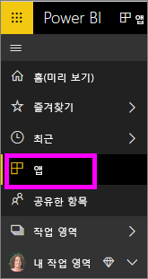
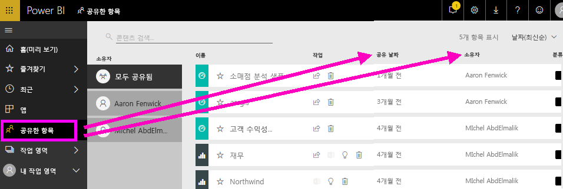
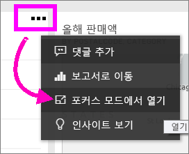
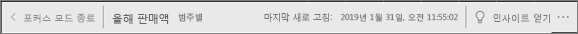
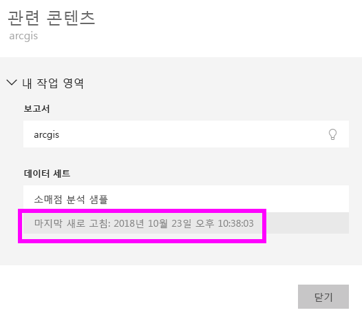

# 콘텐츠가 최신 상태입니다.
*소비자*는 *디자이너*가 만들고 사용자와 공유하는 콘텐츠와 상호 작용합니다. 해당 콘텐츠가 최신 상태인지 궁금하거나 콘텐츠가 마지막으로 새로 고침되었는지 알고 싶을 수도 있습니다. 최신 콘텐츠를 사용하고 있다는 것을 알고 있으면 자신감이 생깁니다.  
 

최신 데이터를 사용하고 있는지 확인하는 것이 올바른 결정을 내리는 데 중요한 경우가 많습니다. 최신 콘텐츠를 사용하고 있는지 확인하기 위해 무엇을 해야 하나요? 대부분의 경우, 아무 작업도 수행할 필요가 없습니다. 사용자와 공유된 앱은 앱 디자이너가 설정한 일정에 따라 자동으로 새로 고침되고 업데이트됩니다. 사용자와 공유한 대시보드와 보고서도 마찬가지로 디자이너는 수동으로 또는 자동 새로 고침 일정을 사용하여 콘텐츠를 최신 상태로 유지합니다.  

데이터 새로 고침에 대한 질문이 있으면 디자이너에게 문의하세요.

## 디자이너의 이름을 찾는 방법

### 앱

앱 화면에는 디자이너 이름과 앱을 만든 날짜가 모두 표시됩니다.  

1. 왼쪽 탐색 창에서 **앱**을 선택합니다.

    

    각 앱의 경우 제목과 만든 날짜가 표시됩니다. 

2. 앱 위에 마우스를 가리키면 앱 디자이너의 이름도 표시됩니다. 

    

### 공유한 항목
**공유한 항목** 화면에는 콘텐츠 소유자의 이름과 콘텐츠가 공유한 항목의 날짜가 표시됩니다.

 

## 마지막 새로 고침 날짜를 조회하는 방법
관심이 있다면 대부분의 콘텐츠에 대해 마지막 새로 고침 날짜를 조회할 수 있습니다. 

### 대시보드 타일
대시보드 타일의 경우 포커스 모드에서 타일을 보고 마지막 새로 고침 타임스탬프를 확인합니다.

1. 대시보드 타일에서 줄임표(...)를 선택하고 **포커스 모드로 열기**를 선택합니다.

    

2. 마지막 새로 고침 날짜는 오른쪽 위 모서리에 표시됩니다. 표시되지 않으면 브라우저를 확장하여 더 넓게 만듭니다. 

    

### 대시보드 및 보고서에서
마지막 새로 고침 날짜를 조회하는 또 다른 방법은 **관련 항목 보기**를 사용하는 것입니다.  **관련 항목 보기**는 Power BI 위 메뉴 모음에서 사용할 수 있습니다.

**관련 콘텐츠** 창에는 대시보드 또는 보고서의 기본 데이터 세트에 대한 마지막 새로 고침 정보가 표시됩니다.

## 디자이너가 앱을 삭제하면 어떻게 되나요?

디자이너가 앱을 삭제하면 해당 앱과 연결된 대시보드와 보고서가 Power BI 작업 영역에서도 자동으로 제거됩니다. 이러한 대시보드 및 보고서는 더 이상 사용할 수 없으며 앱이 탐색 창에 표시되지 않습니다.

## 변경 내용을 확인하기 위해 구독
최신 상태를 유지하는 또 다른 방법은 보고서 또는 대시보드를 구독하는 것입니다. 로그인하거나 보고서나 대시보드를 여는 대신 설정한 일정에 따라 스냅숏을 보내도록 Power BI에 지시합니다.  자세한 내용은 [대시보드 및 보고서 구독](end-user-subscribe.md)을 참조하세요.

## 데이터 경고 설정
데이터가 설정한 한도 이상 또는 초과로 변경되는 경우 알림을 받으시겠습니까? [데이터 경고 만들기](end-user-alerts.md).  데이터 경고를 사용하면 최신 상태를 유지하기가 쉽습니다. 데이터 경고를 사용하면 보고서의 값이 특정 임계값을 통과하는 경우 이메일을 보내도록 Power BI에 지시할 수 있습니다.  예를 들어 인벤토리가 25단위 미만으로 떨어질 경우 또는 판매가 목표를 초과하는 경우  

## 다음 단계
[데이터 경고 만들기](end-user-alerts.md)    
[대시보드 및 보고서 구독](end-user-subscribe.md)    
[관련 콘텐츠 보기](end-user-related.md)    
