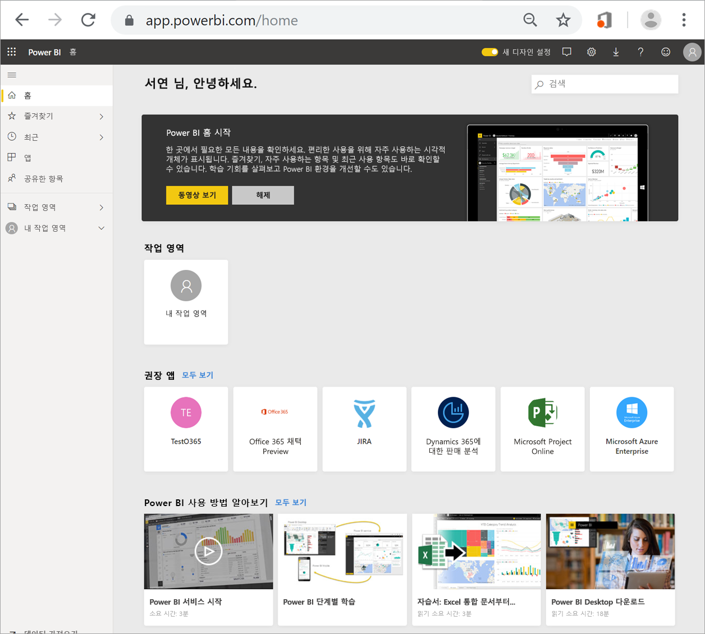
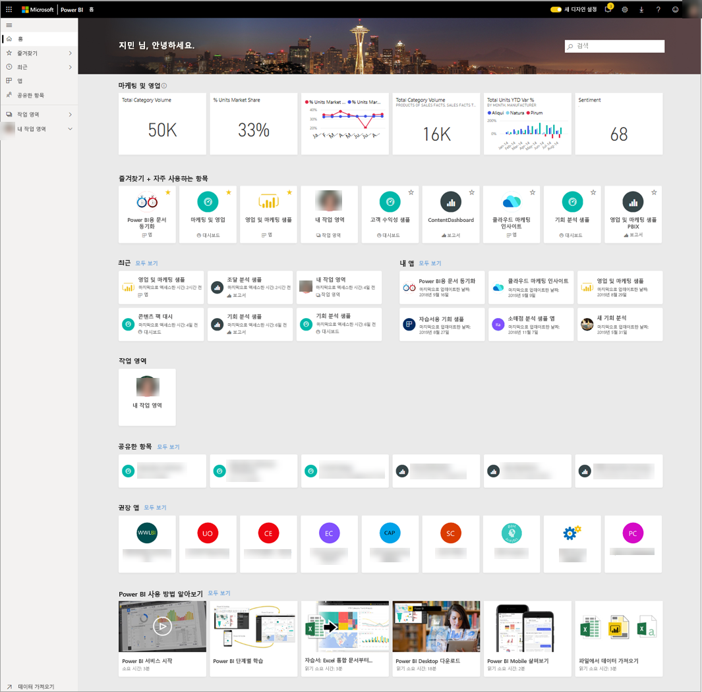
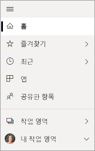
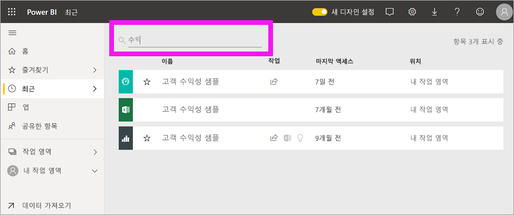

# 대시보드, 보고서 및 앱 찾기
Power BI에서 *콘텐츠*라는 용어는 앱, 대시보드 및 보고서를 가리킵니다. 콘텐츠는 Power BI *디자이너*가 만들고, 이렇게 만든 콘텐츠는 여러분과 같은 동료들에게 공유됩니다. 콘텐츠는 Power BI 서비스에서 액세스하고 볼 수 있습니다. Power BI에서 작업을 시작하기 가장 좋은 곳은 홈 시작 페이지입니다.

## Power BI 홈 살펴보기
Power BI에 로그인하면 다음 그림처럼 홈 캔버스가 표시됩니다.
 

Power BI 홈에서는 세 가지 방법을 사용하여 콘텐츠를 찾아서 볼 수 있습니다. 세 가지 방법은 콘텐츠에 접근하는 방법만 다를 뿐, 어느 것을 사용해도 동일한 콘텐츠 풀에 액세스하게 됩니다. 무언가를 찾을 때 검색을 사용하는 것이 가장 쉽고 빠른 경우도 있고, 홈 캔버스에서 *카드*를 선택하는 것이 더 좋은 방법인 경우도 있습니다.

- 홈 캔버스에서는 자주 사용하는 콘텐츠와 최근 콘텐츠, 권장 콘텐츠와 학습 리소스가 구성되어 표시됩니다. 각 콘텐츠는 제목과 아이콘이 있는 *카드*로 표시됩니다. 카드를 선택하면 해당 콘텐츠가 열립니다.
- 왼쪽에는 탐색 창이 있습니다. 이 창에는 동일한 콘텐츠가 ‘즐겨찾기’, ‘최근에 사용한 항목’, ‘앱’, ‘공유한 항목’과 같이 다른 방식으로 구성됩니다. 여기서 콘텐츠 목록을 살펴보고 하나를 선택하여 열 수 있습니다.
- 오른쪽 위 모서리에 있는 전역 검색 상자에서는 제목, 이름 또는 키워드를 사용하여 콘텐츠를 검색할 수 있습니다.

이어지는 항목에서는 콘텐츠를 찾아서 보기 위한 각 옵션에 대해 설명합니다.

## 홈 캔버스
홈 캔버스에서는 사용 권한이 있는 모든 콘텐츠를 볼 수 있습니다. 처음에는 홈 캔버스에 그다지 많은 콘텐츠가 표시되지 않을 수 있으나(위 이미지 참조), 동료들과 Power BI를 사용하다 보면 점점 더 많은 콘텐츠가 표시될 것입니다.

홈 캔버스에 표시되는 권장 콘텐츠 및 학습 리소스도 업데이트됩니다. 
 
Power BI 서비스에서 작업을 하 때 동료들로부터 대시보드, 보고서 및 앱을 받다 보면 결국에는 홈페이지가 가득 채워지게 됩니다. 시간이 흐른 후에는 홈페이지가 아래 그림처럼 보일 수 있습니다.

 
이어지는 항목에서는 홈페이지를 상단에서부터 자세히 살펴봅니다.

## 가장 중요한 콘텐츠를 간편하게

### 즐겨찾기 및 자주 사용하는 항목
맨 위에 있는 섹션으로, 여기에는 자주 방문하는 콘텐츠나 [주요 또는 즐겨찾기](end-user-favorite.md)로 태그한 콘텐츠로 연결되는 링크가 있습니다. 몇몇 카드에 노란색 별이 있는 것을 볼 수 있습니다. 노란색 별이 표시된 앱 2개와 대시보드 1개는 즐겨찾기로 태그된 것입니다.
 
### 최근에 사용한 항목 및 내 앱
다음 섹션에는 최근에 방문한 콘텐츠가 표시됩니다. 각 카드에 타임스탬프가 있는 것을 볼 수 있습니다. **내 앱** 섹션에는 나와 공유된 앱 또는 [AppSource에서 다운로드](end-user-apps.md)한 앱이 표시되는데, 여기에는 가장 최근 앱이 표시됩니다. **모두 보기**를 선택하면 나와 공유된 모든 앱을 볼 수 있습니다.

### 작업 영역
Power BI *소비자*에게는 한 개의 작업 영역(**내 작업 영역**)이 있습니다. 

### 공유한 항목
동료들은 나에게 앱뿐 아니라 개별 대시보드와 보고서도 공유할 수 있습니다. **공유한 항목** 섹션에서, 동료들에 나에게 공유한 3개의 대시보드와 3개의 보고서가 있는 것을 볼 수 있습니다.

### 권장 앱
Power BI는 사용자의 활동 및 계정 설정에 따라 일련의 권장 앱을 표시합니다. 앱 카드를 열면 앱이 열립니다.
 
### 학습 리소스
홈 캔버스 맨 아래에는 일련의 학습 리소스가 있습니다. 표시되는 리소스의 종류는 사용자의 활동 및 설정과 Power BI 관리자에 따라 달라집니다. 
 
## 탐색 창 안내

탐색 창을 사용하여 대시보드, 보고서 및 앱 사이를 이동하고 찾을 수 있습니다. 탐색 창을 사용하는 것이 콘텐츠로 이동하는 가장 빠른 방법인 경우가 많습니다.
탐색 창은 홈 시작 페이지를 열면 표시되며, Power BI 서비스의 다른 영역을 열어도 그대로 유지됩니다.
  
탐색 창은 홈 캔버스에서 본 것과 비슷한 방식의 컨테이너, 즉 ‘즐겨찾기’, ‘최근에 사용한 항목’, ‘공유한 항목’으로 콘텐츠를 구성합니다. 플라이아웃을 사용하여 각 컨테이너에서 가장 최근 콘텐츠만 볼 수도 있고 콘텐츠 목록으로 이동하여 각 컨테이너 범주의 모든 콘텐츠를 볼 수도 있습니다.
 
- 콘텐츠 섹션 중 하나를 열고 모든 항목을 표시하려면 제목을 선택합니다.
- 각 컨테이너에서 가장 최근 항목을 보려면 플라이아웃( **>** )을 선택합니다.

    

 
탐색 창은 원하는 콘텐츠를 빠르게 찾기 위한 또 하나의 방법입니다. 콘텐츠는 홈 캔버스와 비슷한 방식으로 구성되며, 홈 캔버스와 달리 카드가 아닌 목록으로 표시됩니다. 

## 모든 콘텐츠 검색
콘텐츠를 찾는 가장 빠른 방법은 콘텐츠를 검색하는 것인 경우도 있습니다. 예를 들어, 한동안 사용하지 않은 대시보드가 홈 캔버스에 표시되지 않는다는 사실을 깨닫게 될 수도 있고, 동료가 나에게 콘텐츠를 공유하긴 했는데 이름이 무엇인지, 어떤 종류였는지, 대시보드였는지 보고서였는지 기억나지 않을 수도 있습니다.
 
대시보드의 전체 이름 또는 부분 이름을 입력하여 검색할 수 있습니다. 동료의 이름을 입력해서 동료가 공유한 콘텐츠를 검색할 수도 있습니다. 검색 범위는 내가 소유하고 있거나 액세스할 수 있는 모든 콘텐츠에서 일치하는 항목을 찾도록 설정됩니다.

## 다음 단계
[Power BI 기본 개념](end-user-basic-concepts.md) 개요
