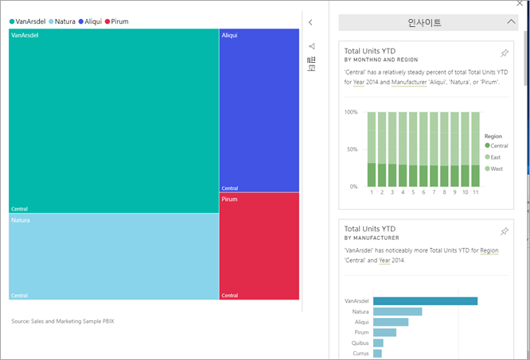
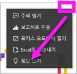
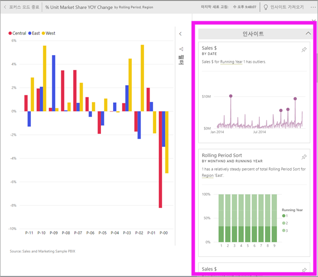
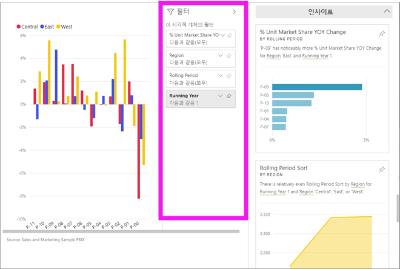
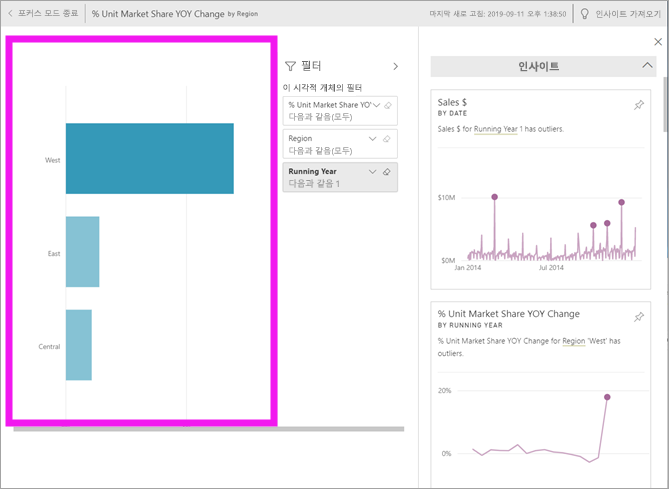
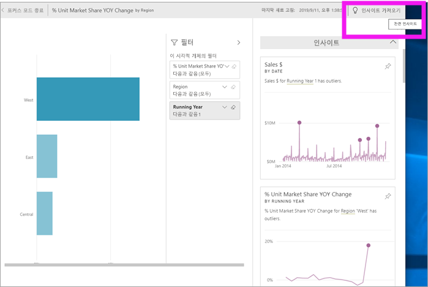

# Power BI로 대시보드 타일에서 데이터 인사이트 보기
대시보드의 각 시각적 개체 [타일](end-user-tiles.md)은 데이터 검색에 사용됩니다. 타일을 선택하면 보고서가 열리거나 [질문 및 답변이 열립니다](end-user-q-and-a.md). 여기서 보고서의 기반이 되는 데이터 세트를 필터링 및 정렬하고 자세히 살펴볼 수 있습니다. 또한 인사이트를 실행하면 Power BI에서 데이터 탐색을 수행합니다.

인사이트를 실행하여 데이터를 기준으로 흥미로운 대화형 시각적 개체를 생성합니다. 인사이트는 특정 대시보드 타일에서 실행할 수 있으며 특정 인사이트에 대해 인사이트를 실행할 수도 있습니다.

인사이트 기능은 Microsoft Research와의 연계를 통해 개발되는 [고급 분석 알고리즘 집합](end-user-insight-types.md)의 성장을 기반으로 구축됩니다. 당사는 더 많은 사람들이 새롭고 직관적인 방식으로 각자 데이터의 정보를 활용할 수 있도록 하기 위해 노력할 것입니다.

## 대시보드 타일에서 인사이트 실행
대시보드 타일에서 인사이트를 실행하는 경우 Power BI에서 해당 단일 대시보드 타일을 만드는 데 사용된 데이터만 검색합니다. 

1. [대시보드를 엽니다](end-user-dashboards.md).
2. 타일을 마우스로 가리킵니다. 줄임표(...)를 선택하고 **인사이트 보기**를 선택합니다. 

    

3. 타일이 오른쪽에 표시되는 인사이트 카드와 함께 [포커스 모드](end-user-focus.md)로 열립니다.    
   
        
4. 인사이트 하나로 호기심이 자극되나요? 자세히 알아보려면 해당 인사이트 카드를 선택합니다. 선택한 인사이트는 왼쪽에 나타나고 해당 단일 인사이트의 데이터에만 기초한 새 인사이트 카드는 오른쪽에 표시됩니다.    

 ## 인사이트 카드와 상호 작용
일단 인사이트가 시작되면 계속 살펴보세요.

   * 캔버스에서 시각적 개체를 필터링합니다.  필터를 표시하려면 오른쪽 위 모서리에 있는 화살표를 선택하여 필터 창을 확장합니다.

      
   
   * 인사이트 카드 자체에 대한 인사이트를 실행합니다. 이것을 **관련된 인사이트**라고 합니다. 인사이트 카드를 선택하여 활성화합니다. 인사이트 카드가 보고서 캔버스에 표시됩니다.
   
      
   
   * 오른쪽 위 모서리에서 전구 모양 아이콘  또는 **인사이트**를 선택합니다. 인사이트가 왼쪽에 표시되고 해당 단일 인사이트의 데이터에만 기초한 새 카드는 오른쪽에 표시됩니다.
     
     
     
보고서로 돌아가려면 왼쪽 위 모서리에서 **포커스 모드 종료**를 선택합니다.

## 고려 사항 및 문제 해결
- **인사이트 보기**는 모든 대시보드 타일 유형에서 작동하지 않습니다. 예를 들면, 사용자 지정 시각적 개체에는 사용할 수 없습니다.<!--[custom visuals](end-user-custom-visuals.md)-->

## 다음 단계
[사용 가능한 빠른 인사이트 유형](end-user-insight-types.md)에 대해 알아보기

