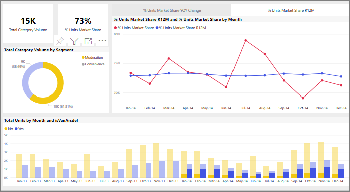

# Power BI 보고서에서 시각적 개체가 서로 교차 필터링되는 방식
Power BI의 뛰어난 기능 중 하나는 보고서 페이지의 모든 시각적 개체가 상호 연결되는 방식입니다. 시각적 개체 중 하나에서 데이터 요소를 선택하는 경우 페이지에서 해당 데이터를 포함하는 다른 모든 시각적 개체는 해당 선택 사항에 따라 변경됩니다. 

기본적으로, 보고서 페이지에 있는 하나의 시각화에서 하나의 데이터 요소를 선택하면 이 페이지에 있는 다른 시각화도 교차 필터링, 교차 강조 표시 및 드릴됩니다. 

이 기능은 데이터에서 하나의 값이 다른 값에 어떻게 기여하는지 살펴볼 때 유용합니다. 예를 들어, 도넛형 차트에서 Moderation(완화) 세그먼트를 선택하면 이 세그먼트가 월별 전체 단위 차트의 각 열에 기여하는 부분이 강조 표시되고 오른쪽에 있는 꺾은선형 차트가 필터링됩니다.

[필터링 및 강조 표시 정보](../power-bi-reports-filters-and-highlighting.md)를 참조하세요. 

페이지의 시각적 개체가 상호 작용하는 방법은 보고서 ‘디자이너’에 의해 설정됩니다.  디자이너는 시각적 개체 상호 작용을 설정하거나 끄고, 기본 교차 필터링, 크로스 강조 표시 및 드릴링 동작을 변경할 수 있는 옵션이 있습니다. 
  
> [!NOTE]
> *교차 필터* 및 *교차 강조 표시*는 여기서 설명하는 동작을 **필터** 창에서 시각화를 필터링하고 강조 표시할 때 나타나는 결과와 구분하는 데 사용합니다.  

## 고려 사항 및 문제 해결
- 보고서에 [드릴링](../power-bi-visualization-drill-down.md)을 지원하는 시각화가 있는 경우 기본적으로 하나의 시각화 드릴링이 보고서 페이지의 다른 시각화에 영향을 주지 않습니다.     
- visualA를 사용하여 visualB와 상호 작용할 경우, visualA의 시각적 개체 수준 필터가 visualB에 적용됩니다.

## 다음 단계
[보고서 필터를 사용하는 방법](../power-bi-how-to-report-filter.md)
