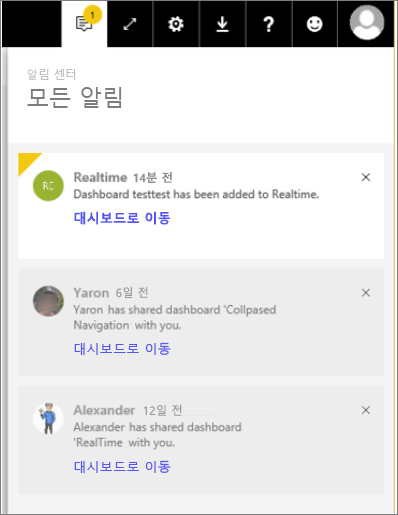

# Power BI 알림 보기

[!INCLUDE [power-bi-service-new-look-include](../includes/power-bi-service-new-look-include.md)]

알림 센터는 Power BI 환경에 관련된 정보의 순차적 피드입니다. 알림 센터를 열어서 나와 공유된 새 대시보드, Power BI 이벤트 및 모임에 대한 정보, 내가 설정한 경고 등에 대한 메시지를 볼 수 있습니다. [Power BI 서비스에서 경고를 설정](end-user-alerts.md)할 수 있으며 Power BI 모바일 앱에서도 설정할 수 있습니다.

Amanda가 알림을 검토, 관리 및 응답하는 과정을 봅니다. 그런 다음 비디오 아래에 있는 지침을 따라서 직접 시도해 볼 수 있습니다.    

> [!NOTE]
> 이 비디오는 Power BI 서비스의 이전 버전을 보여 줍니다. 

<iframe width="560" height="315" src="https://www.youtube.com/embed/bZMSv5KAlcE" frameborder="0" allowfullscreen></iframe>

1. Power BI에 로그인하면 오프라인 상태인 동안 전송된 모든 새 알림이 피드에 추가됩니다. 새로운 알림이 있는 경우 Power BI는 새 항목의 수와 함께 노란색 거품을 표시합니다.
   
   
2. Power BI 메뉴 모음에서 **알림** 아이콘을 선택합니다.
   
   
3. 알림은 가장 최근 메시지부터 읽지 않은 메시지를 강조하여 표시됩니다. 알림은 곧 삭제하거나 최대 제한인 100개에 도달하지 않는 한 90일 동안 유지됩니다.
   
   
4. 알림을 해제하려면 X 아이콘을 선택합니다.

### 다음 단계
* [Power BI 서비스의 데이터 경고](end-user-alerts.md)
* [iPhone 앱(iOS용 Power BI)의 데이터 경고 설정](mobile/mobile-set-data-alerts-in-the-mobile-apps.md)
* [Windows 10용 Power BI 모바일 앱의 데이터 경고 설정](mobile/mobile-set-data-alerts-in-the-mobile-apps.md)
* 궁금한 점이 더 있나요? [Power BI 커뮤니티를 이용하세요.](http://community.powerbi.com/)

