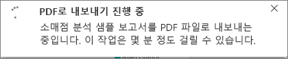
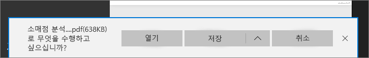

# 보고서를 Power BI에서 PDF로 내보내기
Power BI를 사용하면 보고서를 PDF 형식으로 게시하고 Power BI 보고서를 기반으로 문서를 쉽게 만들 수 있습니다. **PDF로 내보낼** 때 Power BI 보고서의 각 페이지는 PDF 문서에 개별 페이지가 됩니다.

## Power BI 보고서를 PDF로 내보내는 방법
Power BI 서비스에서 보고서를 선택하여 캔버스에 표시합니다. 홈페이지, 앱 또는 왼쪽 탐색 창의 다른 섹션에서 보고서를 선택할 수도 있습니다.

1. 메뉴 모음에서 **파일** > **PDF로 내보내기**를 선택합니다.

    

    진행률 표시줄이 오른쪽 위 모서리에 표시됩니다. 내보내는 데 몇 분 정도 걸릴 수 있으며 보고서를 내보내는 동안 Power BI에서 계속 작업할 수 있습니다.

    

    작업이 완료되면 알림 배너가 변경되어 Power BI 서비스가 내보내기 프로세스를 완료했음을 알려줍니다.

2. 브라우저가 다운로드한 파일을 표시하면 파일을 사용할 수 있습니다. 다음 이미지에서는 브라우저 창 하단의 다운로드 배너로 표시됩니다.

    

이제 필요한 항목이 모두 준비되었습니다. 파일을 다운로드하여 Microsoft Edge에서 사용할 수 있는 PDF 뷰어로 열 수 있습니다.

## 제한 사항 및 고려 사항
**PDF로 내보내기** 기능을 사용하는 경우 염두해야 할 고려 사항과 제한 사항이 있습니다.

- PDF로 내보낼 때 강조 표시, 필터링, 드릴다운 등 세션 내 대화형 작업은 아직 지원되지 않습니다. 내보낸 PDF는 보고서에 저장된 대로 원래 시각적 개체를 보여줍니다. 필터 및 슬라이서를 적용한 후 내보내기에서 이를 보존하려면 보고서를 저장한 다음, 내보내기를 수행합니다.

* **R 시각적 개체**는 현재 지원되지 않습니다. PDF에서 이러한 시각적 개체는 공백이 되고 오류 메시지를 표시합니다.  

* **인증된** **사용자 지정 시각적 개체**가 지원됩니다. 사용자 지정 시각적 개체를 인증하는 방법을 비롯한 인증된 사용자 지정 시각적 개체에 대한 자세한 내용은 [사용자 지정 시각적 개체 인증하기](../power-bi-custom-visuals-certified.md)를 참조하세요. 인증되지 않은 사용자 지정 시각적 개체는 지원되지 않습니다. PDF에서 오류 메시지와 함께 표시됩니다.   

* 30개 이상의 보고서 페이지를 포함하는 보고서는 현재 내보낼 수 없습니다.

* 보고서를 PDF로 내보내는 과정은 완료하는 데 몇 분 정도 걸릴 수 있으므로 잠시 기다려주세요. 필요한 시간에 영향을 줄 수 있는 요소는 보고서의 구조 및 Power BI 서비스의 현재 부하를 포함합니다.

* **PDF로 내보내기** 메뉴 항목을 Power BI 서비스에서 사용할 수 없는 경우 테넌트 관리자가 이 기능을 사용하지 않도록 설정했을 가능성이 큽니다. 자세한 내용은 테넌트 관리자에게 문의하세요.

* 배경 이미지는 차트의 경계 영역에서 잘립니다. PDF로 내보내기 전에 배경 이미지를 제거하는 것이 좋습니다.

* Power BI 테넌트 도메인 외부의 사용자가 소유한 보고서(예: 조직 외부 사람이 소유한 보고서 및 사용자와 공유한 보고서)는 PDF에 게시할 수 없습니다.

* 조직 외부의 사람, 즉 Power BI 테넌트에 없는 사용자와 대시보드를 공유하면 해당 사용자는 공유 대시보드에 연결된 보고서를 PDF로 내보낼 수 없습니다. 예를 들어 aaron@contoso.com인 경우 cassie@cohowinery.com과 공유 할 수 있지만, cassie@cohowinery.com은 연결된 보고서를 PDF로 내보낼 수 없습니다.

* Power BI 서비스는 PDF 내보내기에 대한 언어로 Power BI 언어 설정을 사용합니다. 언어 기본 설정을 보거나 설정하려면 톱니바퀴 아이콘 > **설정** > **일반** > **언어**를 선택합니다.

## 다음 단계
[보고서 인쇄](end-user-print.md)