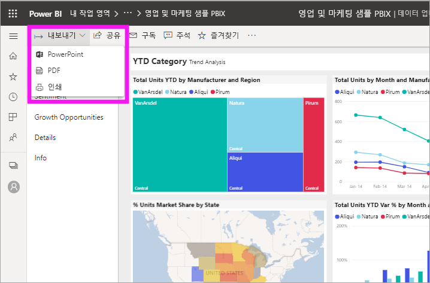
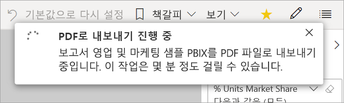

# 보고서를 Power BI에서 PDF로 내보내기

[!INCLUDE [power-bi-service-new-look-include](../includes/power-bi-service-new-look-include.md)]

Power BI를 사용하면 보고서를 PDF 형식으로 게시하고 Power BI 보고서를 기반으로 문서를 쉽게 만들 수 있습니다. PDF로 내보낼 때 Power BI 보고서의 각 페이지는 PDF 문서에서 개별 페이지가 됩니다.

## Power BI 보고서를 PDF로 내보내기
Power BI 서비스에서 보고서를 선택하여 캔버스에 표시합니다. **홈** 페이지, **앱** 또는 탐색 창의 다른 컨테이너에서 보고서를 선택할 수도 있습니다.

1. 메뉴 모음에서 **내보내기** > **PDF**를 선택합니다.

    

    **현재 값** 또는 **기본 값**을 선택할 수 있는 옵션이 있는 팝업이 표시됩니다. **현재 값**은 슬라이서 및 필터 값에 대한 활성 변경 내용을 포함하는 현재 상태의 보고서를 내보냅니다. 대부분의 사용자는 이 옵션을 선택합니다. 또는 **기본 값**을 선택하면 보고서가 원래 상태(*디자이너*가 공유한 대로)로 내보내지며, 변경 내용은 해당 원래 상태로 반영되지 않습니다.
    
    또한 보고서의 숨겨진 탭을 내보낼지 여부를 선택하는 확인란이 있습니다. 브라우저에 표시되는 보고서 탭만 내보내려면 이 확인란을 선택합니다. 모든 숨겨진 탭을 내보내기의 일부로 가져오려면 이 확인란을 선택 취소 상태로 둡니다. 확인란이 회색으로 표시되면 보고서에 숨겨진 탭이 포함되지 않습니다. 항목을 선택한 후 **내보내기**를 선택하여 계속 진행합니다.
    
    오른쪽 위 모서리에 진행률 표시줄이 표시됩니다. 내보내기가 완료되려면 몇 분 정도 걸릴 수 있습니다. 보고서를 내보내는 동안 Power BI에서 계속 작업을 진행할 수 있습니다.

    

    Power BI 서비스에서 내보내기 프로세스가 완료되면 알림 배너에 메시지가 표시됩니다.

2. 브라우저가 다운로드한 파일을 표시하면 파일을 사용할 수 있습니다. 다음 이미지에서는 브라우저 창 하단의 다운로드 배너로 표시됩니다.

    

이제 필요한 항목이 모두 준비되었습니다. 파일을 다운로드하여 Microsoft Edge에서 사용할 수 있는 PDF 뷰어로 열 수 있습니다.

## 제한 사항 및 고려 사항
**PDF로 내보내기** 기능을 사용할 때 유의해야 할 고려 사항과 제한 사항이 있습니다.

* R 시각적 개체는 현재 지원되지 않습니다. PDF에서 이들 시각적 개체는 공백이 되고 오류 메시지를 표시합니다. 
* 인증된 사용자 지정 시각적 개체는 지원됩니다. 사용자 지정 시각적 개체를 인증하는 방법을 비롯한 인증된 사용자 지정 시각적 개체에 대한 자세한 내용은 [사용자 지정 시각적 개체 인증하기](../developer/power-bi-custom-visuals-certified.md)를 참조하세요. 인증되지 않은 사용자 지정 시각적 개체는 지원되지 않습니다. 인증되지 않은 사용자 지정 시각적 개체는 PDF에서 오류 메시지와 함께 표시됩니다. 
* 30개 이상의 보고서 페이지를 포함하는 보고서는 현재 내보낼 수 없습니다.
* 보고서를 PDF로 내보내는 과정은 완료하는 데 몇 분 정도 걸릴 수 있으므로 잠시 기다려 주시기 바랍니다. 소요 시간에 영향을 줄 수 있는 요소에는 보고서의 구조, Power BI 서비스의 현재 부하 등이 있습니다.
* **PDF로 내보내기** 메뉴 항목을 Power BI 서비스에서 사용할 수 없는 경우, 테넌트 관리자가 이 기능을 사용하지 않도록 설정했을 가능성이 큽니다. 자세한 내용은 테넌트 관리자에게 문의하세요.
* 배경 이미지는 차트의 경계 영역에서 잘립니다. PDF로 내보내기 전에 배경 이미지를 제거하는 것이 좋습니다.
* Power BI 테넌트 도메인 외부의 사용자가 소유한 보고서(예: 조직 외부 사람이 소유한 보고서 및 사용자와 공유한 보고서)는 PDF에 게시할 수 없습니다.
* 조직 외부의 사람, 즉 Power BI 테넌트에 없는 사용자와 대시보드를 공유하면 해당 사용자는 공유 대시보드에 연결된 보고서를 PDF로 내보낼 수 없습니다. 예를 들어 aaron@contoso.com은 cassie@cohowinery.com과 공유할 수 있지만, cassie@cohowinery.com은 연결된 보고서를 PDF로 내보낼 수 없습니다.
* 배경 이미지를 포함하는 보고서에서 PDF로 내보낼 때 **페이지 배경**의 **일반** 또는 **채우기** 옵션을 사용할 경우 내보내기에서 왜곡된 이미지가 표시될 수 있습니다. 최상의 결과를 얻으려면 **맞춤** 옵션을 사용하여 내보낸 문서에서 문제를 방지하는 것이 좋습니다.
* Power BI 서비스는 PDF 내보내기에 대한 언어로 Power BI 언어 설정을 사용합니다. 언어 기본 설정을 보거나 설정하려면  > **설정** > **일반** > **언어**를 선택합니다.
* 현재는 내보내기에서 **현재 값**을 선택할 경우 URL 필터가 적용되지 않습니다.
* 사용자 지정 페이지 크기가 비정상적인 보고서는 내보내기 시나리오에서 문제가 발생할 수 있습니다. 최상의 결과를 위해서는 보고서의 표준 페이지 크기로 전환하는 것이 좋습니다.
* PDF로 내보내는 경우, 사용자 지정 글꼴이 있는 테마를 사용하는 보고서에서 사용자 지정 글꼴이 기본 글꼴로 대체됩니다.
* 일관된 환경을 제공하고자 하지만 Power BI 서비스에서 내보낸 PDF가 로컬 Power BI Desktop 파일에서 내보낸 PDF와 항상 일치한다고 보장할 수는 없습니다.

## 다음 단계
[보고서 인쇄](end-user-print.md)
