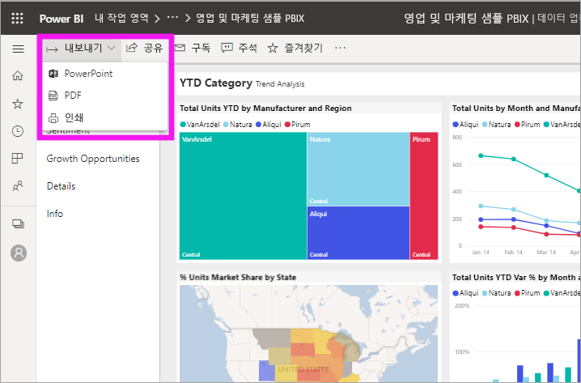
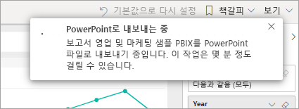
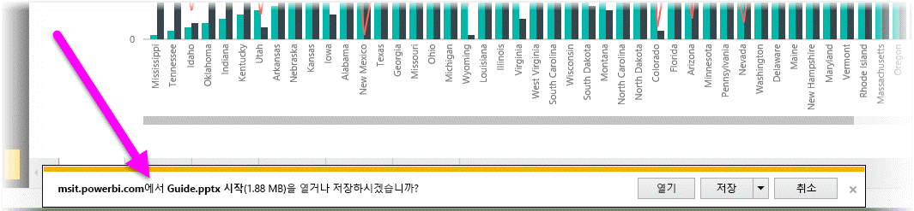
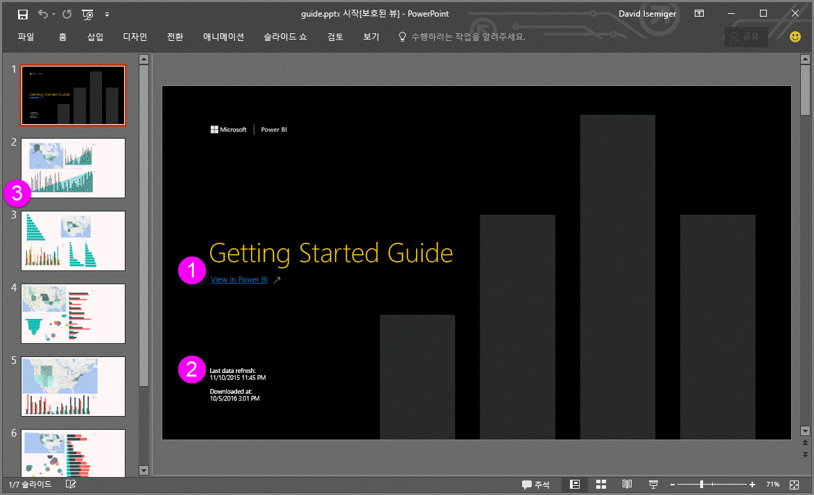
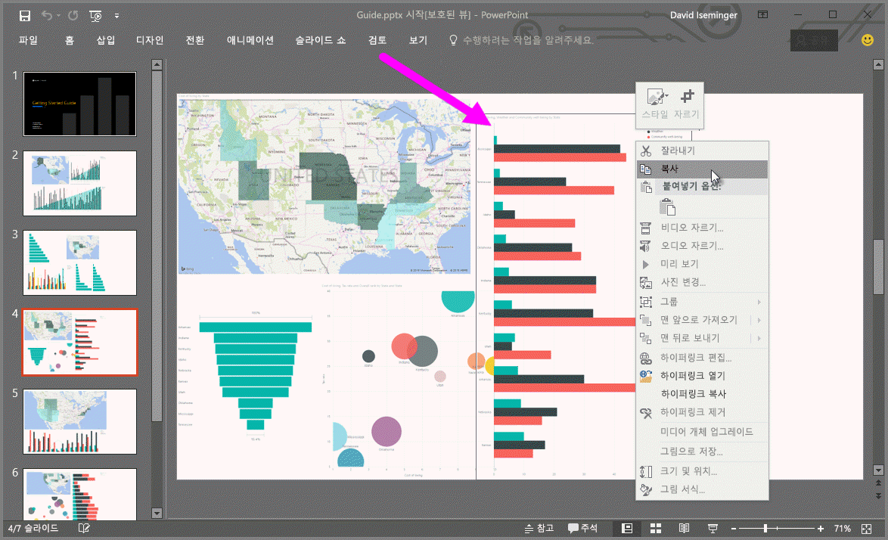

# 보고서를 Power BI에서 PowerPoint로 내보내기

[!INCLUDE [power-bi-service-new-look-include](../includes/power-bi-service-new-look-include.md)]

Power BI를 사용하여 보고서를 Microsoft PowerPoint에 게시하고 Power BI 보고서에 따라 슬라이드 모음을 쉽게 만들 수 있습니다. PowerPoint로 내보내는 경우 다음이 발생합니다.

* Power BI 보고서의 각 페이지는 PowerPoint에서 개별 슬라이드를 생성합니다.
* Power BI 보고서의 각 페이지는 PowerPoint에서 단일 고해상도 이미지로 내보내집니다.
* 사용자가 보고서에 추가한 필터와 슬라이서 세팅은 유지됩니다.
* Power BI 보고서로 연결되는 링크가 PowerPoint에서 만들어집니다.

**Power BI 보고서**를 **PowerPoint**로 빠르게 내보낼 수 있습니다. 다음 섹션에서 설명하는 단계를 수행합니다.

## Power BI 보고서를 PowerPoint로 내보내기
Power BI 서비스에서 보고서를 선택하여 캔버스에 표시합니다. **홈** 페이지, **앱** 또는 탐색 창의 다른 컨테이너에서 보고서를 선택할 수도 있습니다.

PowerPoint로 내보내려는 보고서가 캔버스에 표시되면 메뉴 모음에서 **내보내기** > **PowerPoint**를 선택합니다.

**현재 값** 또는 **기본 값**을 선택할 수 있는 옵션이 있는 팝업이 표시됩니다. **현재 값**은 슬라이서 및 필터 값에 대한 활성 변경 내용을 포함하는 현재 상태의 보고서를 내보냅니다. 대부분의 사용자는 이 옵션을 선택합니다. 또는 **기본 값**을 선택하면 보고서가 원래 상태(*작성자*가 공유한 상태)로 내보내지고 사용자가 원래 상태에서 변경한 내용이 반영되지 않습니다.

 
또한 보고서의 숨겨진 탭을 내보낼지 여부를 선택하는 확인란이 있습니다. 브라우저에 표시되는 보고서 탭만 내보내려면 이 확인란을 선택합니다. 모든 숨겨진 탭을 보고서의 일부로 가져오려면 이 확인란을 선택하지 않은 상태로 둡니다. 확인란이 회색으로 표시되면 보고서에 숨겨진 탭이 포함되지 않습니다. 항목을 선택한 후 **내보내기**를 선택하여 계속 진행합니다.

Power BI 서비스 브라우저 창의 오른쪽 위 모서리에 보고서가 PowerPoint로 내보내지고 있다는 알림 배너가 표시됩니다. 내보내기가 완료되려면 몇 분 정도 걸릴 수 있습니다. 보고서를 내보내는 동안 Power BI에서 계속 작업을 진행할 수 있습니다.

Power BI 서비스가 내보내기 작업을 완료하면 알림 배너에서 메시지를 통해 내보내기 프로세스가 완료되었음을 알려줍니다. 브라우저가 다운로드한 파일을 표시하면 파일을 사용할 수 있습니다. 다음 이미지에서는 브라우저 창 하단의 다운로드 배너로 표시됩니다.

이제 필요한 항목이 모두 준비되었습니다. 파일을 다운로드하고 PowerPoint로 연 다음 다른 PowerPoint 모음에서 원하는 대로 수정하거나 개선할 수 있습니다.

## 내보낸 PowerPoint 파일 확인
Power BI가 내보낸 PowerPoint 파일을 열면 훌륭하고 유용한 요소가 있습니다. 다음 이미지를 살펴보고 이러한 유용한 기능 중 일부에 대해 설명하는 몇몇 요소를 확인합니다.

1. 슬라이드 모음의 첫 번째 페이지에는 보고서의 이름 및 링크가 포함되어 슬라이드 모음의 기반이 되는 보고서를 **Power BI에서 볼** 수 있습니다.
2. 보고서에 대한 유용한 정보도 확인할 수 있습니다. **마지막 데이터 새로 고침**에는 내보내진 보고서의 기준 날짜와 시간이 표시됩니다. **다운로드됨**에는 Power BI 보고서가 PowerPoint 파일로 내보내진 날짜와 시간이 표시됩니다.
3. 각 보고서 페이지는 탐색 창에서 표시된 것과 같이 별도 슬라이드입니다. 
4. 게시되는 보고서는 Power BI 설정 또는 브라우저의 로캘 설정에 따른 언어로 렌더링됩니다. 언어 기본 설정을 보거나 설정하려면  > **설정** > **일반** > **언어**를 선택합니다. 로캘 정보는 [Power BI에 지원되는 언어 및 국가 또는 지역](../supported-languages-countries-regions.md)을 참조하세요.
5. PowerPoint 프레젠테이션에는 올바른 표준 시간대의 내보낸 시간이 있는 표지 슬라이드가 포함됩니다.

개별 슬라이드로 들어가면 각 보고서 페이지가 독립적인 이미지라는 것을 알 수 있습니다.

>[!NOTE]
> 각 보고서 페이지에 대한 시각적 개체를 갖는 것은 새로운 동작입니다. 각 시각적 개체에 대한 독립적 이미지를 제공하는 이전 동작은 더 이상 구현되지 않습니다. 
 

거기에서 PowerPoint 모음이나 고해상도 이미지로 원하는 작업을 수행할 수 있습니다.

## 제한 사항
**PowerPoint로 내보내기** 기능을 사용할 때 유의해야 할 고려 사항 및 제한 사항이 있습니다.

* R 시각적 개체는 현재 지원되지 않습니다. 이러한 시각적 개체는 시각적 개체가 지원되지 않는다는 오류 메시지와 함께 PowerPoint에 빈 이미지로 내보내집니다.
* 인증된 사용자 지정 시각적 개체는 지원됩니다. 사용자 지정 시각적 개체를 인증하는 방법을 비롯한 인증된 사용자 지정 시각적 개체에 대한 자세한 내용은 [사용자 지정 시각적 개체 인증하기](../power-bi-custom-visuals-certified.md)를 참조하세요. 인증되지 않은 사용자 지정 시각적 개체는 지원되지 않습니다. 이러한 시각적 개체는 시각적 개체가 지원되지 않는다는 오류 메시지와 함께 PowerPoint에 빈 이미지로 내보내집니다.
* 30개 이상의 보고서 페이지를 포함하는 보고서는 현재 내보낼 수 없습니다.
* 보고서를 PowerPoint로 내보내는 과정은 몇 분 정도 걸릴 수 있으므로 잠시 기다려 주시기 바랍니다. 소요 시간에 영향을 줄 수 있는 요소에는 보고서의 구조, Power BI 서비스의 현재 부하 등이 있습니다.
* **PowerPoint로 내보내기** 메뉴 항목을 Power BI 서비스에서 사용할 수 없다면 테넌트 관리자가 이 기능을 사용하지 않도록 설정했을 가능성이 큽니다. 자세한 내용은 테넌트 관리자에게 문의하세요.
* 배경 이미지는 차트의 경계 영역에서 잘립니다. PowerPoint로 내보내기 전에 배경 이미지를 제거하는 것이 좋습니다.
* PowerPoint의 페이지는 Power BI 보고서의 원래 페이지 크기에 관계 없이 항상 표준 9:16 크기로 만들어집니다.
* Power BI 테넌트 도메인 외부의 사용자가 소유한 보고서(예: 조직 외부 사람이 소유한 보고서 및 사용자와 공유한 보고서)는 PowerPoint에 게시할 수 없습니다.
* 조직 외부의 사람, 즉 Power BI 테넌트에 없는 사용자와 대시보드를 공유하면 해당 사용자는 공유 대시보드에 연결된 보고서를 PowerPoint로 내보낼 수 없습니다. 예를 들어 aaron@contoso.com은 david@cohowinery.com과 공유할 수 있지만, david@cohowinery.com은 연결된 보고서를 PowerPoint로 내보낼 수 없습니다.
* 이전 버전의 PowerPoint에서는 내보내기가 작동하지 않을 수 있습니다.
* 위에서 언급했듯이, 각 보고서 페이지는 PowerPoint 파일에서 단일 이미지 형식으로 내보내집니다.
* Power BI 서비스는 PowerPoint 내보내기에 대한 언어로 Power BI 언어 설정을 사용합니다. 언어 기본 설정을 보거나 설정하려면  > **설정** > **일반** > **언어**를 선택합니다.
* 내보낸 PowerPoint 파일의 표지 슬라이드에 있는 **다운로드된** 시간은 내보낼 때 컴퓨터의 표준 시간대로 설정됩니다.
* 현재는 내보내기에서 **현재 값**을 선택할 경우 URL 필터가 적용되지 않습니다.

## 다음 단계
[보고서 인쇄](end-user-print.md)
