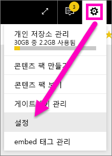
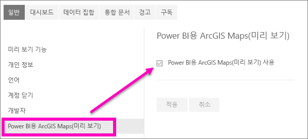

---
title: 미리 보기 기능용 옵트인
description: 미리 보기에 있는 Power BI 기능을 설정/해제하는 방법
author: mihart
manager: kvivek
ms.reviewer: ''
featuredvideoid: ''
ms.custom: seodec18
ms.service: powerbi
ms.subservice: powerbi-consumer
ms.topic: conceptual
ms.date: 05/13/2019
ms.author: mihart
LocalizationGroup: Get started
ms.openlocfilehash: ea81f7c264e4329ae29bb71e0fa8b038604504a1
ms.sourcegitcommit: 60dad5aa0d85db790553e537bf8ac34ee3289ba3
ms.translationtype: HT
ms.contentlocale: ko-KR
ms.lasthandoff: 05/29/2019
ms.locfileid: "65608397"
---
# Power BI 서비스 미리 보기 기능용 옵트인
## *미리 보기 기능* 이란?
Power BI 서비스를 향상하면서, *미리 보기 기능*으로 일부 새로운 기능을 출시합니다. 미리 보기 기능을 설정하거나 해제할 수 있으므로 이를 시험해 볼 수 있습니다.

## 미리 보기 설정(및 해제)
1. Power BI 화면 오른쪽 위 모퉁이에서 기어 아이콘을 선택하여 설정 메뉴를 열고 **설정**을 선택합니다.
   
   을 선택합니다.
2. **일반** 탭을 선택합니다. 미리 보기가 있을 경우, **미리 보기 기능**에 대한 옵션이 표시되거나 왼쪽에 미리 보기 기능이 표시될 것입니다.  이 예에서는 ArcGIS 지도에 대한 미리 보기가 있습니다. 
   
   
3. 새로운 환경을 시도하려면 **설정** 라디오 단추를 선택하거나 확인란을 표시합니다. 그런 다음 **적용**을 선택합니다.
4. 미리 보기 기능을 해제하려면 위의 1-3 단계를 수행하고 3단계에서 **해제**를 선택, 또는 확인 표시를 제거하고 **적용**을 선택합니다.

질문이나 의견이 있으십니까? [Power BI 커뮤니티 포럼 방문](http://community.powerbi.com/t5/Navigation-Preview-Forum/bd-p/NavigationPreview)

