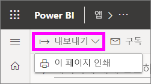
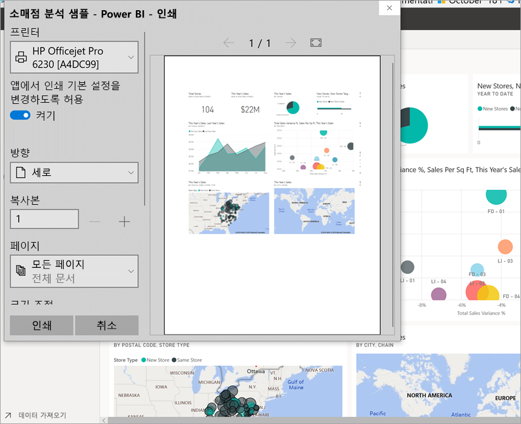
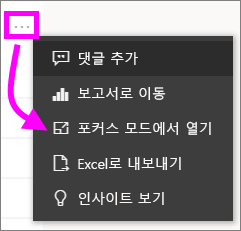
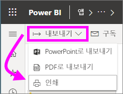

# Power BI 서비스에서 인쇄

[!INCLUDE [power-bi-service-new-look-include](../includes/power-bi-service-new-look-include.md)]

Power BI 서비스에서 전체 대시보드, 대시보드 타일, 보고서 페이지 또는 보고서 시각적 개체를 인쇄합니다. 보고서는 한 번에 한 페이지만 인쇄할 수 있습니다. 전체 보고서를 한 번에 인쇄할 수는 없습니다.

   > [!NOTE]
   > 표시된 인쇄 대화 상자는 사용 중인 브라우저에 따라 달라집니다.
   > 
## 대시보드 인쇄
1. 인쇄하려는 대시보드를 엽니다.
2. 왼쪽 위 모서리에서 [내보내기]를 선택하고 **이 페이지 인쇄**를 선택합니다.
   
    
3. 브라우저의 인쇄 창이 열립니다. 설정 및 인쇄 대상을 선택하고 **인쇄**를 선택합니다.
   

   
    

## 대시보드 타일 인쇄
1. 상단 메뉴 모음에서 전체 화면 아이콘 을 선택하여 [전체 화면 모드](end-user-focus.md)에서 대시보드를 엽니다.
3. 마우스로 가리켜 **추가 옵션**(...)을 표시한 다음 **포커스 모드에서 열기** 또는 포커스 아이콘 을 선택하여 [포커스 모드에서 타일을 엽니다](end-user-focus.md).
   
    
4. 타일을 마우스로 가리켜서 옵션 메뉴 표시
   
    
4. 인쇄 아이콘 을 선택합니다.     
   

## 보고서 페이지 인쇄
한 번에 한 페이지의 보고서를 인쇄할 수 있습니다.

1. 보고서를 열고 **내보내기** > **인쇄**를 선택하여 현재 보고서 페이지를 인쇄합니다.
   
    
3. 브라우저의 인쇄 창이 열립니다.
   

## 보고서 시각적 개체 인쇄
1. 타일 위로 마우스를 가져가고 오른쪽 위 모서리에서 포커스 아이콘 을 선택하여 [시각적 개체를 포커스 모드에서 엽니다](end-user-focus.md).

2. 왼쪽 위 모서리에서 **내보내기** > **인쇄**를 선택하여 시각적 개체를 인쇄합니다.

    

## 고려 사항 및 문제 해결

* Q: 한 번에 모든 보고서 페이지를 인쇄할 수 없습니다.    
* A: 정상 동작입니다. 보고서 페이지는 한 번에 한 페이지만 인쇄할 수 있습니다.
* Q: PDF로 인쇄할 수 없습니다.    
* A: 이 옵션은 브라우저에서 PDF 드라이버를 구성한 경우에만 나타납니다.    
* Q: **인쇄**를 선택하면 표시되는 내용이 여기에 표시된 내용과 같지 않습니다.    
* A: 인쇄 화면은 브라우저 및 소프트웨어 버전에 따라 다릅니다.
* Q: 인쇄물의 크기가 올바르게 조정되지 않습니다.  내 대시보드가 페이지에 맞지 않습니다. 기타 크기 조정 및 방향 질문입니다.    
* A: 인쇄된 복사본이 Power BI 서비스에 표시되는 것과 정확히 동일하게 표시된다고 보장할 수는 없습니다. 크기 조정, 여백, 시각적 개체 세부 정보, 방향 및 크기와 같은 항목은 Power BI에서 제어되지 않습니다. 다음과 같은 문제에 대한 도움말은 특정 브라우저에 대한 설명서를 참조하세요.      

## 다음 단계
[동료 및 다른 사용자와 대시보드 및 보고서 공유](../service-share-dashboards.md)

궁금한 점이 더 있나요? [Power BI 커뮤니티를 이용하세요.](https://community.powerbi.com/)

