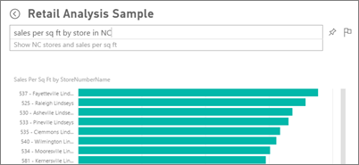
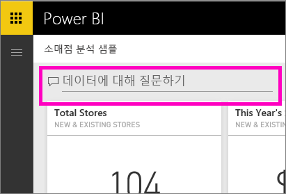
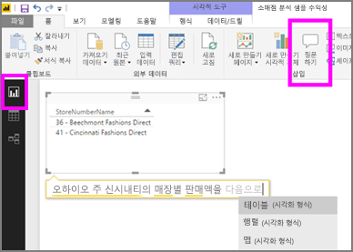

# Power BI 서비스 및 Power BI Desktop의 질문 및 답변
## 질문 및 답변이란 무엇인가요?
경우에 따라 자연어를 사용하여 질문을 하면 가장 빠르게 사용자 데이터로 답변을 받을 수 있습니다. 예를 들어 “지난 해 총 매출은 얼마인가요?”와 같이 질문합니다.  질문 및 답변을 사용하면 직관적인 자연어 기능을 사용하여 데이터를 탐색하고 차트 및 그래프 형식으로 답변을 받을 수 있습니다. 질문 및 답변은 검색 엔진과 다릅니다. 질문 및 답변은 Power BI에서 데이터에 대한 결과만 제공합니다.

이 문서는 모든 질문 및 답변에 대한 출발점입니다. 아래에서 링크를 선택하여 Power BI 서비스(대시보드 및 보고서), Power BI Desktop(보고서), Power BI Embedded 및 Power BI Mobile에서 질문 및 답변이 작동하는 원리를 알아보세요.  

> [!NOTE]
> **Power BI 질문 및 답변**은 영어로 요청된 자연어 쿼리에 응답하는 기능만 지원합니다. 또한 스페인어로 된 질문에 대해 미리 보기 기능을 사용해 볼 수도 있습니다. **Power BI Desktop**에서 **파일**, **옵션 및 설정**, **옵션**으로 이동하여 **미리 보기 기능** 탭을 찾습니다. **질문 및 답변의 스페인어 지원** 확인란을 선택합니다.  
>
>

질문은 시작일 뿐입니다.  질문을 구체화 또는 확장하거나 신뢰할 수 있는 새로운 정보를 발견하거나 세부 사항에 집중하거나 한발 물러서서 넓은 관점에서 살펴보는 등 데이터를 다양하게 활용할 수 있습니다. 이를 통해 통찰력을 얻고 발견의 즐거움을 느낄 수 있게 됩니다.

이러한 모든 경험이 진정한 대화형으로 신속하게 이루어집니다! 메모리 내 저장소를 통해 응답이 거의 즉각적으로 이루어집니다.

##  *소비자*에 대한 질문 및 답변
동료들이 사용자와 대시보드를 공유하면 사용자는 Power BI 서비스(app.powerbi.com)의 대시보드, Power BI Mobile의 대시보드 상단 그리고 Power BI Embedded의 시각화 위에서 질문 및 답변 질문 상자를 찾을 수 있습니다. 소유자가 편집 권한을 부여하지 않는 한, 사용자는 질문 및 답변을 사용하여 데이터를 탐색할 수 있지만 질문 및 답변을 사용하여 만든 시각화를 저장할 수 없습니다.

## *작성자*에 대한 질문 및 답변
Power BI 보고서의 *작성자*이거나 데이터 집합 편집 권한을 갖고 있는 경우 Power BI 서비스의 대시보드와 Power BI 서비스 및 Power BI Desktop의 각 보고서 페이지에서 질문 및 답변 질문 상자를 찾을 수 있습니다. 질문 및 답변을 사용하여 만든 모든 시각화를 대시보드에 저장하고 보고서에 저장할 수입니다.

질문 및 답변을 사용하여 데이터를 탐색할 수 있을 뿐 아니라 작성자 및 데이터 집합 소유자가 온-프레미스 라이브 연결 데이터 집합에 대해 [데이터 집합을 수정](../service-prepare-data-for-q-and-a.md)하고, [추천 질문](../service-q-and-a-create-featured-questions.md)을 추가하고, [질문 및 답변을 설정 및 해제](end-user-q-and-a-direct-query.md)하여 소비자의 질문 및 답변 경험을 개선할 수 있습니다. [Embedded 시나리오](../developer/qanda.md)에서는 개발자가 **대화형** 모드와 **결과 전용** 모드 중에서 선택할 수 있습니다.

## 질문 및 답변에서 질문에 답변하는 방법을 어떻게 알 수 있나요?
### 질문 및 답변에서 어떤 데이터 집합을 사용하나요?
질문 및 답변에서 데이터 관련 질문에 답변하는 방법을 어떻게 알 수 있나요? 질문 및 답변에서는 기본 데이터 집합의 테이블, 열 및 계산된 필드 이름을 사용합니다. 따라서 사용자(또는 데이터 집합 소유자)가 어떤 것을 호출하는지가 중요합니다.

예를 들어, "Product", "Month", "Units Sold", "Gross Sales" 및 "Profit"이라는 열이 있는 "Sales"라는 Excel 테이블이 있다고 가정합니다. 이러한 엔터티에 대해 질문을 할 수 있습니다.  "판매액 표시", "월별 총수익" , "판매된 단위별 제품 정렬" 등으로 질문할 수 있습니다.

질문 및 답변에서는 데이터 집합이 구성되는 방식을 기반으로 질문에 대답할 수 있습니다. Salesforce에서는 데이터에 대해 어떻게 작동하나요? salesforce.com 계정에 연결하면 Power BI가 대시보드를 자동으로 생성합니다.  질문 및 답변으로 질문을 시작하기 전에 대시보드 시각화에 표시되는 데이터와 질문 및 답변 드롭다운에 표시되는 데이터를 확인합니다.

* 시각화 축 레이블과 값에 "sales", "account", "month" 및 "opportunities"가 포함되는 경우 "Which *account* has the highest *opportunity* 또는 show *sales* by month as a bar chart"와 같은 질문을 자신 있게 할 수 있습니다.
* 드롭다운에 "salesperson", "state" 및 "year"를 포함하는 경우 "which *salesperson* had the lowest *sales* in *Florida* in *2013*"과 같은 질문을 자신 있게 할 수 있습니다.

Google 분석의 웹 사이트 성능 데이터가 있는 경우 웹 페이지에 소요된 시간, 페이지 순 방문 수 및 사용자 참여율에 대한 질문 및 답변을 할 수 있습니다. 또는 인구 통계 데이터를 쿼리하는 경우 지역별 연령 및 가구 소득에 대한 질문을 할 수 있습니다.

### 질문 및 답변에서 사용하는 시각화는 무엇인가요?
질문 및 답변에서는 표시되는 데이터를 기반으로 최적의 시각화를 선택합니다. 경우에 따라 기본 데이터 집합의 데이터가 특정 형식 또는 범주로 정의되며 이렇게 하면 질문 및 답변에서 데이터를 표시하는 방법을 알리는 데 도움이 됩니다. 예를 들어 데이터가 날짜 형식으로 정의되는 경우 꺾은선형 차트로 표시될 가능성이 높습니다. 도시로 분류된 데이터는 지도로 표시될 가능성이 높습니다.

질문에 사용할 시각화를 추가하여 사용할 시각화를 알리는 방법도 있습니다. 하지만 질문 및 답변에서 항상 사용자가 요청한 시각화 유형으로 데이터를 표시할 수 있는 것은 아님을 유의해야 합니다.

질문 및 답변에서 인식하는 키워드에 대한 정보는 [질문하기 위한 팁](end-user-q-and-a-tips.md)을 참조하세요.

## Power BI 질문 및 답변에 대한 자세한 내용
[개요: Power BI 대시보드 및 보고서에서 질문 및 답변을 사용하는 방법](../power-bi-tutorial-q-and-a.md): 질문 및 답변 사용에 대한 단계별 지침과 전체적인 작동 방식에 대한 개요입니다.

[Microsoft Power BI 모바일 앱](mobile/mobile-apps-ios-qna.md) iPads, iPhones, iPod Touch 장치의 iOS용.

[Microsoft Power BI Embedded](../developer/qanda.md) 질문 및 답변을 응용 프로그램에 통합합니다.

[Q&A에서 질문하기 위한 팁](end-user-q-and-a-tips.md): Q&A와 대화를 통해 가능한 최상의 결과를 얻는 방법을 알아봅니다.

[데이터 집합에 추천된 질문 추가](../service-q-and-a-create-featured-questions.md) 및 Q&A는 동료에게 이러한 질문을 제안합니다.

[온-프레미스 데이터 집합에 질문 및 답변 사용](end-user-q-and-a-direct-query.md) 데이터 집합에 연결하려면 게이트웨이가 필요한 경우 Power BI 설정을 사용하여 질문 및 답변을 켜고 끕니다.

[자습서: Power BI 서비스에서 소매점 판매 샘플에 질문 및 답변 사용](../power-bi-visualization-introduction-to-q-and-a.md): 실제 업계 자습서에서 질문 및 답변을 사용합니다.

[Q&A에서 데이터가 잘 작동하도록 설정](../service-prepare-data-for-q-and-a.md): 데이터 집합 및 데이터 모델을 작성하시나요?  이 항목을 통해 해답을 얻으실 수 있습니다.

궁금한 점이 더 있나요? [Power BI 커뮤니티를 이용하세요.](http://community.powerbi.com/)
