<!-- once the sample apps are live, change this so consumers can follow along -->
# 빠른 시작: ***소비자***의 Power BI 기능 알아보기
이 빠른 시작에서는 Power BI를 조작하여 데이터 기반 비즈니스 인사이트를 검색하는 방법을 알아봅니다. 이 문서에서는 자세한 내용을 제공하는 대신 Power BI **소비자**가 사용할 수 있는 다양한 작업을 빠르게 둘러볼 수 있습니다.

아직 Power BI에 등록하지 않은 경우 시작하기 전에 [평가판에 등록합니다](https://app.powerbi.com/signupredirect?pbi_source=web).

## 필수 조건
- Power BI 서비스(app.powerbi.com)
<!-- app from AppSource -->

## 읽기용 보기
읽기용 보기는 보고서 ‘소비자’의 Power BI 서비스에서 사용할 수 있습니다. 동료가 보고서를 공유해주면 읽기용 보기를 사용하여 보고서를 탐색 및 조작할 수 있습니다. 

다른 Power BI 서비스 보고서 모드는 보고서 ‘디자이너’가 사용할 수 있는 [편집용 보기](../service-interact-with-a-report-in-editing-view.md)입니다.  

읽기용 보기는 대시보드 및 보고서를 탐색하는 강력하고 안전한 방법입니다. 공유된 대시보드와 보고서를 조각화 및 분석하는 동안 기본 데이터 집합은 그대로 유지되고 변경되지 않습니다. 

읽기용 보기에서 페이지의 시각적 개체를 교차 강조 표시 및 교차 필터링하는 등의 작업을 수행할 수 있습니다.  하나의 시각적 개체에서 값을 강조 표시하거나 선택하고 즉시 다른 시각적 개체에 미치는 영향을 확인합니다. 필터 창을 사용하여 보고서 페이지에 필터를 추가하고 수정하며 시각화에 값이 정렬되는 방식을 변경합니다. 이는 Power BI의 몇 가지 ‘소비자’ 기능일 뿐입니다.  이러한 항목 등을 자세히 알아보려면 계속 읽어보세요.

 
### 앱 보기
Power BI에서 ‘앱’은 관련 대시보드 및 보고서와 함께 모두 한곳에서 번들로 제공됩니다.

1. **앱**  > **앱 가져오기**를 선택합니다. 
   
     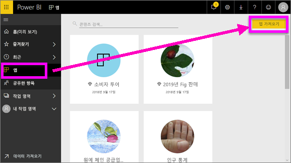
2. AppSource의 **내 조직**에서 검색하여 결과 범위를 좁힌 후 찾고자 하는 앱을 찾습니다.
   
     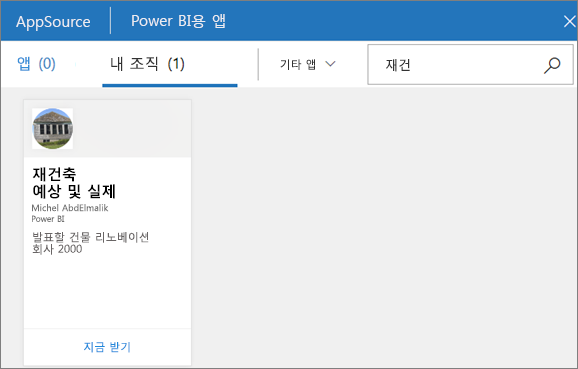
3. **지금 가져오기**를 선택하여 앱 컨테이너에 추가합니다. 

### 대시보드 보기
이 앱은 대시보드로 열립니다. Power BI ***대시보드***는 보통 캔버스라고도 하며 스토리를 전달하기 위해 시각화를 사용하는 단일 페이지입니다. 한 페이지로 제한되기 때문에 해당 스토리의 가장 중요한 요소만 포함할 경우 잘 디자인된 대시보드라 할 수 있습니다.

대시보드에 표시되는 시각화를 타일이라고 하며 보고서에서 대시보드에 고정됩니다.

### 대시보드(또는 보고서) 구독
대시보드를 모니터링하기 위해 Power BI를 열 필요가 없습니다.  대신에 구독하면 Power BI가 설정된 일정에 따라 해당 대시보드의 스냅샷을 메일로 보내 줍니다. 

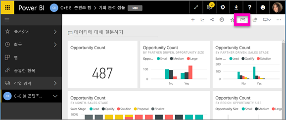

1. 상단의 메뉴 모음에서 **구독**을 선택하거나 봉투 아이콘 을 선택합니다.
   
   

3. 노란색 슬라이더를 사용하여 구독을 설정하거나 해제합니다.  선택적으로 메일 메시지 세부 사항을 추가하세요. 

    아래 스크린샷에서 보고서를 구독할 때 실제 보고서 *페이지*를 구독하는 것을 의미합니다.  보고서에서 여러 페이지를 구독하려면 **다른 구독 추가**를 선택하고, 다른 페이지를 선택합니다. 
      
   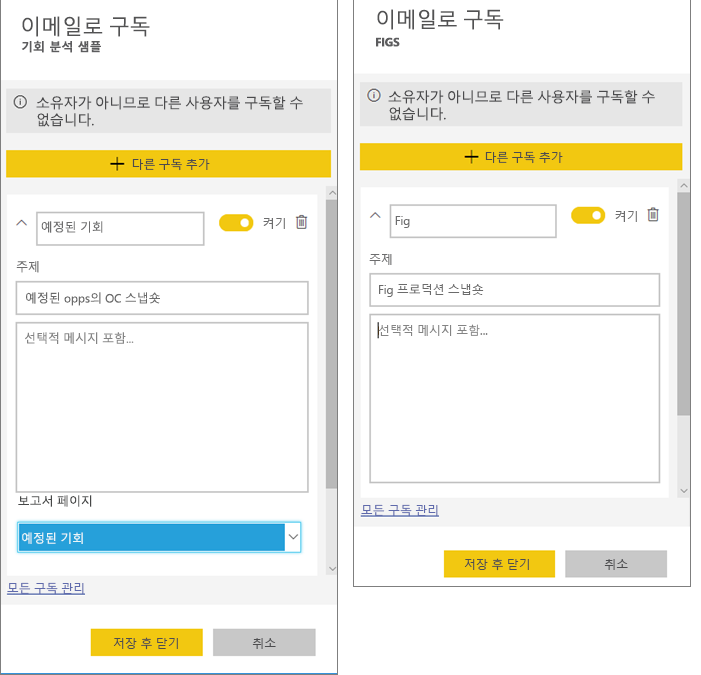
   
    보고서 페이지를 새로 고치면 데이터 세트가 새로 고쳐지지 않습니다. 데이터 세트 소유자만 데이터 세트를 수동으로 새로 고칠 수 있습니다. 기본 데이터 세트의 이름을 검색하려면 맨 위 메뉴 모음에서 **관련 항목 보기**를 선택합니다.

### 관련 콘텐츠 보기
**관련 콘텐츠** 창은 Power BI 서비스 콘텐츠(대시보드, 보고서 및 데이터 세트)가 서로 어떻게 연결되어 있는지를 보여 줍니다. 창에 관련 콘텐츠가 표시될 뿐만 아니라 콘텐츠에 대한 작업을 수행하고 관련 콘텐츠 간을 쉽게 탐색할 수 있습니다.

대시보드 또는 보고서의 위쪽 메뉴 모음에서 **관련 항목 보기**를 선택합니다.

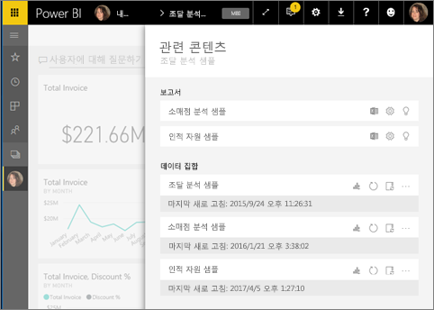

### 질문 및 답변을 사용하여 자연어 사용에 대해 질문하기
경우에 따라 자연어를 사용하여 질문을 하면 가장 빠르게 사용자 데이터로 답변을 받을 수 있습니다. 질문 및 답변 상자는 대시보드의 위쪽에서 사용할 수 있습니다. “show me count of large opportunities by sales stage as a funnel.”을 예로 들 수 있습니다. 

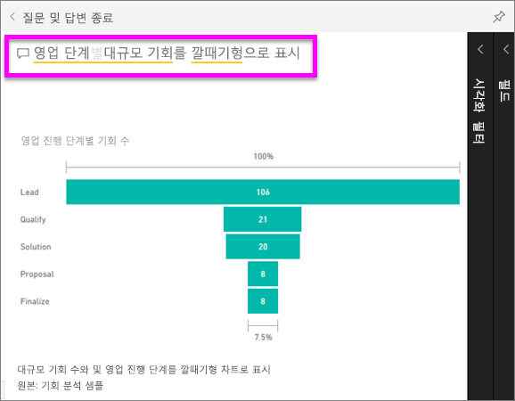

### 대시보드를 즐겨찾기에 추가
콘텐츠를 ‘즐겨찾기’로 만들면 왼쪽 모음에서 콘텐츠에 액세스할 수 있습니다. 왼쪽 탐색 모음은 Power BI의 모든 영역에 표시됩니다. 즐겨찾기는 일반적으로 가장 자주 방문하는 대시보드, 보고서 페이지 및 앱입니다.

1. 질문 및 답변을 종료하여 대시보드로 돌아갑니다.    
2. Power BI 서비스의 오른쪽 위 모서리에서 **즐겨찾기**나 별모양  아이콘을 선택합니다.
   
   

### 보고서 및 보고서 페이지 열기 및 보기
보고서는 하나 이상의 시각적 개체 페이지입니다. 보고서는 Power BI ‘보고서 디자이너’가 만들고 직접 또는 [앱](end-user-apps.md)의 일부로 [‘소비자’와 공유](end-user-shared-with-me.md)합니다. 

대시보드에서 보고서를 열 수 있습니다. 대부분의 대시보드 타일은 보고서에서 ‘고정’됩니다. 타일을 선택하면 타일을 만드는 데 사용된 보고서가 열립니다. 

1. 대시보드에서 타일을 선택합니다. 이 예제에서는 “수익” 열 차트 타일을 선택했습니다.

    

2.  연결된 보고서가 열립니다. “수익 개요” 페이지에 있는지 확인합니다. 이는 대시보드에서 선택한 열 차트가 포함된 보고서 페이지입니다.

    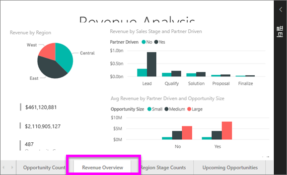

### 표시 크기 조정
보고서는 다양한 디바이스에서 다양한 화면 크기 및 가로 세로 비율로 볼 수 있습니다.  기본 렌더링으로는 디바이스에서 보고자 하는 모습이 아닐 수 있습니다.  

1. 조정하려면 위쪽 메뉴 모음에서 **보기**를 선택합니다.

    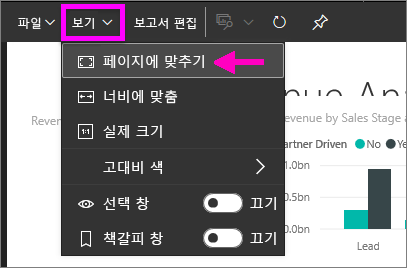

2.  표시 옵션 중 하나를 선택합니다. 이 예제에서는 **페이지에 맞추기**를 선택했습니다.

    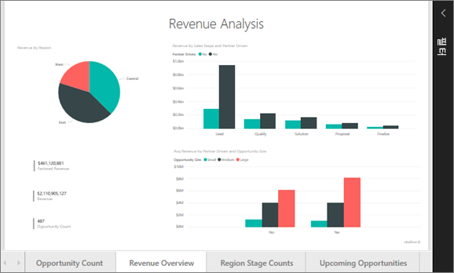    

### 보고서 필터 창 사용
보고서 작성자가 보고서의 페이지에 필터를 추가한 경우 필터를 조작하고 변경 내용을 보고서와 함께 저장할 수 있습니다.

1. 오른쪽 위에 있는 **필터** 아이콘을 선택합니다.
   
   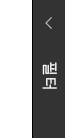  

2. 시각적 개체를 선택하여 활성화합니다. 시각적 개체에 적용된 모든 필터(시각적 개체 수준 필터)가 전체 보고서 페이지(페이지 수준 필터) 및 전체 보고서(보고서 수준 필터)에서 표시됩니다.
   
   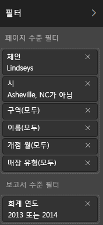

3. 필터를 마우스로 가리키고 아래쪽 화살표를 선택하여 확장합니다.
   
   

4. 필터를 변경하고 시각적 개체에 준 영향을 확인합니다.  
   
     
     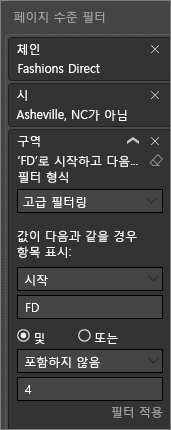

### 페이지에 있는 모든 시각적 개체의 상호 연결 방법 참조
페이지에서 관련 시각화를 교차 강조 표시 및 교차 필터링합니다. 단일 보고서 페이지에 있는 시각화는 모두 서로 "연결되어" 있습니다.  즉, 하나의 시각화에서 하나 이상의 값을 선택하면 동일한 값을 사용하는 다른 시각화가 선택 항목에 따라 변경됩니다.

> 
### 시각화의 세부 정보 표시
세부 정보를 보려면 시각적 요소를 마우스로 가리킵니다.

### 시각화 정렬
보고서 페이지의 시각적 개체를 정렬하고 적용된 변경 내용과 함께 저장할 수 있습니다. 

1. 시각적 개체를 마우스로 가리켜 활성화합니다.    
2. 줄임표(...)를 선택하여 정렬 옵션을 엽니다.

     

###  **선택 영역** 창 열기
보고서 페이지의 시각화 간에 쉽게 탐색할 수 있습니다. 

1. **보기 > 선택 영역 창**을 선택하여 [선택 영역] 창을 엽니다. **선택 영역 창**을 켜기로 토글합니다.

    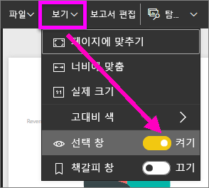

2. [선택 영역] 창이 보고서 캔버스에서 열립니다. 목록에서 시각적 개체를 선택하여 활성화합니다.

    

### 개별 시각적 개체 확대
시각적 개체를 마우스로 가리키고 **포커스 모드** 아이콘 을 선택합니다. 아래와 같이 포커스 모드에서 시각화를 보고 전체 보고서 캔버스를 채우도록 확장합니다.

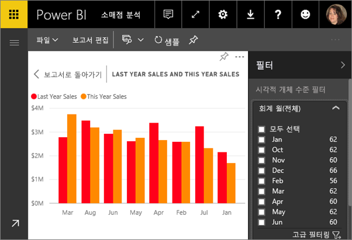

메뉴 모음, 필터 창, 기타 크롬 없이 이 시각화만 표시하려면 상단 메뉴 모음에서 **전체 화면** 아이콘  을 선택합니다.

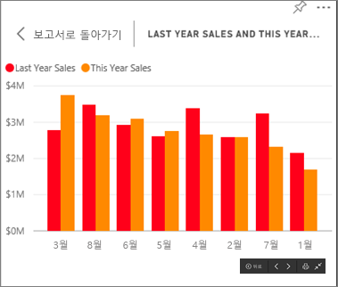

### 시각화를 만드는 데 사용된 데이터 표시
Power BI 시각화는 기본 데이터 세트의 데이터를 사용하여 구성됩니다. 숨은 기능에 관심이 있는 경우, Power BI를 사용하면 시각적 개체를 만드는 데 사용되는 데이터를 *표시*할 수 있습니다. **데이터 표시**를 선택하면 Power BI는 시각화 아래(또는 옆에) 데이터를 표시합니다.

1. Power BI 서비스에서 보고서를 열고 시각적 개체를 선택합니다.  
2. 시각적 개체 뒤에 데이터를 표시하려면 줄임표(...)를 선택하고 **데이터 표시**를 선택합니다.
   
   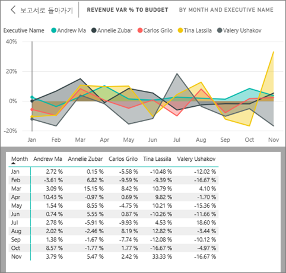

이는 **소비자**가 Power BI 서비스로 수행할 수 있는 몇 가지 작업의 빠른 개요였습니다.  

## 리소스 정리
- 앱에 연결한 경우 왼쪽 탐색 모음에서 **앱**을 선택하여 앱 콘텐츠 목록을 엽니다. 삭제할 앱을 마우스로 가리키고 휴지통 아이콘을 선택합니다.

- Power BI 샘플 보고서를 가져오거나 연결한 경우 왼쪽 탐색 모음에서 **내 작업 영역**을 엽니다. 맨 위에 있는 탭을 사용하여 대시보드, 보고서 및 데이터 세트를 찾고 각각의 휴지통 아이콘을 선택합니다.

## 다음 단계

