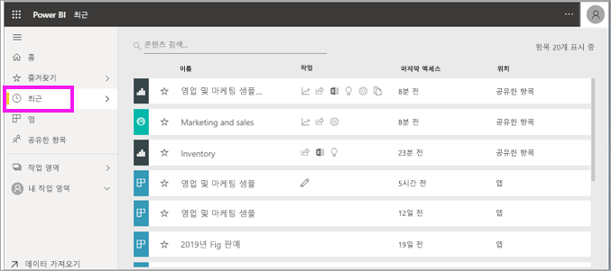
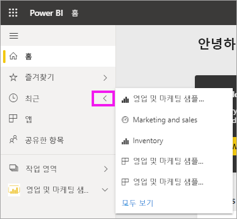
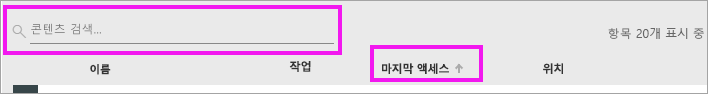

# Power BI 서비스의 **최근** 콘텐츠
최근 콘텐츠란 사용자가 Power BI 서비스에서 방문한 마지막 항목입니다(최대 20개).  여기에는 대시보드, 보고서, 앱 및 통합 문서가 포함됩니다.

Amanda가 Power BI 서비스 **최근** 콘텐츠 목록을 채우는 방법을 보여주는 비디오를 시청한 다음, 비디오 아래의 단계별 지침을 수행하여 직접 사용해보세요.

<iframe width="560" height="315" src="https://www.youtube.com/embed/G26dr2PsEpk" frameborder="0" allowfullscreen></iframe>

> [!NOTE]
> 이 비디오에서는 이전 버전의 Power BI 서비스를 사용합니다.

## 최근 콘텐츠 표시
최근 방문한 5개 항목을 보려면 탐색 창에서 **최근** 오른쪽에 있는 화살표를 선택합니다.  여기에서 최근 콘텐츠를 선택하여 열 수 있습니다. 최근 5개 항목만 나열됩니다.

최근 방문한 항목이 5개 이상 있는 경우 **모두 보기**를 선택하면 최근 화면이 열립니다. 탐색 창에서 **최근** 또는 최근  아이콘을 선택할 수도 있습니다.

## **최근** 콘텐츠 목록에서 사용 가능한 동작
사용 가능한 동작은 콘텐츠 *디자이너*가 할당한 설정에 따라 달라집니다. 옵션에는 다음이 포함될 수 있습니다.
* 별 아이콘을 선택하여 [대시보드, 보고서 또는 앱을 즐겨찾기에 추가](end-user-favorite.md) 
* 일부 대시보드 및 보고서는 다시 공유할 수 있음  .
* [Excel에서 보고서 열기](end-user-export.md)  
* Power BI가 데이터에서 찾은 [인사이트 보기](end-user-insights.md) 
* 또한, 목록이 길어지면 [검색 필드를 사용하여 정렬한 후 필요한 항목을 찾습니다](end-user-search-sort.md). 열을 정렬할 수 있는지 확인하려면 마우스로 가리켜서 화살표가 나타나는지 봅니다. 이 예제에서는 **마지막 액세스**를 마우스로 가리키면 화살표가 나타납니다. 즉, 액세스 날짜를 기준으로 최근 콘텐츠를 정렬할 수 있습니다. 

    

## 다음 단계
[Power BI 서비스 앱](end-user-apps.md)

궁금한 점이 더 있나요? [Power BI 커뮤니티를 이용하세요.](https://community.powerbi.com/)

