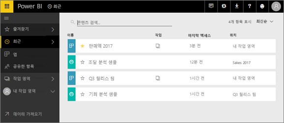
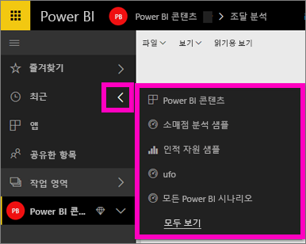
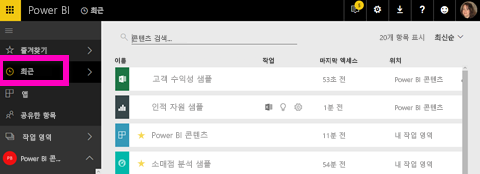

# Power BI 서비스의 **최근** 콘텐츠

## 최근 콘텐츠란
최근 콘텐츠란 사용자가 Power BI 서비스에서 방문한 마지막 항목입니다(최대 20개).  여기에는 대시보드, 보고서, 앱 및 모든 작업 영역의 통합 문서가 포함됩니다.

Amanda가 Power BI 서비스 **최근** 콘텐츠 목록을 채우는 방법을 보여주는 비디오를 시청한 다음, 비디오 아래의 단계별 지침을 수행하여 직접 사용해보세요.

<iframe width="560" height="315" src="https://www.youtube.com/embed/G26dr2PsEpk" frameborder="0" allowfullscreen></iframe>

## 최근 콘텐츠 표시
최근 방문한 5개 항목을 보려면 왼쪽 탐색에서 **최근** 옆의 화살표를 선택하세요.  여기에서 최근 콘텐츠를 선택하여 열 수 있습니다. 최근 5개 항목만 나열됩니다.

최근 방문한 항목이 5개 이상 있는 경우 **모두 보기**를 선택하면 최근 화면이 열립니다(아래 참조). 또한, **최근** 또는 왼쪽 탐색에서 최근  아이콘을 선택할 수도 있습니다.

여기에서 개별 [**대시보드**](end-user-dashboards.md), [**보고서**](end-user-reports.md) 및 **통합 문서** 탭, 그리고 [**앱**](end-user-apps.md) 화면에서 하는 것처럼 콘텐츠와 상호 작용할 수 있습니다.

## 다음 단계
[Power BI 서비스 앱](end-user-apps.md)

궁금한 점이 더 있나요? [Power BI 커뮤니티를 이용하세요.](http://community.powerbi.com/)

