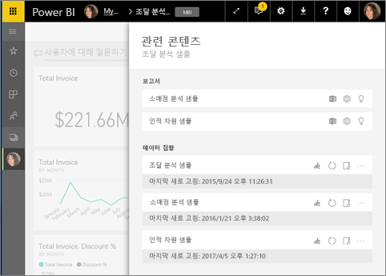
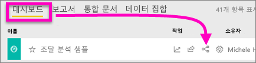
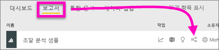
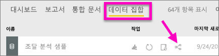
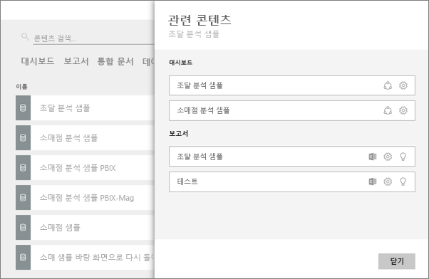

# Power BI 서비스에서 관련 콘텐츠 보기
**관련 콘텐츠** 창은 Power BI 서비스 콘텐츠(대시보드, 보고서 및 데이터 세트)가 서로 어떻게 연결되어 있는지를 보여 줍니다. 관련 콘텐츠 창은 작업을 수행하기 위한 실행 공간으로도 기능합니다. 관련 콘텐츠 창에서 새로 고치거나, 이름을 변경하거나, 인사이트를 생성하는 등 다양한 작업을 수행할 수 있습니다. 관련 보고서 또는 대시보드를 선택하면 Power BI 작업 영역에서 열립니다.   

Power BI에서 보고서는 데이터 세트를 기반으로 작성되고, 보고서의 시각적 개체는 대시보드에 고정되며, 대시보드의 시각적 개체는 다시 보고서로 연결됩니다. 그렇다면 마케팅 보고서의 시각적 개체는 어느 대시보드에서 호스트하는지 어떻게 알 수 있을까요? 그리고 이러한 대시보드를 어떻게 찾나요? 조달 대시보드가 둘 이상의 데이터 세트에 있는 시각적 개체를 사용하고 있나요? 그렇다면 이름을 무엇으로 지정하고 어떻게 열고 편집할 수 있나요? HR 데이터 세트를 사용하는 보고서 또는 대시보드가 있을까요? 링크가 끊어지지 않도록 하면서 데이터 세트를 이동할 수는 없을까요? 이와 같은 질문에 대한 답변은 모두 **관련 콘텐츠** 창에서 확인할 수 있습니다.  관련 콘텐츠 창은 관련 콘텐츠를 표시해 줄 뿐 아니라 콘텐츠에 대해 작업을 수행하고 관련 콘텐츠 사이를 손쉽게 이동할 수 있는 곳으로도 기능합니다.

> [!NOTE]
> 스트리밍 데이터 세트에는 관련 콘텐츠 기능이 작동하지 않습니다.
> 
> 

## 대시보드에 대한 관련 콘텐츠 보기
Will이 대시보드에 대한 관련 콘텐츠를 보는 것을 설명하는 비디오를 시청합니다. 그런 다음, 비디오 아래의 단계별 지침에 따라 직접 조달 분석 샘플 데이터 세트를 사용해 봅니다.

<iframe width="560" height="315" src="https://www.youtube.com/embed/B2vd4MQrz4M#t=3m05s" frameborder="0" allowfullscreen></iframe>

**관련 콘텐츠** 창을 열려면 대시보드에 대해 *보기* 이상의 권한이 있어야 합니다. 이 예제에서는 [조달 분석 샘플](../sample-procurement.md)을 사용합니다.

**방법 1**

작업 영역에서 **대시보드** 탭을 선택한 다음 **관련 항목 보기** 아이콘 을 선택합니다.

 

**방법 2**

대시보드 열기를 사용하여, 상위 메뉴 모음에서 을 선택합니다.

**관련 콘텐츠** 창이 열립니다. 대시보드에 시각화가 고정되고 관련된 데이터 세트가 있는 모든 보고서가 표시됩니다. 이 대시보드의 경우 서로 다른 3개의 보고서에서 고정된 시각화가 있으며 해당 보고서는 서로 다른 3개의 데이터 세트를 기반으로 합니다.

여기에서 관련 콘텐츠에 대해 직접 작업할 수 있습니다.  예를 들어 보고서 이름을 선택하여 엽니다.  나열된 보고서의 경우 [Excel에서 분석](../service-analyze-in-excel.md), [이름 바꾸기](../service-rename.md) 또는 [유용한 정보 얻기](end-user-insights.md)에 대한 아이콘을 선택합니다. 데이터 세트의 경우 [새 보고서 만들기](../service-report-create-new.md), [새로 고침](../refresh-data.md), 이름 바꾸기, [Excel에서 분석](../service-analyze-in-excel.md), [유용한 정보 얻기](end-user-insights.md) 또는 데이터 세트에 대해 **설정** 창 열기에 대한 아이콘을 선택합니다.  

## 보고서에 대한 관련 콘텐츠 보기
**관련 콘텐츠** 창을 열려면 보고서에 대해 *보기* 이상의 권한이 있어야 합니다. 이 예제에서는 [조달 분석 샘플](../sample-procurement.md)을 사용합니다.

**방법 1**

작업 영역에서 **보고서** 탭을 선택한 다음, **관련 항목 보기** 아이콘 을 선택합니다.

 

**방법 2**

[읽기용 보기](end-user-reading-view.md)에서 보고서를 열고 상위 메뉴 모음에서 을 선택합니다.

**관련 콘텐츠** 창이 열립니다. 보고서에서 고정된 타일이 하나 이상 있는 관련 데이터 세트 및 모든 대시보드가 표시됩니다. 이 보고서의 경우 2개의 서로 다른 대시보드에 고정된 시각화가 있습니다.

여기에서 관련 콘텐츠에 대해 직접 작업할 수 있습니다. 예를 들어 대시보드 이름을 선택하여 엽니다. 목록에 있는 대시보드에서 아이콘을 선택하여 [다른 사람과 대시보드를 공유](../service-share-dashboards.md)하거나 해당 대시보드의 **설정** 창을 엽니다. 데이터 세트의 경우 [새 보고서 만들기](../service-report-create-new.md), [새로 고침](../refresh-data.md), 이름 바꾸기, [Excel에서 분석](../service-analyze-in-excel.md), [유용한 정보 얻기](end-user-insights.md) 또는 데이터 세트에 대해 **설정** 창 열기에 대한 아이콘을 선택합니다.  

## 데이터 세트에 대한 관련 콘텐츠 보기
**관련 콘텐츠** 창을 열려면 데이터 세트에 대해 *보기* 이상의 권한이 있어야 합니다. 이 예제에서는 [조달 분석 샘플](../sample-procurement.md)을 사용합니다.

작업 영역에서 **데이터 세트** 탭을 선택하고 **관련 항목 보기** 아이콘 을 찾습니다.

**관련 콘텐츠** 창을 여는 아이콘을 선택합니다.

여기에서 관련 콘텐츠에 대해 직접 작업할 수 있습니다. 예를 들어 대시보드 또는 보고서 이름을 선택하여 엽니다.  목록에 있는 대시보드에서 아이콘을 선택하여 [다른 사람과 대시보드를 공유](../service-share-dashboards.md)하거나 해당 대시보드의 **설정** 창을 엽니다. 보고서의 경우 [Excel에서 분석](../service-analyze-in-excel.md), [이름 바꾸기](../service-rename.md) 또는 [유용한 정보 얻기](end-user-insights.md)에 대한 아이콘을 선택합니다.  

## 제한 사항 및 문제 해결
* "관련 항목 보기"가 없다면  아이콘을 찾으세요. **관련 콘텐츠** 창을 여는 아이콘을 선택합니다.
* 보고서에 대한 관련 콘텐츠를 열려면 [읽기용 보기](end-user-reading-view.md)여야 합니다.
* 스트리밍 데이터 세트에서는 관련 콘텐츠 기능을 사용할 수 없습니다.

## 다음 단계
* [Power BI 서비스 시작](../service-get-started.md)
* 궁금한 점이 더 있나요? [Power BI 커뮤니티를 이용하세요.](http://community.powerbi.com/)

