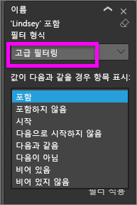
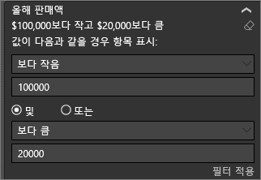
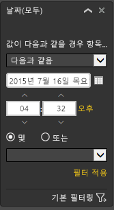

# 보고서 필터 창 둘러보기

이 문서에서는 Power BI 서비스의 보고서 **필터** 창에 대해 알아봅니다. 필터를 사용하여 데이터에서 새로운 인사이트를 검색합니다.

Power BI에서 데이터를 필터링하는 다양한 방법이 있습니다. 필터에 대한 자세한 내용은 [필터 및 Power BI 보고서의 강조 표시](../power-bi-reports-filters-and-highlighting.md)를 참조하세요.

## 보고서 필터 창 작업

동료와 보고서를 공유할 때 **필터** 창을 찾습니다. 필터 창이 보고서의 오른쪽 가장자리를 따라 축소되는 경우가 있습니다. 축소된 창을 선택하여 확장합니다.

**필터** 창에는 보고서 *디자이너*가 보고서에 추가한 필터가 포함되어 있습니다. *소비자*는 기존 필터와 상호 작용하고 해당 변경 내용을 저장할 수 있지만 보고서에 새 필터를 추가할 수 없습니다. 예를 들어 위의 스크린샷에서는 디자이너가 두 개의 페이지 수준 필터인 **세그먼트** 및 **연도**를 추가했습니다. 이러한 필터는 상호 작용하고 변경할 수 있지만 세 번째 페이지 수준 필터를 추가할 수는 없습니다.

Power BI 서비스에서 보고서는 **필터** 창에서 변경한 내용을 유지합니다. 이 서비스는 이러한 변경 내용을 보고서의 모바일 버전으로 전달합니다.

**필터 창**을 디자이너 기본값으로 다시 설정하려면 을 선택합니다. 맨 위 메뉴 모음에서

## 보고서 페이지의 모든 필터 보기

**필터** 창에 디자이너가 보고서에 추가한 모든 필터가 표시됩니다. **필터** 창은 필터에 대한 정보를 보고 상호 작용할 수 있는 영역이기도 합니다. 변경한 내용을 저장하거나 **기본값으로 다시 설정**을 사용하여 원래 필터 설정으로 되돌릴 수 있습니다.

저장하려는 변경 내용이 있는 경우 개인 책갈피를 만들 수도 있습니다.  자세한 내용은 [책갈피란?](end-user-bookmarks.md)을 참조하세요.

**필터** 창은 여러 유형의 보고서 필터를 표시하고 관리합니다. 시각적 개체, 보고서 페이지 및 전체 보고서에 적용할 수 있습니다.

이 예제에서는 두 개의 필터가 있는 시각적 개체를 선택했습니다. 보고서 페이지에는 **이 페이지의 필터** 머리글 아래에 나열된 필터도 있습니다. 또한 전체 보고서는 **Date**에 대한 필터가 있습니다.

필터의 일부는 **(All)** 옆에 있습니다. **(All)** 은 모든 값이 필터에 포함됨을 의미합니다. 위의 스크린샷에서 **Segment(All)** 는 이 보고서 페이지에 모든 제품 세그먼트에 대한 데이터를 포함한다는 것을 알려줍니다. **서부 지역** 페이지 수준 필터를 선택하면 보고서 페이지에는 서부 지역에 대한 데이터만 포함됩니다.

이 보고서를 보는 모든 사용자가 이 필터와 상호 작용할 수 있습니다.

### 시각적 개체에 적용된 필터만 보기

특정 시각적 개체에 적용되는 필터를 자세히 보기 위해 시각적 개체 위에 마우스를 올려 놓으면 필터 아이콘 이 표시됩니다. 해당 시각적 개체에 영향을 주는 모든 필터, 슬라이서 등이 포함된 팝업을 보려면 해당 필터 아이콘을 선택합니다. 팝업의 필터는 **필터** 창에 표시되는 필터와 동일합니다.

이 보기에서 표시할 수 있는 필터 유형은 다음과 같습니다.

- 기본 필터

- 슬라이서

- 교차 강조 표시

- 교차 필터링

- 고급 필터

- 상위 N 필터

- 상대 날짜 필터

- 슬라이서 동기화

- 포함/제외 필터

- URL을 통해 전달된 필터

다음 예제에서 다음을 확인할 수 있습니다.

1. 세로 막대형 차트가 교차 필터링된 것을 볼 수 있습니다.

1. **포함됨**은 교차 필터가 **세그먼트**용이며, 세 개가 포함되어 있음을 알려줍니다.

1. **Quarter**에 대해 슬라이서가 적용되었습니다.

1. **Region**은 이 보고서 페이지에 적용되는 필터이며,

1. **isVanArsdel** 및 **Year**는 이 시각적 개체에 적용되는 필터입니다.

### 필터에서 검색

경우에 따라 필터는 긴 값의 목록을 가질 수 있습니다. 검색 상자를 사용하여 원하는 값을 찾아서 선택합니다.

### 필터 세부 정보 표시

필터를 이해하려면 사용 가능한 값과 개수를 살펴봅니다.  필터 이름 옆의 화살표를 마우스로 가리키고 선택하여 필터의 세부 정보를 봅니다.
  

### 필터 선택 변경

데이터 인사이트를 검색하는 한 가지 방법은 필터와 상호 작용하는 것입니다. 필드 이름 옆에 있는 드롭다운 화살표를 사용하여 필터 선택을 변경할 수 있습니다.  Power BI가 필터링하는 데이터 및 필터 유형의 따라 옵션은 목록의 간단한 선택 항목에서 날짜 또는 숫자 범위를 식별하는 것까지 다양합니다. 아래의 고급 필터에서 트리맵의 **총 단위 YTD** 필터를 2,000에서 3,000 사이로 변경했습니다. 이 변경은 트리맵에서 Prirum을 제거합니다.
  

> [!TIP]
> 한 번에 둘 이상의 필터 값을 선택하려면 CTRL 키를 길게 누릅니다. 대부분의 필터는 다중 선택을 지원합니다.

### 필터를 기본값으로 다시 설정

필터에 대한 모든 변경을 취소하려면 맨 위 메뉴 모음에서 **기본값으로 다시 설정**을 선택합니다.  이 선택은 보고서 디자이너가 설정한 대로 필터를 원래 상태로 되돌립니다.

### 필터 지우기

**(모두)** 로 설정하려는 필터가 하나뿐인 경우, 필터 이름 옆에 있는 지우개 아이콘 을 선택하여 지웁니다. 필터 이름 옆에 있는
  
<!--  too much detail for consumers

## Types of filters: text field filters
### List mode
Ticking a checkbox either selects or deselects the value. The **All** checkbox can be used to toggle the state of all checkboxes on or off. The checkboxes represent all the available values for that field.  As you adjust the filter, the restatement updates to reflect your choices. 

Note how the restatement now says "is Mar, Apr or May".

### Advanced mode
Select **Advanced Filtering** to switch to advanced mode. Use the dropdown controls and text boxes to identify which fields to include. By choosing between **And** and **Or**, you can build complex filter expressions. Select the **Apply Filter** button when you've set the values you want.  

## Types of filters: numeric field filters
### List mode
If the values are finite, selecting the field name displays a list.  See **Text field filters** &gt; **List mode** above for help using checkboxes.   

### Advanced mode
If the values are infinite or represent a range, selecting the field name opens the advanced filter mode. Use the dropdown and text boxes to specify a range of values that you want to see. 

By choosing between **And** and **Or**, you can build complex filter expressions. Select the **Apply Filter** button when you've set the values you want.

## Types of filters: date and time
### List mode
If the values are finite, selecting the field name displays a list.  See **Text field filters** &gt; **List mode** above for help using checkboxes.   

### Advanced mode
If the field values represent date or time, you can specify a start/end time when using Date/Time filters.  

-->

## 다음 단계

[보고서 페이지에서 시각적 개체가 서로 교차 필터링 및 교차 강조 표시되는](end-user-interactions.md) 방식 및 이유 알아보기