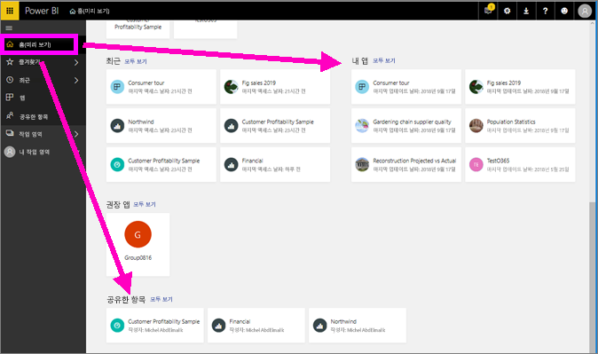
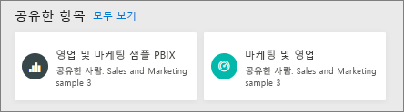
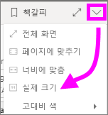
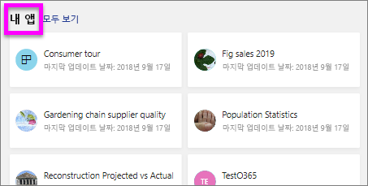
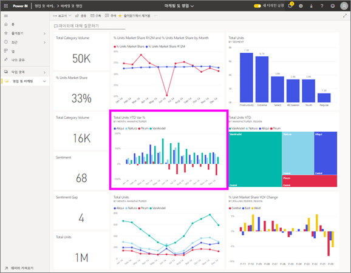

---
title: 보고서 보기
description: 이 항목에서는 Power BI 소비자와 최종 사용자가 Power BI 보고서를 열고 보아야 하는 내용을 표시합니다.
author: mihart
manager: kvivek
ms.reviewer: ''
ms.custom: seodec18
ms.service: powerbi
ms.subservice: powerbi-consumer
ms.topic: conceptual
ms.date: 5/06/2018
ms.author: mihart
ms.openlocfilehash: cda8ec807873f0d6cda09dce90f0d8a823ce50ee
ms.sourcegitcommit: 60dad5aa0d85db790553e537bf8ac34ee3289ba3
ms.translationtype: HT
ms.contentlocale: ko-KR
ms.lasthandoff: 05/29/2019
ms.locfileid: "65609109"
---
# *소비자*에 대한 Power BI 서비스의 보고서 보기
보고서는 시각적 개체로 이루어진 하나 이상의 페이지입니다. Power BI *디자이너*가 보고서를 생성하며 [직접 *소비자*에게 공유](end-user-shared-with-me.md)하거나 [앱](end-user-apps.md)의 일부로 공유합니다. 

보고서를 여는 여러 가지 방법이 있으며 두 가지를 살펴보겠습니다: 홈에서 열기 및 대시보드에서 열기입니다. 

<!-- add art-->

## Power BI 홈에서 보고서 열기
사용자와 직접 공유된 보고서를 연 다음 앱의 일부로 공유된 보고서를 열어 보겠습니다.

   

### 사용자와 공유된 보고서 열기
Power BI *디자이너*는 직접 보고서를 공유할 수 있습니다. 이런 방식으로 공유되는 콘텐츠는 탐색 모음에서 **공유한 항목** 컨테이너와 홈 캔버스의 **공유한 항목** 섹션에서 나타납니다.

1. Power BI 서비스 (app.powerbi.com)를 엽니다.

2. 탐색 모음에서, **홈**을 선택하여 홈 캔버스를 표시합니다.  

   
   
3. **공유한 항목**이 표시될 때까지 아래로 스크롤합니다. 보고서 아이콘 을 찾습니다. 이 스크린 샷에는 *영업 및 마케팅 샘플*이라는 하나의 대시보드 및 하나의 보고서가 있습니다. 
   
   

4. 보고서를 선택 하기만 하면 됩니다 *카드* 보고서를 엽니다.

   

5. 왼쪽에 있는 탭을 확인합니다.  각 탭은 보고서 ‘페이지’를 나타냅니다. 현재 *성장 기회* 페이지가 열려 있습니다. 대신 해당 보고서 페이지를 열려면 *YTD 범주* 탭을 선택합니다. 

   

6. 이제 전체 보고서 페이지를 볼 수 있습니다. 페이지 표시(확대/축소)를 변경하려면, 오른쪽 위 모서리( **>** )에서 보기 드롭다운을 선택하고 **실제 크기**를 선택합니다.

   

   

### 앱의 일부인 보고서 열기
 동료에게서 또는 AppSource에서 앱을 받은 경우, 홈 및 탐색 모음에서 **앱** 컨테이너에서 앱을 사용할 수 있습니다. [앱](end-user-apps.md)은 대시보드와 보고서의 번들입니다.

1. 탐색 모음에서 **홈**을 선택하여 홈으로 이동합니다.

7. **내 앱**이 표시될 때까지 아래로 스크롤합니다.

   

8. 앱 중 하나를 선택하여 엽니다. 앱 *디자이너*가 설정한 옵션에 따라, 앱은 대시보드, 보고서 또는 앱 콘텐츠 목록을 엽니다. 앱을 선택하는 경우:
    - 보고서를 열면 모두 설정됩니다.
    - 대시보드를 열고 아래의 ***대시보드에서 보고서 열기***를 참조하세요.
    - **보고서**에서 앱 콘텐츠 목록을 열고 보고서를 선택하여 엽니다.

## 대시보드에서 보고서 열기
대시보드에서 보고서를 열 수 있습니다. 대부분의 대시보드 타일은 보고서에서 ‘고정’됩니다. 타일을 선택하면 타일을 만드는 데 사용된 보고서가 열립니다. 

1. 대시보드에서 타일을 선택합니다. 이 예에서는 "총 단위 YTD..." 열 차트 타일을 선택했습니다.

    

2.  연결된 보고서가 열립니다. "YTD Category" 페이지에 있는지 확인합니다. 이는 대시보드에서 선택한 열 차트가 포함된 보고서 페이지입니다.

    

> [!NOTE]
> 모든 타일이 보고서로 연결되는 것은 아닙니다. [질문 및 답변으로 작성한](end-user-q-and-a.md) 타일을 선택하면 질문 및 답변 화면이 열립니다. [대시보드 **타일 추가** 위젯을 사용하여 만든](../service-dashboard-add-widget.md) 타일을 선택하면, 몇 가지 다른 일이 발생할 수 있습니다.  

##  보고서를 열 수 있는 기타 방법
Power BI 서비스를 보다 더 편안하게 탐색할 수 있게 되면, 자신에게 가장 적합한 워크플로를 파악할 수 있게 됩니다. 보고서에 액세스하는 몇 가지 다른 방법은 다음과 같습니다.
- **즐겨찾기** 및 **최근 항목**을 사용하여 탐색 모음에서    
- [관련 항목 보기](end-user-related.md) 를 사용    
- 누군가가 [사용자와 공유](../service-share-reports.md)하거나 [경고를 설정](end-user-alerts.md)할 때 메일을 통해    
- [알림 센터](end-user-notification-center.md)를 통해    
- 기타

## 다음 단계
[보고서와 상호 작용하는 여러 가지 방법](end-user-reading-view.md)이 있습니다.  보고서 캔버스에 있는 각 탭을 선택하 여 탐색을 시작 합니다.

