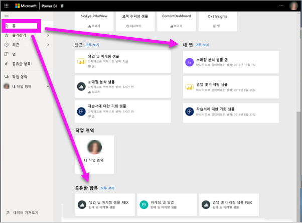
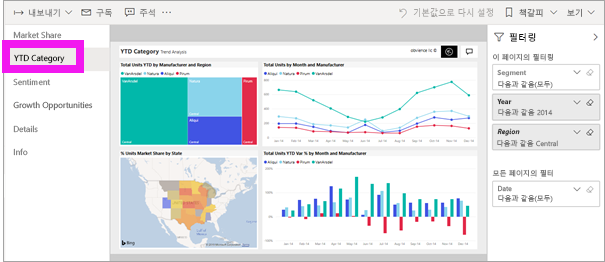
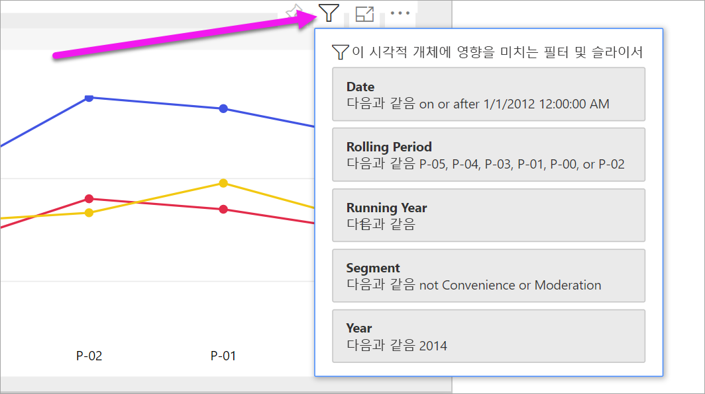
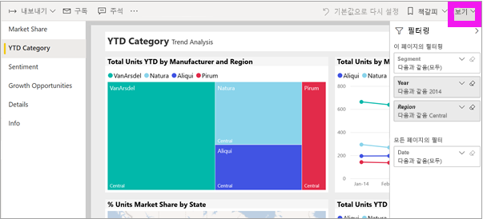
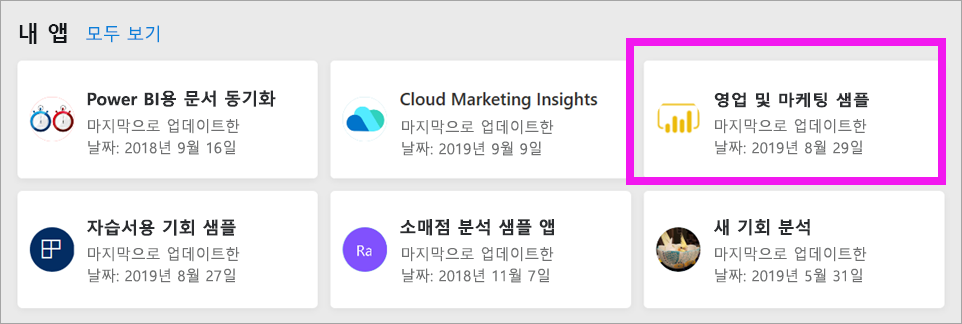
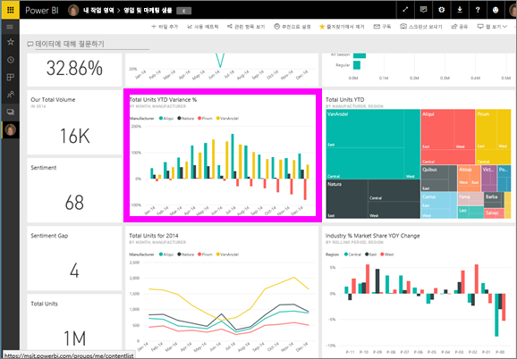
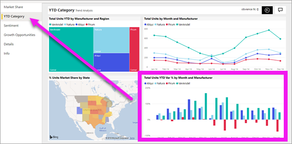

# ‘소비자’에 대한 Power BI 서비스의 보고서 보기 
보고서는 하나 이상의 시각적 개체 페이지입니다. 보고서는 Power BI ‘디자이너’가 만들고 직접 또는 [앱](end-user-apps.md)의 일부로 [소비자와 공유](end-user-shared-with-me.md)합니다.   

여러 가지 방법으로 보고서를 열 수 있으며, 여기서는 홈 또는 대시보드에서 여는 방법을 보여줍니다. 

<!-- add art-->

## Power BI 홈에서 보고서 열기
사용자와 직접 공유된 보고서를 연 다음 앱의 일부로 공유된 보고서를 열어 보겠습니다.

   

### 사용자와 공유된 보고서 열기
Power BI ‘디자이너’가 메일의 링크를 통해 또는 자동으로 추가하여 개별 보고서를 직접 사용자와 공유할 수 있습니다.  이 방식으로 공유된 콘텐츠는 탐색 모음에 있는 **공유한 항목** 컨테이너와 홈 캔버스의 **공유한 항목** 섹션에 표시됩니다.

1. Power BI 서비스(app.powerbi.com)를 엽니다.

2. 탐색 모음에서 **홈**을 선택하여 홈 캔버스를 표시합니다.  

   
   
3. **공유한 항목**이 표시될 때까지 아래로 스크롤합니다. 보고서 아이콘 을 찾습니다. 이 스크린샷에서는 하나의 대시보드와 *판매 및 마케팅 샘플*이라는 보고서가 있습니다. 
   
   

4. 간단히 보고서 *카드*를 선택하여 보고서를 엽니다.

   

5. 왼쪽의 탭을 확인합니다.  각 탭은 보고서 ‘페이지’를 나타냅니다.  현재 *성장 기회* 페이지가 열려 있습니다. *YTD범주* 탭을 선택하여 해당 보고서 페이지를 대신 엽니다. 

   

6. 오른쪽을 따라 **필터** 창이 표시됩니다. 이 보고서 페이지 또는 전체 보고서에 적용된 필터가 여기에 표시됩니다.

7. 보고서 시각적 개체를 마우스로 가리키면 여러 아이콘과 줄임표(...)가 표시됩니다. 특정 시각적 개체에 적용된 필터를 확인하려면 필터 아이콘을 선택합니다. 여기서는 *롤링 기간 및 지역별 전체 단위* 꺾은선형 차트에 대한 필터 아이콘을 선택했습니다.

   

6. 이제 전체 보고서 페이지가 표시됩니다. 페이지 표시(확대/축소)를 변경하려면 오른쪽 위에서 보기 드롭다운을 선택하고 **실제 크기**를 선택합니다.

   

   

### 앱의 일부인 보고서 열기
동료 또는 AppSource에서 앱을 받은 경우 홈과 탐색 모음의 **앱** 컨테이너에서 해당 앱을 사용할 수 있습니다. [앱](end-user-apps.md)은 대시보드와 보고서의 번들입니다.

### 필수 조건
작업을 계속 진행하려면 영업 및 마케팅 앱을 다운로드합니다.
1. 브라우저에서 appsource.microsoft.com으로 이동합니다.
1. "영업 및 마케팅"을 검색하고 **Microsoft 샘플 - 영업 및 마케팅**을 선택합니다.
1. **지금 가져오기** > **계속** > **설치**를 선택하여 앱 컨테이너에 앱을 설치합니다. 

앱 컨테이너 또는 홈에서 앱을 열 수 있습니다.
1. 탐색 모음에서 **홈**을 선택하여 홈으로 돌아갑니다.

7. **내 앱**이 표시될 때까지 아래로 스크롤합니다.

   

8. 새 영업 및 마케팅 앱을 선택하여 엽니다. 앱 ‘디자이너’가 설정한 옵션에 따라 앱에서 대시보드나 보고서가 열립니다.  이 앱은 대시보드로 열립니다.  

## 대시보드에서 보고서 열기
대시보드에서 보고서를 열 수 있습니다. 대부분의 대시보드 [타일](end-user-tiles.md)은 보고서에서 *고정*됩니다. 타일을 선택하면 타일을 만드는 데 사용된 보고서가 열립니다. 

1. 대시보드에서 타일을 선택합니다. 이 예에서는 "총 단위 YTD..." 열 차트 타일을 선택했습니다.

    

2.  연결된 보고서가 열립니다. "YTD 범주" 페이지에 있는지 확인합니다. 이는 대시보드에서 선택한 열 차트가 포함된 보고서 페이지입니다.

    

> [!NOTE]
> 모든 타일이 보고서로 연결되는 것은 아닙니다. [질문 및 답변으로 작성한](end-user-q-and-a.md) 타일을 선택하면 질문 및 답변 화면이 열립니다. [대시보드 **타일 추가** 위젯을 사용하여 만든](../service-dashboard-add-widget.md) 타일을 선택하면, 몇 가지 다른 일이 발생할 수 있습니다.  

##  보고서를 열 수 있는 기타 방법
Power BI 서비스를 보다 더 편안하게 탐색할 수 있게 되면, 자신에게 가장 적합한 워크플로를 파악할 수 있게 됩니다. 보고서에 액세스하는 몇 가지 다른 방법은 다음과 같습니다.
- **즐겨찾기** 및 **최근 항목**을 사용하여 탐색 모음에서    
- [관련 항목 보기](end-user-related.md) 사용    
- 누군가가 [사용자와 공유](../service-share-reports.md)하거나 [경고를 설정](end-user-alerts.md)할 때 메일을 통해    
- [알림 센터](end-user-notification-center.md)를 통해    
- 기타

## 다음 단계
[대시보드 열기 및 보기](end-user-dashboard-open.md)    
[보고서 필터](end-user-report-filter.md)

