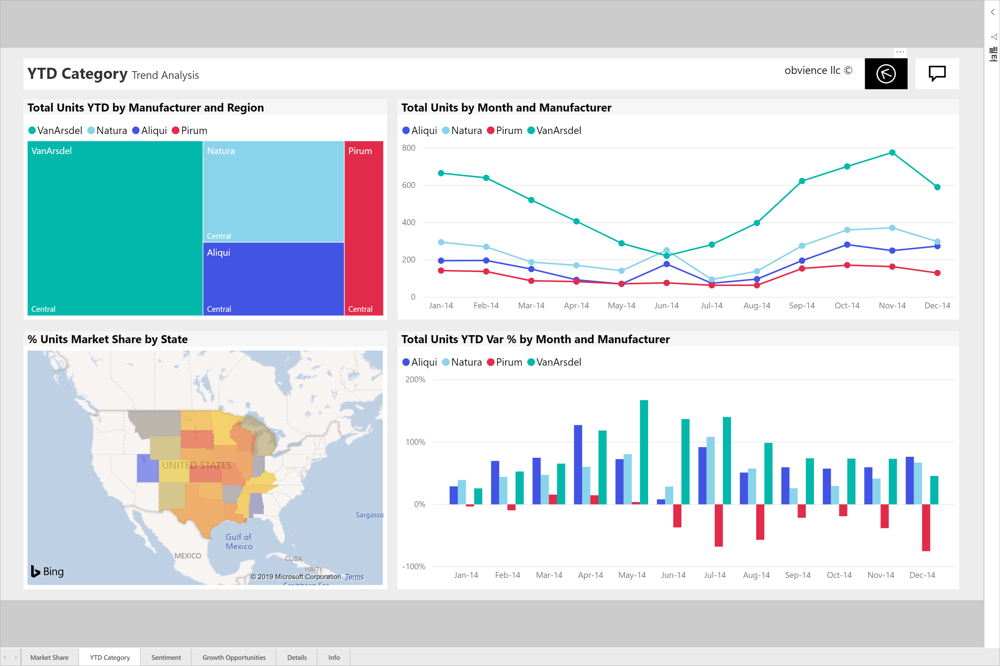

# 보고서 페이지의 표시 변경

사용자는 다양한 디바이스에서 여러 화면 크기 및 가로 세로 비율로 볼 수 있습니다. 필요에 맞게 보고서 페이지가 표시되는 방식을 변경합니다.

## 보기 메뉴 탐색

**보기** 메뉴의 옵션을 사용하면 선택한 크기와 너비로 보고서 페이지를 유연하게 표시할 수 있습니다.

- 소형 디바이스에서 보고서를 보고 있고 제목과 범례를 보기 어렵다고 가정해 보겠습니다.  **보기** > **실제 크기**를 선택하여 보고서 페이지의 크기를 늘립니다. 스크롤 막대를 사용하여 보고서를 이동합니다.

    

- 또 다른 옵션은 **너비에 맞추기**를 선택하여 보고서를 화면 너비에 맞추는 것입니다. 너비만 있고 높이가 아니기 때문에 세로 스크롤 막대를 사용해야 할 수도 있습니다.

  

- 스크롤 막대를 사용하지 않고 화면 크기를 최대한 활용하려면 **페이지에 맞추기**를 선택합니다.

   

- 다음 4개의 **고대비 색** 중에서 선택할 수도 있습니다: 고대비 #1, 고대비 #2, 고대비 검정 및 고대비 흰색. 시각 장애가 있는 사용자가 보고서를 더 잘 볼 수 있도록 사용할 수 있는 접근성 기능입니다.

    
    

- 마지막 옵션인 **전체 화면**은 메뉴 모음 및 머리글 없이 보고서 페이지를 표시합니다. 전체 화면은 세부 정보를 보기 어려운 작은 화면에 적합할 수 있습니다.  전체 화면은 사용자가 볼 수 있지만 상호 작용하지 않도록 대형 화면에 보고서 페이지를 프로젝션할 때 적합할 수 있습니다.  

    

보고서를 종료하면 **보기** 설정이 저장되지 않지만 기본값으로 되돌아갑니다. 이러한 설정을 저장하는 것이 중요한 경우 [책갈피](end-user-bookmarks.md)를 사용합니다.

## 다음 단계

* [보고서 필터 창 둘러보기](end-user-report-filter.md)