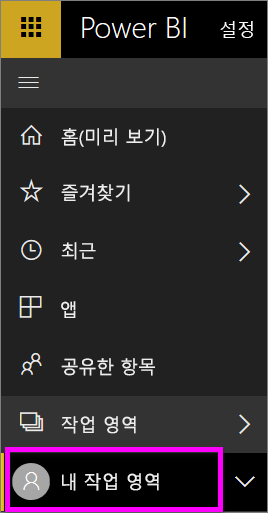
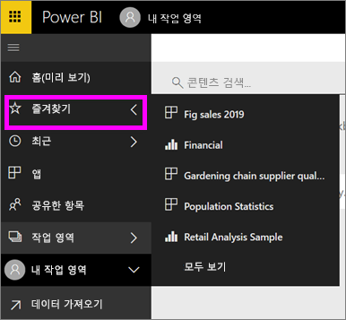

# 탐색: Power BI 서비스에서 콘텐츠 검색, 찾기 및 정렬
Power BI 서비스에서 콘텐츠를 탐색하는 방법은 여러 가지가 있습니다. 콘텐츠는 작업 영역 내에서 대시보드, 보고서, 통합 문서, 데이터 세트와 같은 유형별로 정리됩니다.  그리고 즐겨찾기, 최근, 공유한 항목, 주요와 같은 용도별로도 정리됩니다. 하나의 탐색 중지를 위해 홈페이지에서 한 페이지에 모든 콘텐츠를 구성합니다. 이처럼 다양한 콘텐츠 경로를 통해 Power BI 서비스에서 필요한 항목을 빠르게 찾을 수 있습니다.  

## 작업 영역 내에서 탐색

일반적으로 Power BI 소비자는 작업 영역이 한 개(**내 작업 영역**)만 있습니다. Microsoft 샘플을 다운로드하거나 고유한 콘텐츠를 생성하거나 다운로드한 경우에만 **내 작업 영역**에 콘텐츠가 포함됩니다.  

**내 작업 영역** 내에서 Power BI 서비스는 대시보드, 보고서, 통합 문서 및 데이터 집합과 같은 유형별로 콘텐츠를 구분합니다. 작업 영역을 선택하면 이 조직이 표시됩니다. 이 예제에서 **내 작업 영역**에는 대시보드 한 개, 보고서 두 개, 데이터 세트 두 개가 포함되어 있고, 통합 문서는 포함되어 있지 않습니다.

________________________________________

## 왼쪽 탐색 모음을 사용하여 탐색
왼쪽 탐색 모음은 사용자가 필요한 것을 더 쉽게 빨리 찾을 수 있는 방식으로 콘텐츠를 분류합니다.  

- 사용자와 공유된 콘텐츠는 **공유한 항목**에서 사용할 수 있습니다.
- 사용자가 마지막으로 본 콘텐츠는 **최근 항목**에서 사용할 수 있습니다. 
- **앱**을 선택하여 앱을 찾을 수 있습니다.
- **홈**은 가장 중요한 콘텐츠와 제안된 콘텐츠 및 학습 소스의 단일 페이지 보기입니다.

또한 콘텐츠에 [즐겨 찾기](end-user-favorite.md) 및 [주요](end-user-featured.md) 태그를 지정할 수 있습니다. 자주 볼 것으로 예상하는 하나의 대시보드를 선택하고 이를 *주요* 대시보드로 설정합니다. Power BI 서비스를 열 때마다 추천 대시보드가 먼저 표시됩니다. 자주 방문하는 여러 대시보드 및 앱이 있나요? 이들을 즐겨찾기로 설정하면 왼쪽 탐색 표시줄에서 항상 사용할 수 있습니다.

.

## 고려 사항 및 문제 해결
* 데이터 세트의 경우 **정렬 기준**에서 소유자별 기준은 사용할 수 없습니다.

## 다음 단계
[Power BI - 기본 개념](end-user-basic-concepts.md)

궁금한 점이 더 있나요? [Power BI 커뮤니티를 이용하세요.](http://community.powerbi.com/)