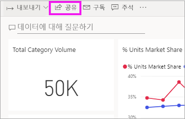
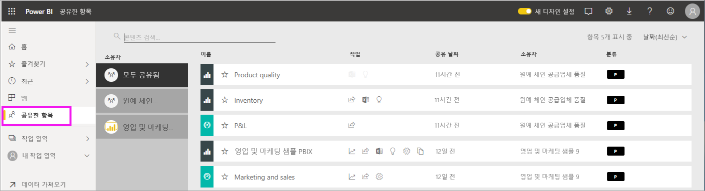
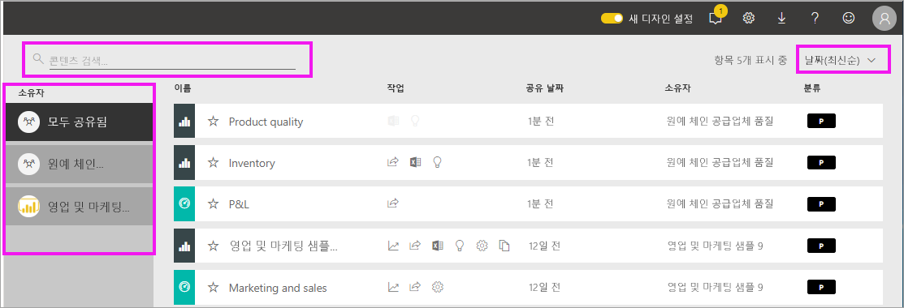

# 나와 공유한 대시보드 및 보고서 표시

[!INCLUDE [power-bi-service-new-look-include](../includes/power-bi-service-new-look-include.md)]

동료가 콘텐츠를 공유하는 경우 **공유** 단추를 사용하면 **공유한 항목** 컨테이너에 표시됩니다. 대시보드 또는 보고서는 **공유한 항목**에서만 사용 가능하며, **앱**에서는 사용할 수 없습니다.

Amanda가 **공유한 항목** 콘텐츠 목록을 설명하고 목록을 탐색하고 필터링하는 방법을 보여 주는 비디오를 시청하세요. 그런 다음 비디오 아래에 있는 단계별 지침을 따라서 직접 시도해 볼 수 있습니다. 공유된 대시보드를 보려면 Power BI Pro 라이선스가 필요합니다. 자세한 내용은 [Power BI 프리미엄이란?](../service-premium-what-is.md)을 참조하세요.
    

> [!NOTE]
> 이 비디오에서는 이전 버전의 Power BI 서비스를 사용합니다.
    

<iframe width="560" height="315" src="https://www.youtube.com/embed/G26dr2PsEpk" frameborder="0" allowfullscreen></iframe>

## 공유 콘텐츠 조작

*디자이너*가 제공하는 권한에 따라 공유 대시보드 및 보고서를 조작하는 옵션이 제공됩니다. 이러한 옵션에는 대시보드 사본 만들기, [읽기 보기에서](end-user-reading-view.md) 보고서 열기, 다른 동료와 다시 공유 등이 있습니다.

### **공유한 항목** 컨테이너에서 사용 가능한 작업
사용 가능한 동작은 콘텐츠 *디자이너*가 할당한 설정에 따라 달라집니다. 옵션에는 다음이 포함될 수 있습니다.
* 별 아이콘을 선택하여 [대시보드 또는 보고서를 즐겨찾기에 추가](end-user-favorite.md) 
* 대시보드 또는 보고서 제거  .
* 일부 대시보드 및 보고서는 다시 공유할 수 있음  .
* [Excel에서 보고서 열기](end-user-export.md)  
* Power BI가 데이터에서 찾은 [인사이트 보기](end-user-insights.md) 
  
  > [!NOTE]
  > EGRC 분류에 대한 자세한 내용을 보려면 **분류** 단추를 선택하거나 [대시보드 데이터 분류](../service-data-classification.md)를 방문하세요.
  > 

## 공유 대시보드 검색 및 정렬
콘텐츠 목록이 길어지면 필요한 항목을 찾기 위해 몇 가지 옵션을 사용할 수 있습니다. 검색 필드를 사용하거나, 날짜로 정렬하거나, **소유자** 열에서 선택할 수 있습니다.    

