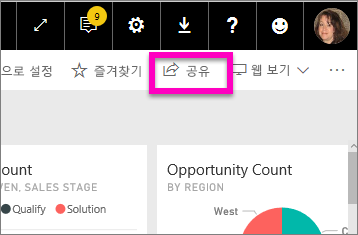
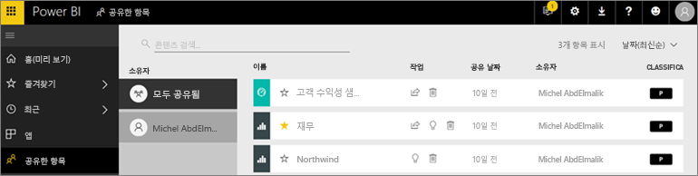
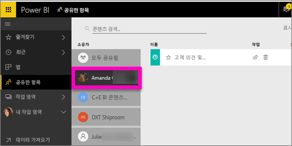

# 나와 공유한 대시보드 및 보고서 표시
## 공유

동료가 콘텐츠를 공유하는 경우 **공유** 단추를 사용하면 **공유한 항목** 컨테이너에 표시됩니다. 대시보드 또는 보고서는 **공유한 항목**에서만 사용 가능하며, **앱**에서는 사용할 수 없습니다.

Amanda가 **공유한 항목** 콘텐츠 목록을 설명하고 목록을 탐색하고 필터링하는 방법을 보여 주는 비디오를 시청하세요. 그런 다음 비디오 아래에 있는 단계별 지침을 따라서 직접 시도해 볼 수 있습니다. 공유된 대시보드를 보려면 Power BI Pro 라이선스가 필요합니다. 자세한 내용은 [Power BI 프리미엄이란?](../service-premium-what-is.md)을 참조하세요.

<iframe width="560" height="315" src="https://www.youtube.com/embed/G26dr2PsEpk" frameborder="0" allowfullscreen></iframe>

디자이너가 제공하는 권한에 따라 대시보드 및 보고서와 상호 작용하는 옵션이 제공됩니다. 이러한 옵션에는 대시보드 사본 만들기, [읽기 보기에서](end-user-reading-view.md) 보고서 열기, 다른 동료와 다시 공유 등이 있습니다.

## **공유한 항목** 컨테이너에서 사용 가능한 작업
* 별 아이콘을 선택하여 [대시보드 또는 보고서를 즐겨찾기에 추가](end-user-favorite.md)합니다.
* 대시보드 또는 보고서 제거  
* 일부 대시보드 및 보고서는 다시 공유할 수 있음  
* 또한, 목록이 길어지면 [검색 필드를 사용하여 정렬한 후 필요한 항목을 찾습니다](end-user-search-sort.md).
  
  > [!NOTE]
  > EGRC 분류에 대한 자세한 내용은 분류 단추를 선택하거나 [대시보드 데이터 분류에 방문](../service-data-classification.md)합니다.
  > 
  > 
* 대시보드 이름을 선택하여 연 후 탐색합니다. 공유 대시보드를 연 후에는 Q&A를 사용하여 기본 데이터에 대한 질문을 하거나 타일을 선택하여 읽기 보기로 보고서를 열고 상호 작용할 수 있습니다.

## 소유자별로 공유 대시보드 필터링
**공유한 항목** 화면의 콘텐츠는 콘텐츠 소유자별로 더 필터링할 수 있습니다. 예를 들어, **Amanda**를 선택하면 Amanda가 나와 공유한 대시보드만 보입니다.

