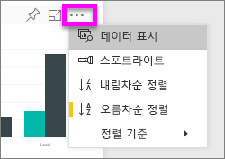
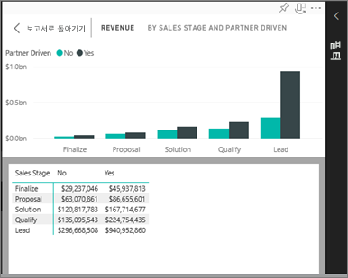
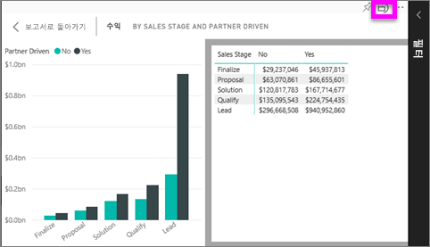

# 시각화를 생성하는 데 사용 된 데이터 표시
## 읽기용 보기에 데이터 표시
Power BI 시각화는 기본 데이터 세트의 데이터를 사용하여 구성됩니다. 숨은 기능에 관심이 있는 경우 Power BI를 사용하면 시각적 개체를 만드는 데 사용되는 데이터를 *표시*할 수 있습니다. **데이터 표시**를 선택하면 Power BI는 시각화 아래(또는 옆에) 데이터를 표시합니다.

## Power BI 서비스 읽기용 보기에서 *데이터 표시* 사용
1. Power BI 서비스에서 보고서를 읽기용 보기에서 열고 시각적 개체를 선택합니다.  
2. 시각적 개체 뒤에 데이터를 표시하려면 줄임표(...)를 선택하고 **데이터 표시**를 선택합니다.
   
   
3. 기본적으로 데이터는 시각적 개체 아래에 표시됩니다.
   
   

4. 방향을 변경하려면 시각화의 오른쪽 위에서 세로 레이아웃  을 선택합니다.
   
   

## 다음 단계
[Power BI 보고서의 시각화](../visuals/power-bi-report-visualizations.md)    
[Power BI 보고서](end-user-reports.md)    
