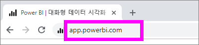
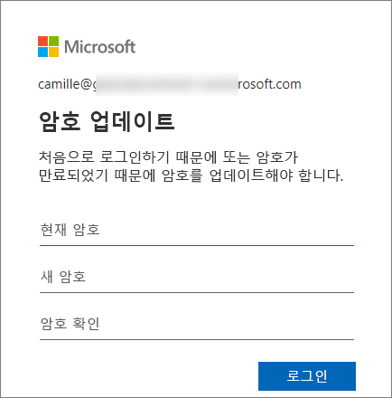
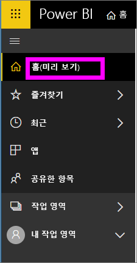
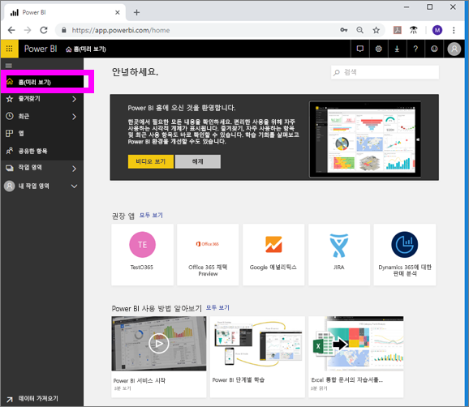
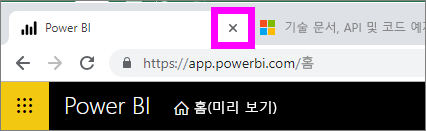
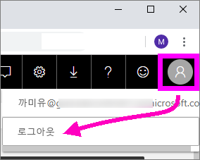

# Power BI 서비스에 로그인

## Power BI 계정
Power BI에 로그인하기 전에 계정이 필요합니다. Power BI 계정을 가져오는 방법은 두 가지가 있습니다. 첫 번째는 회사가 직원을 위해 Power BI 라이선스를 구입한 경우입니다. 그리고 두 번째는 개인 평가판 체험 등록이나 개인 라이선스인 경우입니다. 이 문서는 첫 번째 시나리오를 다룹니다.

## 처음으로 로그인

### 1단계: 브라우저 열기
Power BI 서비스는 브라우저에서 실행됩니다.  따라서 1단계는 즐겨찾는 브라우저를 열고 **app.powerbi.com**을 입력합니다.

### 2단계: 이메일 주소 입력
처음 로그인하면 이메일 주소를 입력하라는 메시지가 나타납니다.  이는 Power BI에 등록하는 데 사용된 회사 또는 학교 이메일 주소입니다.  

받은 편지함에서 Power BI 관리자가 보낸 이메일을 확인합니다. 대부분의 관리자는 임시 암호가 포함된 환영 이메일을 보냅니다. 로그인 시 이 이메일 계정을 사용합니다. 

 
### 3단계: 새 암호 만들기
Power BI 관리자가 임시 암호를 보낸 경우 **현재 암호** 필드에 암호를 입력합니다. 이 암호를 이메일로 받지 못한 경우 Power BI 관리자에게 문의하세요.

Power BI는 자격 증명을 저장하므로 다음에 로그인할 때 사용자 이름(이메일 주소)를 입력할 필요가 없습니다. 

### 4단계: 홈 페이지 검토
처음 방문 시 Power BI에서 **홈** 페이지를 엽니다. **홈** 페이지가 열리고 않으면 왼쪽 탐색 창에서 해당 페이지를 선택합니다. 

홈 페이지에는 사용 권한이 있는 모든 내용이 표시됩니다. 처음에는 홈 페이지에 많은 콘텐츠가 없을 수도 있지만 동료와 함께 Power BI를 사용할 때 변경되므로 걱정하지 않아도 됩니다. 

Power BI를 홈 페이지로 열지 않으려면 [**추천** 대시보드 또는 보고서 설정](end-user-featured.md)을 대신 열 수 있습니다. 

## 콘텐츠와 안전하게 상호 작용
***소비자***는 다른 사용자와 콘텐츠를 공유하고 데이터를 탐색하고 비즈니스 결정을 내리기 위해 해당 콘텐츠와 상호 작용합니다.  필터링, 슬라이스, 구독, 내보내기 및 크기 조정 시 작업이 기본 데이터 세트 또는 원래 공유 콘텐츠(대시보드 및 보고서)에 영향을 주지 않으므로 걱정하지 마세요. Power BI는 탐색하고 실험할 수 있는 안전한 공간입니다. 그렇다고 해서 변경 내용을 저장할 수 없다는 의미는 아닙니다. 하지만 이러한 변경 내용은 콘텐츠의 **사용자** 보기에만 영향을 줍니다. 그리고 기본 보기로 되돌리기 것은 단추를 클릭하는 것만큼 쉽습니다.

## Power BI 서비스에서 로그아웃
Power BI를 닫거나 로그아웃하면 변경 내용이 저장되므로 중단한 위치를 바로 선택할 수 있습니다.

Power BI를 닫으려면 단순히 작업 중인 브라우저 탭을 닫습니다. 

 

컴퓨터를 공유하는 경우 Power BI를 닫을 때마다 로그아웃하는 것이 좋습니다.  로그아웃하려면 오른쪽 위 모서리에서 프로필 사진을 선택하고 **로그아웃**을 선택합니다. 그렇지 않은 경우 작업이 완료되면 단순히 브라우저 탭을 닫습니다.

 

## 문제 해결 및 고려 사항
- Power BI를 개인으로 등록한 경우 등록할 때 사용한 이메일 주소로 로그인합니다.

- 둘 이상의 계정으로 Power BI를 사용하는 경우 로그인할 때 목록에서 계정을 선택하고 암호를 입력하라는 메시지가 표시됩니다. 

## 다음 단계
[Power BI 앱 보기](end-user-app-view.md)
