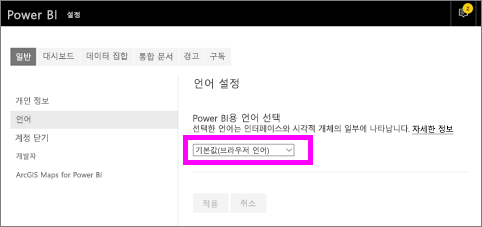
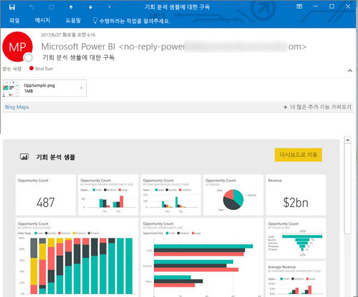
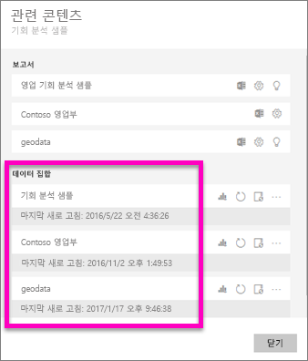
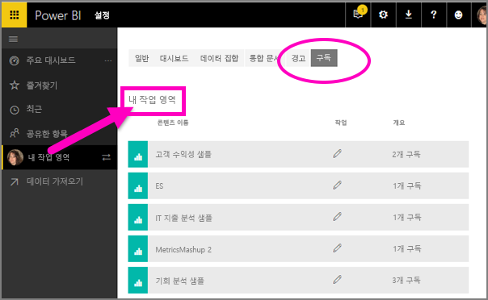

# Power BI 서비스에서 보고서 또는 대시보드 구독 
가장 중요한 대시보드와 보고서를 최신 상태로 유지하는 것이 결코 쉬운 일은 아닙니다. 가장 중요한 보고서 페이지와 대시보드를 구독하면 Power BI에서 스냅숏을 전자 메일로 받은 편지함에 보냅니다. Power BI에 전자 메일 수신 빈도(예: 하루에 한 번에서 일주일에 한 번)를 알려줍니다. 

메일 및 스냅숏은 Power BI 설정에 설정된 언어를 사용합니다([Power BI에 지원되는 언어 및 국가/지역](../supported-languages-countries-regions.md) 참조). 언어가 정의되지 않은 경우 Power BI는 현재 브라우저의 로캘 설정에 따른 언어를 사용합니다. 언어 기본 설정을 보거나 설정하려면 기어 아이콘  > **설정 > 일반 > 언어**를 선택합니다. 

받은 이메일에는 "보고서 또는 대시보드로 이동"할 링크가 포함되어 있습니다. Power BI 앱이 설치된 모바일 장치에서 이 링크를 선택하면 앱이 시작됩니다(Power BI 웹 사이트에서 보고서 또는 대시보드를 여는 기본 동작과는 반대).

## 요구 사항
- 구독 **만들기**는 Power BI Pro의 기능입니다. 
- 기존 데이터 집합을 업데이트하거나 새로 고칠 때에만 구독 메일이 전송되므로 구독은 업데이트하거나 새로 고치지 않은 데이터 집합에서 작동하지 않습니다.

## 대시보드 또는 보고서에 대한 구독 페이지
대시보드 또는 보고서를 구독하는지와 관계 없이 프로세스는 유사합니다. 동일한 단추를 사용하면 Power BI 서비스 대시보드 및 보고서를 구독할 수 있습니다.
 
.

1. 대시보드 또는 보고서를 엽니다.
2. 상단의 메뉴 모음에서 **구독**을 선택하거나 봉투 아이콘 을 선택합니다.
   
   

3. 노란색 슬라이더를 사용하여 구독을 설정하거나 해제합니다.  슬라이더를 Off에 설정하면 구독을 삭제하지 않습니다. 구독을 삭제하려면 휴지통 아이콘을 선택합니다.

4. 선택적으로 메일 메시지 세부 사항을 추가하세요. 

    아래 스크린샷에서 보고서를 구독할 때 실제 보고서 *페이지*를 구독하는 것을 의미합니다.  보고서에서 여러 페이지를 구독하려면 **다른 구독 추가**를 선택하고, 다른 페이지를 선택합니다. 
      
   

5. **저장 후 닫기**를 선택하여 구독을 저장합니다. 기본 데이터 집합이 변경될 때마다 대시보드 또는 보고서 페이지의 메일 및 스냅숏을 수신합니다. 하루에 여러 번 대시보드 및 보고서를 새로 고치더라도 처음 새로 고침 이후에만 이메일이 전달됩니다.  
   
   
   
보고서 페이지를 새로 고치면 데이터 집합이 새로 고쳐지지 않습니다. 데이터 집합 소유자만 데이터 집합을 수동으로 새로 고칠 수 있습니다. 기본 데이터 집합의 이름을 검색하려면 맨 위 메뉴 모음에서 **관련 항목 보기**를 선택합니다.
   

## 전자 메일 일정을 확인하는 방법
다음 표에서는 전자 메일 수신 빈도를 설명합니다. 이 빈도는 대시보드 또는 보고서의 근거가 되는 데이터 집합의 연결 방법(Power BI로 가져온 DirectQuery, Live 연결 또는 OneDrive 또는 SharePoint Online의 Excel 파일) 및 사용 가능하고 선택한 구독 옵션(매일, 매주 또는 없음)에 따라 다릅니다.

|  | **DirectQuery** | **라이브 연결** | **예약된 새로 고침(가져오기)** | **OneDrive/SharePoint Online의 Excel 파일** |
| --- | --- | --- | --- | --- |
| **보고서/대시보드는 얼마나 자주 새로 고칩니까?** |15분마다 |Power BI에서 매 15분마다 검사하고 데이터 집합이 변경되면 보고서를 새로 고칩니다. |사용자가 없음, 매일 또는 매주를 선택합니다. 일일 최대 8회까지 가능합니다. 매주는 실제로 주간 일정으로 사용자가 일주일에 한 번씩 및 매일 자주 수행하는 새로 고침을 만들고 설정합니다. |매시간 한 번 |
| **사용자가 구독 전자 메일 일정에 대해 어느 정도 제어할 수 있습니까?** |옵션: 매일 또는 매주 |옵션 없음: 보고서를 새로 고치는 경우 사용자에게 메일을 하루에 한 번만 보냅니다. |새로 고침 일정이 매일인 경우 옵션은 매일과 매주입니다.  새로 고침 일정이 매주인 경우 옵션은 매주뿐입니다. |옵션 없음: 데이터 집합을 업데이트할 때마다 사용자에게 전자 메일을 하루에 한 번만 보냅니다. |

## 구독 관리
구독을 관리만 할 수 있습니다. 다시 **구독**을 선택하고 **모든 구독 관리**를 선택합니다(위의 4단계에서 스크린샷 참조). 

Pro 라이선스가 만료되거나, 소유자가 대시보드 또는 보고서를 삭제하거나, 구독을 만드는 데 사용된 사용자 계정이 삭제된 경우 구독이 종료됩니다.

## 고려 사항 및 문제 해결
* 대시보드 이메일 구독의 경우 타일에 RLS(행 수준 보안)이 적용되면 해당 타일은 표시되지 않습니다.  보고서 메일 구독의 경우 데이터 세트가 RLS를 사용하면 구독을 만들 수 없습니다.
* 보고서 페이지 구독은 보고서 페이지의 이름과 연결됩니다. 보고서 페이지를 구독하고 이름을 바꾸면 구독을 다시 만들어야 합니다.
* 조직이 Power BI에서 메일 구독을 사용하는 기능을 제한할 수 있는 Azure Active Directory에서 구성할 수 있는 특정 설정입니다.  여기에는 리소스에 액세스할 때 다단계 인증 또는 IP 범위 제한 사항이 포함되지만 이에 국한되지는 않습니다.
* 라이브 연결 데이터 집합에 대한 전자 메일 구독의 경우 데이터가 변경될 때만 전자 메일을 받습니다. 따라서 새로 고침이 발생했지만 데이터가 변경되지 않았으면 Power BI에서 전자 메일을 보내지 않습니다.
* 전자 메일 구독은 대부분의 [사용자 지정 시각적 개체](../power-bi-custom-visuals.md)를 지원하지 않습니다.  한 가지 예외는 [인증](../power-bi-custom-visuals-certified.md)된 사용자 지정 시각적 개체입니다.  
* 이메일 구독은 현재 R 지원 사용자 지정 시각적 개체를 지원하지 않습니다.  
* 대시보드 타일에 RLS(행 수준 보안)이 적용되면 해당 타일은 표시되지 않습니다.
* 전자 메일 구독은 보고서의 기본 필터 및 슬라이서 상태와 함께 보내집니다. 구독한 후에 수행된 기본값에 대한 변경 사항은 이메일에 표시되지 않습니다.    
* 특히 대시보드 구독의 경우, 특정 유형의 타일은 아직 지원되지 않습니다.  여기에는 타일, 비디오 타일, 사용자 지정 웹 콘텐츠 타일의 스트리밍이 포함됩니다.     
* 전자 메일 크기 제한으로 인해 매우 큰 이미지가 있는 대시보드 또는 보고서의 구독은 실패할 수 있습니다.    
* Power BI는 2개월 이상 방문하지 않은 대시보드 및 보고서와 연결된 데이터 집합의 경우 자동으로 새로 고침을 일시 중지합니다.  그러나 대시보드 또는 보고서에 구독을 추가하면 방문하지 않았더라도 일시 중지되지 않습니다.    

## 다음 단계
* 궁금한 점이 더 있나요? [Power BI 커뮤니티에 질문합니다.](http://community.powerbi.com/)    
* [블로그 게시물 읽기](https://powerbi.microsoft.com/blog/introducing-dashboard-email-subscriptions-a-360-degree-view-of-your-business-in-your-inbox-every-day/)

