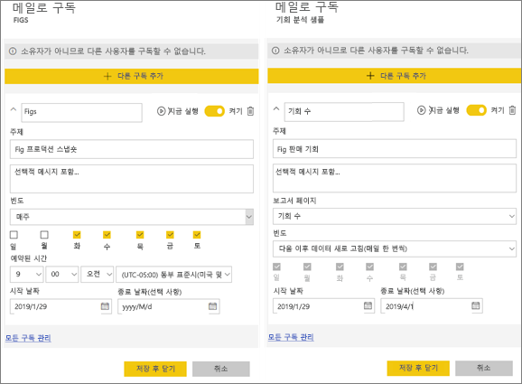
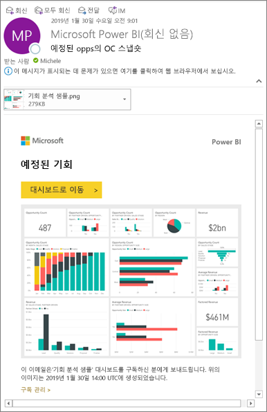
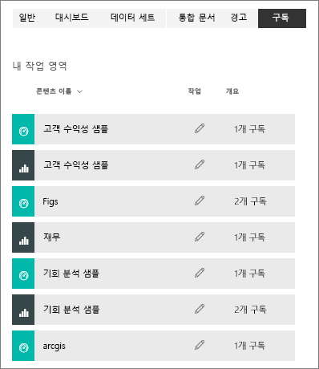

# Power BI 서비스에서 보고서 또는 대시보드 구독 
가장 중요한 대시보드와 보고서를 최신 상태로 유지하는 것이 결코 쉬운 일은 아닙니다. 가장 중요한 보고서 페이지와 대시보드를 구독하면 Power BI에서 스냅숏을 전자 메일로 받은 편지함에 보냅니다. 매일, 매주 또는 데이터 새로 고침될 때 Power BI에게 이메일 수신 빈도를 알려줍니다. Power BI가 이메일을 보내거나 지금 실행되도록 특정 시간을 설정할 수도 있습니다.  

메일 및 스냅숏은 Power BI 설정에 설정된 언어를 사용합니다([Power BI에 지원되는 언어 및 국가/지역](../supported-languages-countries-regions.md) 참조). 언어가 정의되지 않은 경우 Power BI는 현재 브라우저의 로캘 설정에 따른 언어를 사용합니다. 언어 기본 설정을 보거나 설정하려면 기어 아이콘  > **설정 > 일반 > 언어**를 선택합니다. 

받은 이메일에는 "보고서 또는 대시보드로 이동"할 링크가 포함되어 있습니다. Power BI 앱이 설치된 모바일 디바이스에서 이 링크를 선택하면 앱이 시작됩니다(Power BI 웹 사이트에서 보고서 또는 대시보드를 여는 기본 동작과는 반대).

## 요구 사항
구독 **만들기**는 Power BI Pro의 기능입니다.   

## 대시보드 또는 보고서에 대한 구독 페이지
대시보드 또는 보고서 구독 여부와 관계없이 프로세스는 유사합니다. 동일한 단추를 사용하면 Power BI 서비스 대시보드 및 보고서를 구독할 수 있습니다.
 
.

1. 대시보드 또는 보고서를 엽니다.
2. 상단의 메뉴 모음에서 **구독**을 선택하거나 봉투 아이콘 을 선택합니다.
   
   

   
    
    대시보드에 있는 **구독**을 선택하면 왼쪽 화면이 나타납니다. 보고서 페이지에 있는 **구독**을 선택하면 오르쪽 화면이 나타납니다. 보고서에서 여러 페이지를 구독하려면 **다른 구독 추가**를 선택하고, 다른 페이지를 선택합니다. 

4. 노란색 슬라이더를 사용하여 구독을 설정하거나 해제합니다.  슬라이더를 Off로 설정해도 구독이 삭제되지 않습니다. 구독을 삭제하려면 휴지통 아이콘을 선택합니다.

4. 선택적으로 메일 메시지 세부 사항을 추가하세요. 

5. 구독에 대해 **빈도**를 선택합니다.  매일, 매주 또는 데이터 새로 고침 후(매일)를 선택할 수 있습니다.  특정 요일에만 구독 이메일을 받으려면 **매주**를 선택하고 수신할 요일을 선택합니다.  예를 들어 평일에만 구독 이메일을 받으려면 빈도에 대해 **매주**를 선택하고 토요일 및 일요일의 확인란을 선택 취소합니다.   

6. 빈도에 대해 매일 또는 매주를 선택하고 구독에 대해 **예약** **시간**을 입력하여 이메일이 전송되는 시간을 예약합니다.   

7. 날짜 필드에 날짜를 입력하여 시작 및 종료 날짜를 예약합니다. 기본적으로 구독 시작 시간은 구독을 만든 날짜이고 종료 날짜는 1년 후입니다. 구독이 종료 날짜에 도달하면 다시 활성화될 때까지 중지됩니다.  예정된 종료일 전에 확장 여부를 묻는 알림을 받게 됩니다.     

8. 구독을 검토하고 테스트하려면 **지금 실행**을 선택합니다.  바로 이메일을 보내드립니다. 

8. 모든 항목이 양호하면 **저장 후 닫기**를 선택하여 구독을 저장합니다. 설정한 일정에 따라 대시보드 또는 보고서의 스냅숏과 이메일을 받게 됩니다. 빈도가 **데이터 새로 고침 후**로 설정된 모든 구독은 첫 번째 예약된 새로 고침 이후에만 이메일을 보냅니다.
   
   
   
    보고서 페이지를 새로 고치면 데이터 세트가 새로 고쳐지지 않습니다. 데이터 세트 소유자만 데이터 세트를 수동으로 새로 고칠 수 있습니다. 기본 데이터 세트의 이름을 검색하려면 맨 위 메뉴 모음에서 **관련 항목 보기**를 선택합니다.
   
    

## 구독 관리
구독을 관리만 할 수 있습니다. 다시 **구독**을 선택하고 왼쪽 아래 모서리에서 **모든 구독 관리**를 선택합니다(위의 스크린샷 참조). 

Pro 라이선스가 만료되거나, 소유자가 대시보드 또는 보고서를 삭제하거나, 구독을 만드는 데 사용된 사용자 계정이 삭제된 경우 구독이 종료됩니다.

## 고려 사항 및 문제 해결
* 대시보드 이메일 구독의 경우 타일에 RLS(행 수준 보안)이 적용되면 해당 타일은 표시되지 않습니다.  보고서 이메일 구독의 경우 데이터 세트가 RLS를 사용하면 구독을 만들 수 없습니다.
* 보고서 페이지 구독은 보고서 페이지의 이름과 연결됩니다. 보고서 페이지를 구독하고 이름을 바꾸면 구독을 다시 만들어야 합니다.
* 구독 기능을 사용할 수 없는 경우 시스템 관리자에게 문의하세요. 조직에서 인증 또는 기타 이유로 이 기능을 사용하지 않도록 설정할 수 있습니다.  
* 전자 메일 구독은 대부분의 [사용자 지정 시각적 개체](../power-bi-custom-visuals.md)를 지원하지 않습니다.  예외는 [인증](../power-bi-custom-visuals-certified.md)된 사용자 지정 시각적 개체입니다.  
* 이메일 구독은 현재 R 지원 사용자 지정 시각적 개체를 지원하지 않습니다.  
* 특히 대시보드 구독의 경우, 특정 유형의 타일은 아직 지원되지 않습니다.  여기에는 타일, 비디오 타일, 사용자 지정 웹 콘텐츠 타일의 스트리밍이 포함됩니다.     
* 전자 메일 크기 제한으로 인해 매우 큰 이미지가 있는 대시보드 또는 보고서의 구독은 실패할 수 있습니다.    
* Power BI는 2개월 넘게 방문하지 않은 대시보드 및 보고서와 연결된 데이터 세트의 경우 자동으로 새로 고침을 일시 중지합니다.  그러나 대시보드 또는 보고서에 구독을 추가하면 방문하지 않았더라도 일시 중지되지 않습니다.    

## 다음 단계

[콘텐츠 검색 및 정렬](end-user-search-sort.md)